# V3 FUSION

**Nombre canónico:** V3 FUSION  
**Producto:** GatoPago  
**Fecha de consolidación:** 3 de septiembre de 2026  
**Revisión 2:** 8 de septiembre de 2026 — Web Next.js, Consumer primero y Platform  
**Estado:** especificación canónica; E0 iniciada localmente, V3 no desplegada  
**Entorno de transición:** testnet descartable; sin obligación de compatibilidad con V1/V2 ni con el modelo histórico `home/satellite`

> Este documento reúne en una sola pieza toda la propuesta V3 vigente:
> arquitectura onchain y offchain, decisiones no ambiguas, modelo de amenazas,
> gates de seguridad, recuperación y salida soberana, ERC/EIP, Stellar y la API
> futura B2C/B2B/B2B2C. No constituye evidencia de implementación, auditoría o
> despliegue.

## 0. Cómo leer y gobernar este documento

### Decisión posterior — Consumer V3.0, 20 de septiembre de 2026

Para la continuación contractual aprobada, **una passkey basta para gastar y
administrar**. Los respaldos son opcionales y equivalentes: SPEND 1-de-N y ADMIN
1-de-N en el perfil consumer. No se promociona automáticamente a ADMIN 2-de-N.
Agregar una llave exige consentimiento ADMIN actual y prueba de posesión de la
nueva; perder todas las llaves deja la cuenta inaccesible. Soporte, correo y
GatoPago no tienen autoridad especial onchain.

Esta decisión sustituye las secciones históricas que prescriben bootstrap sin
ADMIN, guardian assisted, RECOVERY, veto individual o activación obligatoria con
varias llaves. Permanecen propuestas administrativas, confirmación fresca,
nonces/versiones y controles de upgrade. El protocolo conserva quorums genéricos;
eso no cambia el perfil consumer ni agrega una interfaz multisig al producto.

La cancelación requiere ADMIN actual. Con ADMIN=1, una llave comprometida también
puede cancelar y administrar: **no se promete resistencia a esa llave**. La
recepción inicial exige despliegue y verificación en la red; CREATE2 no implica
que una dirección contrafactual sea segura para depositar.

Implementación local, límites y evidencia actual:
[Account V3 consumer — continuación](../operations/v3-consumer-authority-2026-09-20.md).
Regularización del conjunto, nombres, archivo V2 y despliegue enlazado:
[Contratos V3 — 21/09](../operations/v3-contract-regularization-2026-09-21.md).
La documentación restante conserva trazabilidad, no autorización para restaurar
el modelo anterior. V3 completa y el release público siguen sin estar terminados.

### 0.1 Autoridad

A partir de esta consolidación, **V3 FUSION es el punto principal de lectura y
decisión de V3**. Los documentos modulares originales permanecen en el
repositorio como trazabilidad de origen, revisión especializada y soporte a
enlaces históricos.

Cuando dos afirmaciones parezcan entrar en conflicto, se aplica este orden:

1. decisiones cerradas de la Parte II;
2. bloqueos y gates de la Parte III;
3. arquitectura objetivo de la Parte I;
4. estándares del radar de la Parte IV;
5. extensión de implementación Stellar de la Parte V.

La revisión 2 refina las Partes I–III: sus secciones de producto, Web,
ambientes, API/Accounts y entregas sustituyen el orden anterior. Los originales
modulares son snapshots de procedencia; si difieren, rige este documento.
El diseño puede estar aceptado mientras su implementación/gate sigue pendiente.

Soberanía, API neutral y modelo de plataforma pertenecen al núcleo, aunque
Business y sus endpoints se entreguen después de Consumer. La extensión
Stellar no reemplaza el núcleo EVM ni bloquea Account V3. Los
antecedentes de Payments explican por qué existen ciertas fronteras, pero no
reabren la arquitectura descartada.

### 0.2 Estado honesto

La ejecución E0–E4 se registra en
[Implementación V3](../operations/v3-e0-e4-implementation.md). Existen primitives,
schemas y vectores TS/Solidity iniciales; eso no equivale a Account V3 ni a
gates cerrados. El registro distingue lo implementado de lo pendiente.

Este documento describe el objetivo. No afirma que existan todavía:

- contratos Account V3 desplegados;
- una misma dirección verificada en todas las EVM;
- recovery disappear-safe probado;
- export package y emergency client terminados;
- compatibilidad Stellar;
- API multiecosistema pública;
- auditoría externa o aprobación para mainnet.

Cada afirmación de disponibilidad debe seguir separando **especificado**,
**implementado localmente**, **desplegado en testnet**, **probado con usuarios**
y **aprobado para mainnet**.

### 0.3 Fuentes fusionadas

| Parte | Documento de origen | Función |
|---|---|---|
| I | [ARQUITECTURA-OBJETIVO-V3.md](./ARQUITECTURA-OBJETIVO-V3.md) | Diseño total del sistema |
| II | [DECISIONES-BASE-V3.md](./DECISIONES-BASE-V3.md) | ADR y decisiones no ambiguas |
| III | [REVISION-SEGURIDAD-PRE-V3.md](./REVISION-SEGURIDAD-PRE-V3.md) | Threat model, hallazgos y gates |
| IV | [RADAR-EIP-ERC-V3.md](./RADAR-EIP-ERC-V3.md) | Selección de ERC/EIP |
| I/V | [STELLAR-SOBERANIA-API-V3.md](./STELLAR-SOBERANIA-API-V3.md) | Soberanía/API trasladadas al núcleo; implementación Stellar futura |
| Apéndice A | [CORRECCIONES.md](./CORRECCIONES.md) | Antecedentes de Payments |

### 0.4 Índice maestro

Lectura rápida de la revisión 2: [entregas E0–E8](#14-orden-de-implementación-recomendado--revisión-2),
[Next y landing](#19-producto-nextjs-y-migración-de-la-landing),
[ambientes y RP](#20-dominios-ambientes-y-corte-de-identidad),
[Accounts](#21-platform-accounts-vocabulario-propiedad-y-autorización),
[API/Flow/ledger](#22-api-neutral-flow-y-contabilidad) y
[métricas/aceptación](#23-operación-métricas-y-cierre-de-las-entregas).


- [Parte I — Arquitectura objetivo](#parte-i--arquitectura-objetivo)
- [Parte II — Decisiones base](#parte-ii--decisiones-base)
- [Parte III — Seguridad y gates preimplementación](#parte-iii--seguridad-y-gates-preimplementación)
- [Parte IV — Radar ERC/EIP](#parte-iv--radar-erceip)
- [Parte V — Implementación futura Stellar](#parte-v--implementación-futura-stellar)
- [Atlas visual V3](#atlas-visual-v3)
- [Apéndice A — Antecedentes y correcciones de Payments](#apéndice-a--antecedentes-y-correcciones-de-payments)

### 0.5 Cobertura y pendientes de la revisión 2

| Solicitud/incorporación | Decisión localizable | Aceptación de implementación |
|---|---|---|
| Fusionar landing, PWA y checkout en Next | §19, ADR-012 | E2/E4, Gate W |
| Usar la landing real con cambios locales | §19.1, ruta completa y procedencia | E1/E2, inventario y paridad ES/EN |
| Dominio único y RP definitivo | §20, ADR-013 | Preflight E1, corte E4 |
| Staging independiente | §20.2 | Recursos, credenciales y orígenes verificados |
| Preservar los dos backends | §8, §20–21, ADR-007/016 | Routing y ownership por recurso |
| Accounts/tenancy con IDs distintos | §21, ADR-014 | Consumer mínimo E3; Platform E6/Gate P |
| Flow como producto y wallet externa | §22.2, ADR-011/015 | E5/Gate C sin Account V3 |
| API neutral antes de Stellar | §22.1 | Schemas E0 y API/SDK E6 |
| Ledger sin balances inventados | §22.3, ADR-017 | Journal E5; financiero según producto |
| Soberanía y exportación desde el núcleo | §10–11, ADR-004/005/010 | E3/E4 y drill independiente |
| Métricas, calidad web e indexer | §23, ADR-018 | Baseline E1/E2; evidencia por entrega |
| Orden implementable con foco App | §14, diagrama 29 | E0–E8; ejecución en roadmap |

Esta revisión cierra elecciones de arquitectura, no especificaciones
ejecutables ni gates. Siguen por concretar en E0/E1: encoding/storage/digests,
schemas de configuración/API y valores de presupuestos/SLO. Antes de E6 se
fijan TTL, revocación y fixtures de grants entre dominios. Versiones exactas
de Next y paquetes se fijan en E2; soporte real de proveedores/redes se prueba
en su entrega. Ninguno de esos pendientes se marca implementado aquí.


---

## Parte I — Arquitectura objetivo

> Contenido consolidado desde [ARQUITECTURA-OBJETIVO-V3.md](./ARQUITECTURA-OBJETIVO-V3.md).

### Arquitectura objetivo V3 de GatoPago

**Fecha:** 2 de septiembre de 2026  
**Estado:** especificación canónica; no implementada ni desplegada  
**Decisión de entorno:** testnet es descartable. No se preserva compatibilidad con
las cuentas V1/V2 ni con el modelo `home/satellite` de Fase 4A.  
**Alcance:** contratos, App, Payments, B2C/B2B, redes EVM, activos, seguridad,
recuperación, comisiones, paymasters, operación y salida del usuario.

La soberanía está en esta Parte I (§11) y la API multiecosistema/Accounts en
§21–22. La Parte V conserva únicamente la implementación futura de Stellar.

Las decisiones cerradas y el threat model que bloquea la implementación están
en las Partes II y III de este documento. En caso de ambigüedad, las
decisiones base y sus gates prevalecen sobre propuestas anteriores.

> Este documento reemplaza como arquitectura objetivo a
> [`app-multichain-phase-4a.md`](../design/app-multichain-phase-4a.md). No prueba
> que V3 exista. Ningún contrato, migración, Worker, frontend o configuración
> remota fue modificado por esta especificación.

### 1. Problema que corregimos

El candidato de Fase 4A intentaba agregar redes sin romper las cuentas de
testnet existentes. El resultado fue una identidad Firebase asociada a una
cuenta `home` y a cuentas `satellite` creadas por factories y generaciones de
contratos diferentes. Era operable, pero no era el modelo correcto para un
producto todavía descartable:

- la dirección podía cambiar entre redes;
- el usuario veía una "activación" como si estuviera creando otra wallet;
- backend y D1 no registraban con suficiente precisión factory,
  implementación, verifier, bytecode y generación;
- coexistían componentes onchain antiguos y nuevos dentro del camino activo;
- `account_version` podía significar revisión de destino, generación del
  contrato o versión de seguridad según el contexto;
- la compatibilidad temporal empezaba a parecer arquitectura permanente.

La corrección no consiste en agregar más condiciones al modelo anterior. Se
redefine el núcleo y, después, se reconstruyen las capacidades alrededor.

### 2. Principios no negociables

1. **Una persona ve una cuenta GatoPago.** La misma cuenta tiene la misma
   dirección en todas las EVM admitidas por el wallet rail.
2. **Misma dirección no significa mismo estado.** Cada red conserva balances,
   nonces, código desplegado, seguridad aplicada y transacciones propios.
3. **La cuenta es genérica.** No conoce USDC, Circle, Uniswap, comerciantes,
   fees, paymasters ni una red hogar.
4. **Capacidad no equivale a aceptación comercial.** La cuenta puede custodiar
   y mover activos EVM genéricos; Payments acepta sólo activos y rutas
   explícitamente aprobados.
5. **Todo proveedor es reemplazable.** RPC, bundler, paymaster, swap, bridge,
   indexador y correo viven detrás de puertos y adaptadores.
6. **GatoPago no es requisito para salir.** Con manifests públicos, RPC y gas,
   el propietario debe poder operar, recuperar o vaciar su cuenta sin nuestros
   Workers ni secretos.
7. **La seguridad de gasto es onchain.** Firebase identifica una sesión de
   producto; no controla fondos por sí solo.
8. **Compatibilidad con fecha de muerte.** Las ventanas N/N-1 sólo existen
   durante un rollout medido. Nunca definen la identidad de la cuenta.
9. **El estado económico se confirma con evidencia onchain.** Un navegador, un
   hash declarado o una cola no declaran por sí solos un pago final.
10. **Mainnet no hereda experimentos.** Una sola generación activa, bytecodes
    reproducibles, auditoría, simulacros de salida y gates duros preceden a
    cualquier despliegue productivo.

### 3. Modelo mental del producto

```text
Identidad de producto (Firebase UID)
              │
              ▼
Account Identity (accountId estable)
              │
              ▼
Dirección EVM determinística única: 0xABC...
              │
      ┌───────┼─────────┐
      ▼       ▼         ▼
 Arbitrum   Avalanche   otra EVM habilitada
 instancia  instancia   instancia
 estado A   estado B    estado C
```

La dirección puede recibir fondos antes de tener código. Al primer gasto, una
UserOperation despliega de forma contrafactual la instancia de esa misma cuenta
y ejecuta la acción. La UI puede decir **"Recibir en Avalanche"**, pero nunca
**"Crear otra cuenta en Avalanche"**.

Una red sólo entra al wallet rail si puede reproducir exactamente el stack
canónico y demostrar la misma dirección. Si no puede, puede aparecer como
lectura externa o quedar fuera de soporte; no obtiene una dirección alternativa.

#### 3.1 Ecosistemas no EVM

La igualdad de dirección sólo pertenece al grupo EVM. Un mismo `accountId` de
producto puede tener una instancia nativa en otro ecosistema, pero no se fuerza
el formato ni el contrato EVM:

```text
Account Identity
├─ EVM Account Group -> misma dirección 0x... por EVM habilitada
└─ Stellar Account Instance -> contract account C... nativa de Stellar
```

Intent, recovery policy y UX pueden compartir conceptos; addresses,
serialización, firmas, fees, finality y evidencia permanecen nativos.
`defaultNetworkId` es sólo una preferencia mutable de onboarding/settlement.
Para V3.0, EVM es el núcleo y Base es la candidata inicial a esa preferencia si
supera el capability gate. Stellar queda como adapter futuro: no es la cuenta
principal, no bloquea V3 y no concede a una instancia autoridad sobre otra.

### 4. Account V3: núcleo onchain

#### 4.1 Responsabilidades mínimas

`GatoPagoAccountV3` debe contener únicamente:

- validación ERC-4337 de UserOperations;
- validación de firmas de contrato ERC-1271;
- ejecución genérica `CALL` individual y por lote;
- recepción segura de activo nativo, ERC-721 y ERC-1155;
- introspección de interfaces;
- administración de validadores y recuperación;
- actualización de implementación autorizada por el propio usuario;
- storage namespaced para evitar colisiones entre versiones/módulos.

No debe contener routing, swaps, CCTP, token lists, cálculo comercial de fees,
patrocinio de gas, merchants, settlement ni lógica específica de una cadena.

#### 4.2 Dirección determinística universal

Cada chain habilitada debe tener en las **mismas direcciones** y con los
**mismos runtime codehashes**:

1. bootstrap deployer canónico;
2. verifier(s) canónicos;
3. bibliotecas enlazadas fijas, con dirección/codehash y referencias del linker;
4. implementación canónica de Account V3;
5. `AccountFactoryV3` canónica.

La dirección se deriva de:

```text
initialSecurityCommitment = hash(validadores iniciales + threshold + recovery)
accountId = hash(generation, initialSecurityCommitment, userSaltCommitment)

accountAddress = CREATE2(
  canonicalFactory,
  accountId,
  hash(constant ERC1967 proxy creation code)
)
```

El creation code del proxy es constante: apunta a la misma implementación y no
incluye parámetros variables. La factory despliega e inicializa atómicamente.
Si la inicialización o la prueba del manifest falla, revierte toda la
transacción. El manifest comprometido impide que un tercero inicialice la
dirección con llaves diferentes.

`createAccount(accountId, initialManifest, proof)`:

- comprueba que `initialManifest` produce el commitment del `accountId`;
- valida la prueba de control de los validadores iniciales;
- acepta creación contrafactual sólo por la ruta permitida por el EntryPoint
  soportado (`senderCreator` en la especificación ERC-4337 vigente);
- despliega proxy e inicializa en una sola transacción;
- devuelve la cuenta existente si código y manifest coinciden;
- falla cerrado si address, codehash o generación no coinciden.

`userSalt`, `initialSecurityCommitment`, `accountId` y dirección predicha se
calculan y verifican también en el cliente. Firebase UID, correo, username y
otros PII nunca forman parte del salt ni se publican onchain. El Worker puede
recalcular y almacenar, pero no elegir silenciosamente otra identidad.

Que un tercero despliegue **la configuración exacta y autorizada** antes que el
usuario no le entrega control y es aceptable. Nunca se permite inicialización
posterior sin compromiso criptográfico.

#### 4.3 Actualizaciones y módulos

La decisión de V3.0 es un proxy ERC-1967/UUPS controlado por la propia cuenta,
con storage ERC-7201. No existe un admin, beacon o clave de GatoPago que pueda
actualizar todas las cuentas. La autoridad `admin` es diferente de `spend`,
exige al menos dos factores independientes, un timelock inicial de 72 horas y
permite veto por cualquier signer/guardian vigente.

Una actualización requiere el threshold de seguridad vigente y un
`UpgradeManifest` que fije implementación, runtime codehash, generación,
storage-layout hash, chain scope, validez y versión anterior. Cada chain aplica
el mismo manifest de manera independiente y verificable.

Validadores previstos:

- P-256/WebAuthn mediante verifier compatible con ERC-7913;
- ECDSA/secp256k1 para una wallet externa;
- ERC-1271 para multisig o smart wallet externa;
- guardian/recovery threshold;
- más adelante, permisos de sesión o capabilities limitadas.

Todo verifier ERC-7913 promovido es stateless, no upgradeable y sin autoridad
administrativa. Su address, runtime codehash, formato de key y curva quedan
fijados por manifest. Una registry o backend no puede cambiarlo en runtime.

**Perfil WebAuthn ejecutable (candidato local, 8 de septiembre de 2026):**
`AccountV3WebAuthnVerifier` usa una key de 128 bytes:
`SHA256(rpId) | SHA256(origin serializado exacto) | qx | qy`. Exige el RP hash de
authenticatorData, presencia y verificación del usuario, consistencia BE/BS y
el prefijo de verificación limitada W3C de clientDataJSON con `crossOrigin=false`.
No busca el challenge/origen en campos anidados ni acepta las keys V1/V2 de
64 bytes. Mantiene P256 y WebAuthn de OpenZeppelin; no agrega validación raw P256
como alternativa a una assertion inválida. La app debe normalizar `s` a low-S.
El codec local `shared/v3/webauthn.ts` ya normaliza DER mediante la biblioteca
P-256, valida SPKI/scope y verifica la firma antes de emitir ese ABI. El vector
`v3-webauthn-encoding.json` se recalcula desde el encoder y se consume sin
re-encoding en Foundry. El adaptador browser exige gesto explícito, UV,
credential ID conocido, timeout/cancelación y bloqueo de recarga. No constituye
enrollment ni autoriza por sí solo un digest recibido del backend.
ABI de firma: `abi.encode(r,s,challengeIndex,typeIndex,authenticatorData,clientDataJSON)`;
los índices de este perfil son 23 y 1. Firma <=4096 bytes, clientDataJSON <=2048,
authenticatorData entre 37 y 1024 y origin ASCII sin escapes de hasta 512 bytes.
Se toleran campos futuros después del prefijo W3C; no es un parser JSON general.
El verificador es stateless: no consume nonces ni decide expiración, enrollment,
quorum o recuperación. Esas responsabilidades siguen en Account V3. La assertion
de Chromium con autenticador virtual y las pruebas P256 locales no cierran Gate A/B
ni demuestran el precompile de las tres redes o el lifecycle físico de passkeys.

**Políticas, firmas y enrolamiento (candidato local, 8 de septiembre de 2026):**
`AccountV3Policy`, `AccountV3Signatures` y `AccountV3Enrollment` implementan
validación estructural, votos unitarios y consentimiento criptográfico de cambios.
ECDSA es siempre recuperación directa low-S mediante OpenZeppelin (65 bytes en
este perfil), incluso si la dirección tiene código; no se cambia automáticamente
a ERC-1271. Para ERC-1271 se fija `verifier == address(key)` y el runtime codehash
de esa wallet: es validación directa de contrato, no un adapter ERC-7913 implícito.
El codehash no congela el storage ni la implementación detrás de un proxy;
su autorización puede revocarse y debe comprobarse de nuevo para cada firma.

El transporte de firmas de contrato usa STATICCALL, copia sólo 32 bytes de
retorno y exige el magic value ABI completo. El perfil candidato limita cada
firma a 4096 bytes y cada llamada a verifier a 1.000.000 gas. Esto no promete
compatibilidad con toda wallet ERC-1271: los límites deben medirse con wallets
soportadas y por red antes de promover el manifest. Un codehash coincidente no
demuestra que un verifier sea seguro/immutable ni que los factores sean
independientes. La admisión/revisión del manifest sigue siendo obligatoria.

Bootstrap no satisface un quorum de gasto/admin/recovery: sólo tiene una ruta
explícita de consentimiento para inicialización/promoción. El enrolamiento exige
la autoridad de la política vigente y prueba de cada descriptor nuevo o con
roles/asistencia modificados, sobre `EnrollmentProof` ligado a la propuesta,
política futura, dominio, nonce y ventana. No instala nada: Account debe cargar
la política vigente desde storage, comparar identidad/versión/predecessor/scope,
consumir el nonce y aplicar prepare/timelock/commit/veto. Estos predicados no son
una cuenta ni una API a la que se pueda entregar una política elegida por el caller.

**Transiciones stateful (candidato local, 8 de septiembre de 2026):**
`AccountV3Security` compone estos predicados con el namespace real, siempre
cargando la autoridad vigente de storage. Consume nonces separados y almacena
propuestas; sólo commit/activación instalan signers y encadenan el manifest.
Recovery usa la espera anterior desde aceptación y no puede ejecutar activos
ni upgrades. Veto/expiración conservan nonces consumidos; freeze es irreversible
y no reinicia recovery. Un guard impide gasto durante bootstrap/recovery, pero
no sustituye la autorización/ejecución 4337. El duodécimo incremento añade
`AccountFactoryV3`, `AccountV3Proxy` y una base de inicialización autenticada,
con pruebas de CREATE2 y seguridad sobre proxy real. Todavía no hay Account
completo. El decimotercer incremento enlaza las transiciones de seguridad en
una biblioteca fija: el candidato integrado baja de 24.361 a 18.868 B, con
5.708 B de margen; la biblioteca ocupa 15.432 B. Esto no demuestra el tamaño
del Account final con ejecución/4337/upgrades. El incremento siguiente integra
localmente el EntryPoint oficial v0.9 y adapta las ventanas sin leer el reloj
ni el código del EntryPoint durante creación/validación. El decimoquinto incremento
compacta la política y la ventana persistente, deriva el ID desde su preimagen y
comparte la instalación inicial en la biblioteca fija. El caso de dos ECDSA pasa
con 500.000 gas y con 496.000 para reservar slack; NO demuestra todavía admisión
de WebAuthn, políticas mayores ni todas las reglas ERC-7562. Upgrades, bundler real,
manifiestos remotos y Gate A/B siguen pendientes. Evidencia y límites en el
[registro E0–E4](../operations/v3-e0-e4-implementation.md).

**Validez de creación y primera UserOperation:** `InitializationApproval` y
`ExecutionPlan` usan timestamps positivos de 47 bits y el intervalo firmado
`validAfter <= now < validUntil`. El adaptador a EntryPoint v0.9 resta uno a
ambos extremos; no acepta cero/infinito ni flags de rango de bloques. Esta
restricción se valida también antes de firmar en TypeScript. La ventana inicial
queda persistida en `creationValidAfter/creationValidUntil`, empaquetados en el
header del namespace (offsets 15 y 21 del slot relativo 0),
hasta validar la primera operación. No basta que exista código o que termine
una transacción para activar la cuenta. Mientras siga pendiente, se rechazan
transiciones de seguridad. El primer `validateUserOp` combina ambas ventanas;
si la validación falla, `handleOps` revierte también creación y prefund. Si sólo
falla la ejecución posterior, la creación permanece y el nonce/gas se consumen.
Una cuenta ya activada no vuelve a aplicar la ventana de creación por recibir
`initCode` antiguo: EntryPoint v0.9 lo ignora. El Account completo deberá conservar
estas invariantes al añadir ejecución, security operations y upgrades.

**Consentimiento y vida de propuestas de política (incremento 45):**
`BootstrapActivation`, `SecurityChange` y `RecoveryProposal` firman además
`uint48 proposalValidUntil`. `validAfter/validUntil` conservan una ventana positiva,
semiabierta y de como máximo 300 segundos para aceptar la propuesta. La expiración
del pendiente es `proposalValidUntil`, estrictamente posterior a `validUntil` y
acotada desde el `validAfter` firmado: siete días para bootstrap/cambio de política;
para recovery, la demora de la política anterior más siete días. La espera de
recovery empieza al aceptar onchain, nunca al firmar ni al backdatear el mensaje.
Commit de política requiere otra firma con nonce propio, ventana máxima de 300
segundos y vencimiento no posterior al pendiente. Una lectura, reentrega o avance
de finalidad no modifica ninguno de los plazos. Veto y expiración siguen disponibles;
no se prolonga automáticamente una firma ni se degrada la finalidad a `latest`.
`UpgradeManifest` conserva su protocolo temporal independiente: este cambio no
redefine las ventanas de upgrade, ejecución, creación o freeze.

**Representación almacenada, no nuevo formato de firma:** `StoredPolicy` ocupa
dos slots fijos, con los mismos anchos de thresholds y delays. `StoredSigner`
es una unión etiquetada: ECDSA usa el header con dirección/roles; ERC-1271 añade
codehash; WebAuthn añade sus 128 bytes completos. Los campos inactivos de una
variante no conceden autoridad. La entrada pública se valida antes de codificar;
el formato `T.SecurityPolicy`, IDs de signer y digests EIP-712 no cambian.
Reemplazar miembros borra también el almacenamiento dinámico anterior.

`accountId` se calcula con la misma función canónica a partir de
`initialSecurityCommitment` y `userSaltCommitment`, que siguen persistidos e
inmutables después de inicializar. No depende de la política actual, de una DB
ni de un evento recuperable sólo por GatoPago. Se evita una escritura redundante
al crear, a cambio de leer los dos compromisos al consultar el ID.
El nuevo layout de 28 slots es un **corte testnet**, no un upgrade compatible
del layout anterior de 31 slots; ninguna cuenta remota ha sido migrada.

V3.0 no instala módulos ni hooks elegidos por un caller, ni admite `DELEGATECALL`
como operación del usuario. Las dos delegaciones internas explícitas son el
proxy ERC-1967 a su implementación y las llamadas generadas por el compilador a
bibliotecas fijas enlazadas en ese bytecode. No existe selector que reciba destino
o calldata de un módulo genérico. ERC-7579, ERC-6900 y ERC-7821 siguen fuera del
release porque su semántica y poder ampliarían la auditoría sin un caso concreto.

**Composición fija de seguridad (candidato local):** `AccountV3SecurityModule`
expone seis transiciones tipadas y una consulta de política hacia
`AccountV3Security`; comprueba antes de
cada delegación el codehash capturado en el constructor de la implementación.
El linker fija la dirección; no hay slot mutable, registry ni
destino de delegación elegido por el usuario. `AccountV3Initializable` hereda
este mismo guard y llama al instalador inicial de la biblioteca únicamente
después de validar identidad/contexto, bajo el `initializer` de OpenZeppelin.
Ese selector de instalación no está expuesto por el dispatch de la cuenta;
no es una vía alternativa de enrolamiento. La prueba de traza incluye el cuerpo
de esta delegación usando su destino y profundidad, porque Foundry atribuye
sus instrucciones al contexto de almacenamiento del proxy, no a la dirección
de código de la biblioteca.

**Ejecución candidata local (decimosexto incremento):** `AccountV3Execution`
añade batches atómicos de 1–32 `CALL`, con `callsHash = keccak256(abi.encode(calls))`
compartido con TypeScript. Modo 0: `execute(calls, expectedSecurityVersion)`
sólo desde el EntryPoint fijado, nonce de key 0 del EntryPoint y un envelope
`abi.encode(ExecutionPlan, Signature[])` en `UserOperation.signature`, nunca
en calldata. El plan vincula el UserOp hash real, gas/paymaster y las llamadas;
no hay ciclo entre firma y hash. La versión se verifica nuevamente al ejecutar,
además del bloqueo de recovery, porque otras operaciones pueden cambiar la
seguridad después del bucle de validación del bundle.

Modo 1: `executeSigned(calls, plan, signatures)` permite retransmisión directa
por cualquier pagador de gas, sin servicios de GatoPago ni bundler. Exige
`entryPoint=0`, `userOpHash=0`, `paymaster=0`, nonce propio `Layout.spendNonce`,
quorum spend, dominio cuenta/chain, versión y ventana `[validAfter, validUntil)`.
Ese nonce es independiente del EntryPoint: un revert directo revierte nonce y
todos los efectos; un fallo de ejecución 4337 conserva el nonce/gas consumido
por EntryPoint. El modelo TypeScript previo de `spend` sólo cubre modo 0;
el modo directo tiene pruebas criptográficas/stateful Solidity propias, no se
presenta como una ampliación ya validada de ese modelo abstracto.

No se aceptan targets cero ni self-CALL; seguridad/recovery/upgrade conservan
entradas tipadas separadas. `ReentrancyGuardTransient` de OpenZeppelin y el flag
compartido `executing` bloquean callbacks de ejecución y cambios de seguridad,
incluso con una firma admin válida. La primitiva `LowLevelCall.callNoReturn`
limita returndata sin implementar assembly propio. Un CALL exitoso **no prueba
settlement**: un token puede retornar false. Los hashes de límites/fees/preview
son compromisos firmados; el ejecutor genérico no interpreta esos documentos
ni comprueba balances finales arbitrarios. Los adapters/simulación/evidencia
deben comprobar el resultado económico, sin confundirlo con `CallsExecuted`.

Bootstrap sólo puede finalizar creación mediante `completeCreation()` firmado
y sin calls. La predicación criptográfica se reutiliza en la biblioteca fija
`verifyExecutionSignature`; el ejecutor aplica binding, ventanas y nonces, y
comprueba el codehash antes de delegar. Esto no habilita módulos instalables.
La composición del incremento 16 medía 23.118 B y la biblioteca 22.251 B.
El incremento 17 añade la interoperabilidad descrita debajo y reutiliza la
validación estructural en la biblioteca: composición completa probada 22.138 B,
biblioteca 24.046 B. Esas medidas corresponden al perfil histórico de un millón
de runs; todavía no incluían UUPS. El incremento 18 compone la actualización
descrita debajo y fija un nuevo perfil de 200 runs, con margen comprobado por
el compilador y tests sobre contratos reales. Siguen pendientes perfil WebAuthn
bajo 500k, conformance completa ERC-7562, admisión de artefactos, auditoría y recorridos remotos.
No se promueve un contrato definitivo con estas pruebas locales.

**Interoperabilidad candidata local (incremento 17):** `AccountV3Interop`
compone ejecución y seguridad con `IERC1271`, `IERC5267`, `ERC721Holder` y
`ERC1155Holder` de OpenZeppelin; el receptor nativo ya proviene de OZ Account.
ERC-20 no necesita callback. ERC-165 anuncia únicamente esas interfaces, los
receptores y `IAccount`. Recibir un activo no equivale a soportar su precio,
indexación, UI o settlement; el test prueba también su retiro por CALL firmado.

Perfil ERC-1271: `isValidSignature(applicationHash, envelope)` devuelve
`0x1626ba7e` sólo con quorum SPEND activo. El envelope canónico es
`abi.encode(AccountSignature, Signature[])`, con mensaje:

```text
AccountSignature(bytes32 accountId,uint32 generation,uint64 securityVersion,bytes32 applicationHash)
domain = GatoPago Account / 3 / chainId / account proxy address
```

Este propósito es distinto de las diez autorizaciones con nonces. Se rechazan
firmas directas del owner sobre el hash de la aplicación, firmas de ejecución
o administración, sustitución de cuenta/red/versión y votos no SPEND. No se
afirma ERC-7739 ni compatibilidad automática de cualquier frontend externo:
el cliente firmante debe construir este envelope; la aplicación consumidora
puede usar un verificador ERC-1271 ordinario sin conocer su formato interno.

La aplicación DEBE vincular su dominio, destinatario/acción, nonce y plazo en
`applicationHash` y aplicar su propia prevención de replay. No se restringe
`msg.sender`: una simulación o verificador intermedio puede consultar la misma
firma. La cuenta no puede adivinar el contenido de un hash de 32 bytes. La UI
no debe llamar a toda firma «login»: una orden/permit puede autorizar activos.

La comprobación no consume nonces, no emite eventos, no escribe storage ni
lee TIMESTAMP. Puede ejecutarse durante un CALL autorizado para validar una
orden mientras `executing` bloquea mutaciones de seguridad. Creación pendiente,
bootstrap y recovery pendiente no autorizan aplicaciones. Cambiar política
invalida firmas de la versión anterior; terminar por expiración un recovery
sin cambio de política restaura esa autoridad. Esto no revoca allowances o
permisos ya materializados en contratos externos.

El perfil limita el envelope a 67.776 B y cada voto a 4.096 B, con máximo de
16 miembros. ABI malformado puede revertir: consumidores deben tratar revert
como inválido, por ejemplo con `SignatureChecker` de OZ. No se usa un decoder
assembly propio ni se anuncia una garantía universal de gas ERC-1271.

`eip712Domain()` describe exactamente el dominio usado por los hashes, desde
el proxy y en la chain actual. Implementa la interfaz de OZ sin heredar los
slots ordinarios de strings fallback del EIP712 no-upgradeable instalado:
el namespace ERC-7201 y su layout no cambian.

La optimización de gas conserva la validación íntegra de cada política antes
de su instalación. Sólo las políticas cargadas del namespace controlado usan
la variante de quorum ya validado; siguen comprobándose modo, threshold,
miembros, roles, duplicados, codehashes y firmas. Inputs no confiables siguen
usando `verifyQuorum`/`verifySigner`, con validación estructural. El primer
CALL contrafactual con dos votos ECDSA conserva el test de 496.000 gas de
verificación; esto no acredita WebAuthn/políticas mayores o un bundler remoto.

No hay admin, beacon ni upgrade de la biblioteca. Solidity rechaza CALL directo a sus funciones que
modifican estado. Authority, EIP-712, eventos y namespace permanecen en el proxy.
La factory verifica que su enlace y el de la implementación coinciden y bloquea
creación/consulta si ese código cambió. Capturar un hash no acredita procedencia:
Gate A/B deben verificar fuentes, referencias de enlace, bytecode y despliegues
de biblioteca/implementación/factory en todas las redes. No se acepta enlazar a
un proxy de biblioteca. El paquete portable debe incluir estas dependencias;
una futura implementación con otro enlace requiere el upgrade del propio
usuario, no un cambio global de biblioteca. Este ajuste de composición no
satisface por sí solo la revisión independiente de Gate A.
**Incremento 18 — UUPS candidato:** `AccountV3` compone interoperabilidad y
`UUPSUpgradeable` instalado, sin copiar su escritura ERC-1967. Una segunda
biblioteca fija, `AccountV3Upgrade`, ejecuta exclusivamente el protocolo tipado
de actualización. No se amplía la biblioteca de seguridad hasta superar el
límite ni se agrega dispatch por selector, registro de módulos o target mutable.
Sus direcciones y codehashes forman parte del artefacto que debe admitirse y
exportarse; captura local de codehash no sustituye procedencia ni revisión.

`proposeUpgrade(UpgradeManifest, chains, signatures)` exige política activa,
quorum ADMIN vigente, nonce, predecessor, scope y ventana. La demora de la
política (mínimo 72h) comienza al aceptar la propuesta; una firma con fecha
anterior no la reduce. `commitUpgrade(CommitProposal, migration, signatures)`
necesita otro consentimiento tipado del quorum, acknowledgements no vacíos,
la propuesta madura y aún vigente, y los bytes exactos de migración. El selector
UUPS genérico revierte siempre; sólo el wrapper tipado invoca internamente OZ.
Veto, expiry, prioridad de recovery y freeze irreversible reutilizan la máquina
de propuestas existente. Recovery no instala código ni descongela upgrades.

Antes de proponer y ejecutar se verifica código fijado, UUID ERC-1967 y la
declaración `upgradeCompatibility(previousLayout, entryPoint, generation)`
del target mediante lectura acotada a 60k gas/32 bytes. El layout onchain del
core coincide con la evidencia del compilador. La declaración de compatibilidad
NO demuestra que el bytecode sea seguro o que namespaces adicionales sean
compatibles: siguen siendo obligatorios el storage diff compuesto, simulación,
provenance y revisión. La base acepta su layout predecesor conocido; revisiones
con extensión de layout deben declarar explícitamente su compatibilidad revisada.

La aplicación del upgrade avanza `securityVersion` y el manifest aunque los
signers no cambien. `SecurityManifest` sigue siendo historia de política: que
coincida entre redes no prueba igualdad de implementación. La admisión y la
reconciliación deben contrastar también target/codehash/layout y el evento de
upgrade por red, no sólo el hash de política. Una migración no vacía debe consumir `onlyUpgradeMigration`,
capacidad transient de un solo uso ligada a su calldata. No basta `executing`,
porque ese flag también existe durante un pago. La autorización se limpia y los
callbacks no la reutilizan. Un fallo de OZ, de la migración o de postcondiciones
revierte implementación, propuesta y nonces. El checkpoint protege identidad,
política, cabecera, nonces escalares, propuesta y balance nativo; no pretende
demostrar integridad de todo mapping, token o namespace ajeno. Una migración no
debe depender del relayer `msg.sender` como autoridad o nuevo propietario.

El guard de storage compila en output/cache temporales aislados: Foundry lint
puede dejar artefactos sólo ABI en la caché habitual. Exige runtime presente,
perfil 0.8.34/Cancun/via-IR/optimizer 200, runtime menor o igual a 20.000 bytes y
sólo los dos enlaces fijos esperados. Esto es evidencia de compilación, no un
manifest desplegado. El cambio de optimizer invalida las predicciones antiguas
de bytecode/CREATE2: es un corte testnet, nunca un redeploy silencioso de V1/V2.

**Incremento local 19 — composición y consulta después de upgrade:** la factory
exige al construirla el EntryPoint, layout inicial, UUID UUPS y las direcciones/
codehashes de ambas bibliotecas fijas de la implementación. En creación comprueba
drift de implementación, SenderCreator y ambas bibliotecas; no vuelve a introducir
lecturas de código del EntryPoint en la fase de validación ERC-4337.

`getAddress` conserva la predicción sin escrituras. `inspectAccount` consulta una
cuenta desplegada usando una expectativa explícita del artefacto **actual**:
implementación, runtime, layout y cada biblioteca con su codehash. Primero compara
el runtime del proxy y lee su selector no delegado `proxyImplementation`; sólo
después de verificar el código del target consulta sus metadatos e identidad.
No obliga a que el target siga siendo el original de la factory ni escribe un
allowlist que limite upgrades del usuario. La ruta de inicialización no es una
ruta de consulta para cuentas ya actualizadas.

La expectativa y el propio artefacto de factory deben venir de un manifest
admitido independientemente: construir la expectativa leyendo el mismo RPC que
se pretende verificar sería una comprobación circular. Esta consulta no acredita
procedencia, finality, salud del EntryPoint, creación validada, política lista
para gastar ni igualdad multichain. Un perfil no reconocido no implica fondos
perdidos. La salida directa no depende de llamar a esta consulta ni de que la
biblioteca de upgrades esté disponible. El guard aislado comprueba además factory
y proxy y rechaza storage ordinario fuera de los namespaces revisados; no
sustituye una prueba de migración entre layouts diferentes.

**Incremento local 20 — integridad del perfil e inspección fuera de cadena:**

Existe un perfil ejecutable de inspección en `shared/v3/deployment-schema.json`:
mantiene factory/receta CREATE2 originales y la implementación/bibliotecas/layout
de la revisión actual. `loadPinnedDeploymentManifest` exige el hash externo de
los bytes exactos, valida forma/receta y congela los datos. No hay un booleano
de aprobación que habilite una red ni un pin de producción: la admisión externa
de fuente, artefactos vinculados, immutables y migración sigue siendo obligatoria.
El perfil no sustituye el manifest completo ni ChainCapabilityRegistry de §5.

El lector compartido verifica identidad y código con checkpoint explícito y
EIP-1898 (sin fallback latest); el adaptador Wallet Core usa viem con respuestas,
plazos y estado acotados por petición. No hay endpoint público ni dependencia
del router histórico. Sus estados `recognized`/`not_deployed` conservan readiness
sin evaluar: no son permiso de gasto, finality, prueba de RPC honesto ni evidencia
de propiedad del solicitante. Cambiar el target legítimamente no recrea la cuenta.
La salida directa deberá seguir disponible sin este helper ni su factory.

Las pruebas comparan el ABI real compilado y ejecutan transporte en workerd con
RPC simulado. Integración al resolver autenticado, artefactos admitidos, evidencia
de redes, UI y paquete portable permanecen abiertos en E3/E4.

**Incremento local 21 — identidad Consumer, ownership y conexión Next:**

Wallet Core verifica ID tokens Firebase RS256 contra claves públicas acotadas,
issuer/audience/proveedor y tiempos. La caché contiene sólo claves públicas
resueltas; no sesiones ni promesas globales. `UserIdentity` se vincula por
proyecto+subject, nunca por correo. La migración local `0002` separa UserIdentity,
Party individual, Wallet, AccountIdentity, account instance y WalletAccount;
las FK compuestas impiden asociar una instancia a otra wallet y exigen dirección
canónica común. No migra V1/V2 ni convierte una sesión en signer.

`/app/v1/session` crea/consulta exclusivamente identidad y Party; las consultas
paginadas `/app/v1/wallets` y `/app/v1/wallets/{id}/accounts` comprueban ownership,
deshabilitación y corte local de sesión en batches D1 sobre primary. No devuelven
direcciones listas para depósito ni habilitan gasto desde una proyección. El
resolver interno de inspección comprueba propiedad y derivación antes del RPC;
no añade un proxy HTTP arbitrario ni admite perfiles reales.

Next consulta estas wallets con token del usuario actual, bootstrap idempotente
de perfil sólo si falta, errores explícitos y cancelación al cambiar de identidad.
No hace polling, registro de llaves, recovery ni reintentos monetarios. Hay
evidencia workerd/D1, pruebas de transporte y navegador Chromium con datos
sintéticos. Firebase Admin revocation no está sincronizado con el corte D1;
su comprobación remota y los recorridos reales de onboarding/seguridad/salida
siguen pendientes. Este incremento no cierra E0–E4 ni habilita fondos.

**Incremento local 22 — enrolamiento previo a la autorización onchain:**
Wallet Core prepara desafíos de registro/posesión y verifica ambas ceremonias
antes de persistir material público en `webauthn_credentials`. Origin/RP,
ownership, sesión y expiración se comprueban en servidor; D1 impide reemplazar
la credencial ganadora en una carrera. Registro ES256/none con SimpleWebAuthn
y prueba P-256 con el codec V3, sin hacer de Firebase una llave monetaria.
Next tiene adaptadores explícitos create/get con cancelación, timeout, exclusión
de llaves registradas y error diferenciado para llave existente. No inician
recovery ni cambian signers automáticamente. Una credencial enrolada no es un
signer activo: falta la autorización tipada del Account y su evidencia onchain.
En ese corte quedaban pendientes pantalla/transporte autenticado, creación,
manifiestos admitidos y recorrido en dispositivos. Flags/AAGUID sin atestación confiable no
demuestran gestor ni respaldo independiente. Evidencia y límites en el
[registro E0–E4](../operations/v3-e0-e4-implementation.md).

**Incremento local 23 — pantalla Next de registro y prueba:**
`/settings/security` conecta los endpoints anteriores con la sesión Firebase
capturada y una máquina de estados propia de la pantalla. Preparar, crear y
probar requieren acciones explícitas; navegar/renderizar no crea llaves. Un
cambio de sesión cancela el flujo, y un resultado HTTP incierto permite repetir
sólo la confirmación con el mismo identificador y prueba, sin crear otra llave.
Hay prueba Chromium con autenticador virtual y el verificador criptográfico
real del servidor; identidad y persistencia de ese harness son sintéticas.
La ruta tiene no-store/noindex y el SDK de passkeys se carga sólo en seguridad.
Esto no activa Account V3, no modifica signers onchain ni demuestra recuperación
o firma desde un dispositivo físico. Autorización inicial, manifiestos admitidos,
recuperación/salida y E4 siguen pendientes.

**Incremento local 24 — consentimiento inicial tipado y persistente:**
`shared/v3/initialization.ts` distingue el perfil original de creación del
perfil de inspección post-upgrade. Un pin externo cubre receta del proxy,
composición original, EntryPoint/SenderCreator y verificador WebAuthn; su
integridad no sustituye admisión ni observación de código/immutables. El
compilador deriva política bootstrap, accountId, dirección y digest
`InitializationApproval` y verifica posesión antes de codificar factoryData
para el camino SenderCreator/ERC-4337, nunca como transacción directa.
`InitializationRepository` usa la credencial del propietario autenticado y
registra prepare/authorize con vencimiento, idempotencia y compare-and-set.
Los recibos de este flujo son sólo evidencia de consentimiento: no crean
wallets, no autorizan gasto ni declaran dirección habilitada para recibir.
Existe evidencia local P-256/D1; aún no se expone este flujo por HTTP/Next,
no hay perfil real admitido y faltan la operación de creación, receipt y
activación comprobada. Se mantiene el alcance completo E0–E4 abierto.

**Incremento local 25 — composición original y creación ERC-4337 local:**
El inspector comprueba siete codehashes y 18 valores de composición usando
un único bloque canónico, sin fallback ni admisión implícita. El constructor
compartido genera la primera UserOperation account-funded y verifica dos
pruebas WebAuthn distintas: inicialización y ExecutionPlan con gas/cap ligados.
Sólo llama `completeCreation`, sin operaciones de activos ni paymaster. La
prueba Anvil usa los contratos compilados, compara el hash con EntryPoint,
verifica creación/receipt/nonce y concilia prefund, depósito y cargo. También
rechaza mezclar factory/implementación, repriciar tras firmar y repetir la
operación. La política resultante permanece bootstrap. Esto no acredita
ERC-7562, patrocinio, red admitida, identidad humana ni aceptación en dispositivos.
HTTP/Next, entrega/reconciliación durable, activación/recovery/salida y E4
continúan pendientes; no se publica ningún artefacto ni se habilita mainnet.

**Incremento local 26 — primera operación persistente y outbox atómico:**
El consentimiento inicial conserva su assertion WebAuthn acotada y canónica;
las lecturas propias vuelven a verificarla criptográficamente. El repositorio
de creación conserva gas/cap, UserOpHash, ExecutionPlan y la segunda firma sin
repriciar ni renovar el plazo por recarga o reintento. Firma y solicitud de
entrega se confirman en una única transacción D1, con compare-and-set y
autorización SQL actualizada. Una revocación concurrente de sesión impide
comprometer ambas. Las pruebas de workerd cubren concurrencia, rollback,
expiración, ownership y corrupción. El outbox es sólo intención de entrega:
no hay consumidor/bundler/reconciliador conectado ni cuenta activada. HTTP/Next,
admisión independiente, recuperación/salida y la integración E4 siguen abiertas.

**Incremento local 27 — entrega durable de la primera UserOperation:**
El procesador interno restaura ambas pruebas y el grant persistente, sin JWT
en mensajes ni identidad Firebase fabricada. D1 concede un lease exclusivo;
antes de enviar se comprueban composición, chain/EntryPoint y simulación sin
modificar el gas firmado. El marcador `sending` se persiste antes del efecto
externo. Una caída posterior o respuesta ambigua pasa a `uncertain`, nunca a
un reenvío automático; `accepted` sólo acredita respuesta del proveedor, no
inclusión ni activación. Los reintentos previos tienen backoff y límite. La
implementación es privada y local, sin binding/cron/HTTP activado ni admisión
de red implícita. Reconciliación onchain, integración Next, bootstrap completo,
recuperación/salida y los gates de E0–E4 permanecen pendientes.

**Incrementos locales 28–29 — evidencia y journal de creación:**
El receipt crudo se contrasta con el grant firmado, eventos de inicialización,
factory y EntryPoint, coste y resultado de la UserOperation. Dos RPC de operadores
configurados deben coincidir tras comprobar composición y bloque canónico; el
bundler sólo aporta una pista de transaction hash. Identidades/hostnames distintos
no prueban por sí mismos independencia: ésta se acredita en admisión.
El journal D1 conserva observaciones sucesivas con lease y append/head atómicos;
un worker vencido no sobrescribe una observación nueva. Las consultas siguen
tras expirar/revocar el login de un envío previo, sin conceder nueva autorización.
Incertidumbre y cambios de bloque conservan historia, no éxito actual ficticio.
Un hash previamente verificado permite reconsultar sin bundler, siempre mediante
evidencia nueva. Al cierre de esos incrementos, `finality` y `account_readiness`
seguían `not_assessed`.
Ni este journal, su checksum ni el estado `observed` habilitan cuentas o redes.
Quedan finalidad específica por red, inspección de política actual, proyección de
bootstrap, integración HTTP/Next/consumer y recovery/salida. No hay despliegue
remoto ni activación de colas/cron por estos incrementos.

**Incremento local 30 — finalidad por política y continuidad de evidencia:**
El proceso durable requiere ahora un documento de finalidad ligado por hash al
network/genesis del perfil de creación. Dos operadores consultan `finalized`,
coinciden en el menor checkpoint común y revalidan el bloque del receipt y sus
anclas. Se distinguen finalidad de Ethereum, datos L1 de Arbitrum/OP Stack y
accepted de Avalanche; ninguna etiqueta demuestra por sí sola independencia,
admisión real, prueba de light client o retiro L2→L1 habilitado.
La evidencia incluye vigencia acotada y falla cerrada ante RPC ausente, datos
antiguos/futuros, discrepancia o regresión. El journal conserva un bloque
previamente finalizado como invariante incluso tras observaciones fallidas:
no se sustituye silenciosamente por otro bloque. `finality=finalized` no cambia
`account_readiness=not_assessed`, no activa bootstrap ni autoriza gasto.
Validación local: 46 pruebas de finalidad, 38 del journal D1, 300 runtime V3,
363 unitarias V3 y 243 Web. Detalles y fuentes en el
[registro del incremento 30](../operations/v3-e0-e4-implementation.md#incremento-30--finalidad-por-red-y-evidencia-durable).
Faltan políticas/proveedores admitidos con evidencia real, inspección actual de
seguridad, proyección de bootstrap, integración HTTP/Next/consumer, recovery y
salida. E0–E4 siguen abiertas; no hay despliegue remoto ni red habilitada.

**Incremento local 31 — inspección de seguridad actual:**
`AccountV3.securitySnapshot()` expone un esquema público fijo de 16 palabras,
sin depender de offsets de storage: flags, manifest/scope, versión, ventanas,
nonces y propuesta pendiente. La lectura no registra, actualiza ni retira llaves;
tampoco expira recovery implícitamente. `securityPolicy()` se lee en el mismo
bloque EIP-1898 después de validar proxy, implementación y bibliotecas.
El lector compartido valida ABI canónico, límites, política y código de sus
verifiers; dos proveedores deben coincidir. Reconocimiento no es posesión de
factores, finalidad ni permiso de gasto. No hay caché global ni polling del Home.

El formato fijo mantiene Account en 19.919 B, Security en 19.475 B y Upgrade
en 10.680 B, sin subir el presupuesto de 20.000 B por componente. El layout
permanece igual; el bytecode/ABI nuevo exige artefactos y pins nuevos antes de
admisión. Pasaron 259 tests Foundry, 408 unitarios V3, 313 runtime y 243 Web;
la lectura también se comprobó en el recorrido de creación Anvil real local.
No se completó la proyección/activación, recovery/salida ni E0–E4.

**Incremento local 32 — seguridad ligada a finalidad vigente:** el resolver de
ownership lee el checkpoint común finalizado reciente, no el bloque histórico del
receipt. Revalida finalidad tras los RPC y conserva el vencimiento más corto;
una consulta lenta no renueva la evidencia. Comprueba sesión, archivo de wallet
y pin otra vez después de I/O. Rechaza evidencia anterior a la vigencia de su
política y sesiones vencidas. Pasaron 344 pruebas workerd/D1, incluidas 51
dirigidas a esta integración y ownership. No añade autorización de gasto,
proyección automática, endpoint público, proveedor admitido ni despliegue.

**Incremento local 33 — proyección atómica de creación:** un proceso privado
une el receipt finalizado con la lectura actual de seguridad y el consentimiento
firmado restaurado. Sólo acepta el manifest inicial bootstrap, versión uno,
creación completada, sin propuestas, freeze ni nonces consumidos. Inserta Wallet,
AccountIdentity, instancia, WalletAccount y evidencia histórica en una transacción
D1; un head reemplazado o una observación concurrente no deja recursos huérfanos.
Otra red reutiliza la identidad y wallet existentes, sin reasignar propietario.
La migración local `0007` registra procedencia y no permite editar la proyección.
El seguimiento de creación deja de programar RPC tras proyectar; la inspección
de actividad/seguridad posterior sigue siendo otra responsabilidad. `active`
en deployment no habilita gasto ni depósitos: la política sigue bootstrap.
Pasaron 58 pruebas dirigidas de proyección/journal; la regresión final suma
364 runtime y 408 unitarias V3. La integración de consumidor
privado, HTTP/Next, activación con factor independiente y gates E0–E4 siguen abiertos.

**Incremento local 34 — inventario persistente de credenciales en Next:**
`GET /app/v1/security/credentials` consulta los registros propios con sesión
Firebase verificada, RP/origin exactos y revalidación de ownership tras D1.
Devuelve metadatos de hasta 16 registros, no credential IDs, claves públicas,
pruebas ni permisos monetarios. Distingue dispositivo `unknown` y autoridad
onchain `not_assessed`; respaldo observado durante el registro no prueba un
factor independiente ni identifica de forma verificada al gestor.
Next muestra el inventario tras recargar y al completar el enrolamiento, con
cancelación al cambiar de sesión, sin polling ni ceremonias automáticas.
Consulta fallida, perfil no preparado y lista vacía son estados diferentes.
Pruebas locales: 383 runtime, 408 unitarias V3, 274 Web y recorrido Chromium
con autenticador virtual. Builds Next/Worker dry-run verificados. No es prueba
de iPhone, proveedor real, activación onchain, despliegue ni cierre de E0–E4.

**Incremento local 35 — transporte de consentimiento inicial:**
El entrypoint V3 monta preparación y autorización HTTP de `InitializationApproval`.
La preparación liga referencia de credencial propia, salt y perfil admitido;
el cliente recompone el digest con su documento fijado independientemente y
verifica la firma antes de enviarla. El servidor verifica identidad, ownership,
scope, compatibilidad de cuenta y prueba P-256, con persistencia idempotente.
El cliente se carga de forma diferida y captura la sesión Firebase exacta.
Al cerrar el incremento 35 aún no había pantalla de confirmación. El catálogo real y la
allowlist de perfiles permanecen vacíos; el observador de despliegue requerido
por esta ruta no está conectado. Las pruebas HTTP sustituyen sólo esa observación
por un fixture, no demuestran admisión ni frescura RPC real. Ninguna respuesta
declara cuenta desplegada, recepción o gasto habilitados. Pasan 401 runtime,
408 unitarias V3 y 300 Web; build Next, tipos, lint y Knip locales. No hubo
deploy, nuevas migraciones ni cambios onchain. E0–E4 siguen abiertas.

**Incremento local 36 — consentimiento inicial en Next:**
Seguridad conecta el inventario existente a selección, revisión y confirmación
explícita de `InitializationApproval`. El cliente reconstruye el consentimiento
desde su pin, scope, referencia y salt; WebAuthn sólo se invoca desde el botón
de confirmación. Una respuesta incierta conserva identificador/prueba para
reintento explícito, sin otra firma. Plazos acotados, cancelación, cambio de
sesión y exclusión de acciones concurrentes evitan conservar un flujo ajeno o
perderlo por actualizar el inventario. La respuesta distingue consentimiento
guardado de despliegue, recepción y gasto. Ambos perfiles Web permanecen nulos;
no se habilita ninguna red ni se sustituye el observador real.
Evidencia local: 326 pruebas Web, 408 unitarias V3 y 401 runtime; build Next,
tipos, lint y Knip/ciclos. Chromium con autenticador virtual y P-256 real probó
registro, autorización, 503 posterior al registro y replay idéntico, ES/EN,
ancho 390 px y cambio de identidad. Identidad/persistencia del navegador son
sintéticas, no Firebase/D1 remoto ni ejecución onchain. La conexión de la
UserOperation, activación, recovery/salida y aceptación E4 sigue pendiente.

**Incremento local 37 — restauración por lectura autenticada:**
Next consulta el historial de consentimientos antes de ofrecer configuración
nueva. Dos GET propios listan diez metadatos por página y restauran el
consentimiento exacto; la prueba guardada se verifica en servidor, no se
devuelve. Recargar no crea sesión/cuenta, abre WebAuthn ni ejecuta RPC. El
cliente recompone el digest con su pin y conserva ID/salt/plazo; un resultado
ya autorizado no requiere otra firma. Un registro de operación de creación
se distingue del consentimiento y no prueba ejecución ni habilitación.
Pasan 355 pruebas Web, 408 unitarias V3 y 411 runtime, tipos, lint, build Next
y Knip/ciclos. Chromium sintético confirma recarga antes de firmar y después
de un 503 posterior al registro, sin nuevo POST, prueba ni storage local.
Los perfiles reales siguen cerrados; HTTP/UI de UserOperation, renovación
explícita de consentimientos vencidos, activación y recorridos E4 faltan.

**Incremento local 38 — operación de creación por HTTP y cliente de sesión:**
La operación durable del 26 ya tiene GET/POST y autorización HTTP en Wallet
Core, más cliente diferido en Next. El caller aprueba un límite de gas nativo;
el servidor selecciona estimación/perfil y prepara sólo `completeCreation()`.
Una preparación repetida conserva precio, hash y plazo. La vista de operación
devuelve a su propietario la prueba inicial necesaria para recomponer factory
bytes, sin devolver la firma de UserOperation ni leases. Esto no modifica los
GET del consentimiento del 37. Ambos lados recomponen el digest antes de
aceptar la segunda autorización; su registro y outbox siguen siendo atómicos.
Lecturas y replay exacto no recotizan, renuevan ni envían. Sesión, origen,
release, red, tiempo, límites de payload y revocación se revalidan.
Pasan 385 pruebas Web, 408 unitarias V3 y 429 runtime, tipos/lint, build Next
y Knip/ciclos. Los proveedores de observación/estimación son sintéticos en
tests; el catálogo real sigue vacío. Falta pantalla de segunda confirmación,
estimación/patrocinio y observación admitidos, consumidor conectado,
renovación explícita, activación/recovery/salida y aceptación E4. No se
desplegó ni habilitó ninguna cuenta/red por este incremento.

**Incremento local 39 — confirmación de creación y consulta en Next:**
El consentimiento inicial verificado alimenta la pantalla de la primera
UserOperation; las firmas siguen siendo distintas. Al entrar se consulta el
recurso propio por GET, sin preparación ni ceremonia automática. El usuario
revisa un límite decimal nativo convertido exactamente con enteros; la UI
distingue cargo del EntryPoint, coste total y ausencia de patrocinio en este
trayecto. No pide financiar direcciones todavía no habilitadas. Una respuesta
incierta obliga a consultar la misma operación antes de continuar; conserva
cap/hash y no sustituye una autorización por otra. Sesión capturada, expiración,
cancelación, desmontaje y protección de recarga se verifican localmente.
Los detalles confirmados se pliegan; `authorized`/`pending`/`accepted` no se
presentan como cuenta activa. Pasan 434 Web, 408 unitarias V3 y 429 runtime,
tipos/lint/build y Knip. El recorrido Chromium usa autenticador virtual y
persistencia/estimación sintéticas, no Firebase ni red real. Observación,
estimación/patrocinio admitidos, consumidor, activación/recovery/salida y E4
continúan pendientes; perfiles reales Web/Worker siguen cerrados.

**Incremento local 40 — seguimiento asíncrono privado de creación:**
La autorización, outbox y nuevo job se guardan atómicamente en D1 (`0008`).
Cola/cron conectan entrega → observación → proyección bootstrap sin depender
de la pestaña. La cola sólo lleva IDs/token; el Worker recupera el grant firmado,
perfil admitido y endpoints propios. Leases separados para wake-up/ejecución
y para el envío monetario rechazan duplicados y procesos viejos. Un envío
incierto se observa, nunca se rebroadcast automáticamente. Los fallos persistentes
y evidencia no resuelta pasan a revisión, sin declararlos pagos fallidos ni
cuentas utilizables. La configuración es local; catálogo y resolver reales
siguen cerrados. No se provisionaron recursos, desplegó ni activó una red.
Persisten Gate A/E1, proveedores/checkpoint/patrocinio admitidos, estado de
seguimiento en UI y revisión operativa, activación/recovery/salida y E4.
Pasan 452 runtime V3 (23 nuevos), 408 unitarias, tipos, lint dirigido, Knip y
dry-run Wrangler. Web/Chromium/Foundry no se repitieron en este incremento.

**Incremento local 41 — seguimiento propio en HTTP/Next:**
El preview autenticado añade estado del job, última observación y bootstrap
histórico desde un snapshot SQL ligado al propietario. Leer no ejecuta RPC,
leases, cola ni mutaciones. El recibo de operación sustituye la afirmación fija
`account_deployed: false` por `deployment_assessment: not_assessed`; crear no
equivale a activar. Next distingue cola, seguimiento, revisión y activación
pendiente, con fechas explícitas, refresh manual y limpieza entre sesiones.
No hace polling del Home ni firma en mount. Pasa 465 runtime, 454 Web y 408
unitarias V3, tipos/lint, builds locales, Knip/ciclos y recorrido Chromium con
autenticador virtual y evidencia de red sintética. Perfiles reales siguen
cerrados. Continúan Gate A/E1, activación con factor independiente,
recovery/salida, recepción/envío/balance y E4. Véase registro de implementación.

**Incremento local 42 — compilador de activación con prueba EVM:**
BootstrapActivation/EnrollmentProof y CommitProposal se recompilan desde la
identidad original, política propuesta y estado observado. El contrato recibe
prepare y commit separados, con firmas P-256/ECDSA reales, nonces y
acknowledgement del checkpoint revisado. El perfil conserva la llave inicial;
cambiar sus roles requiere otra prueba. Alcanzar un quorum con claves directas
no se presenta como independencia de almacenamiento ni soberanía probada.
La integración Anvil crea la cuenta por EntryPoint, instala el manifest esperado,
envía 1 wei con una clave directa y prueba admin con dos claves sin WebAuthn;
rechaza replays y admin con una sola clave. No es un drill humano de salida.
445 unitarias/integración V3, 465 runtime y 454 Web pasan localmente. El
adaptador ERC-1271, persistencia/HTTP/jobs de activación, observación vigente y
pantallas Next siguen pendientes. No hay admisión de red ni cambios remotos.

**Incremento local 43 — consentimiento de activación durable y propio:**
Wallet Core conserva preparación y autorización con CAS, términos inmutables,
pruebas completas verificadas al restaurar y dos snapshots diferenciados:
preparación original e inspección finalizada al autorizar. El backend deriva la
identidad y consulta la seguridad vigente mediante el resolver propio; no toma
observaciones del visitante ni bloquea globalmente cuenta/nonce al preparar.
La consulta no renueva ventanas ni inicia firmas/RPC/envíos. El resolver de redes
por defecto rechaza todas. 490 pruebas runtime pasan, incluidas 25 nuevas sobre
D1/criptografía local y RPC sintético. Faltan commit durable, HTTP/Next y
entrega/observación de activación; los recibos no habilitan dinero. No hubo
cambios remotos ni se cerraron gates de E0–E4.

**Incremento local 44 — segunda confirmación de activación durable:**
El commit tiene recurso propio, snapshot de revisión inmutable, firma P-256
distinta y confirmación de finalidad guardada atómicamente. Al restaurar se
recompila y reverifica la autorización; no se confía en una bandera D1.
Antes de aceptar una nueva firma se revisan propuesta, nonce, propiedad y sesión,
y que el bloque originalmente reconocido siga siendo canónico. Puede avanzar
el head sin sustituir el mensaje firmado. No hay HTTP/cola/UX ni activación
implícita. Pasan 515 pruebas runtime, incluidas 25 nuevas de confirmación.

**Hallazgo histórico del incremento 44, corregido localmente en el 45:**
el adaptador y la propuesta onchain compartían una ventana de 300 segundos;
si prepare se observaba finalizado después, commit quedaba impedido. Las pruebas
del 44 sólo demostraban rechazo, no disponibilidad con finalidad lenta.

**Incremento local 45 — plazo de aceptación separado de plazo de propuesta:**
Los tres mensajes de política, el ABI, compilador, persistencia y modelo ejecutable
aplican ahora los límites descritos arriba. D1 conserva `proposal_expires_at` como
campo firmado e inmutable, separado del vencimiento de aceptación; los recibos
exponen ambos. Se exige un checkpoint vigente y otra autorización para commit.
La reconstrucción histórica no vuelve utilizable una firma de prepare vencida.
Los vectores públicos pasan a schema 4. No cambia la preimagen de `accountId`,
pero sí bytecode/digests/ABI: requiere una nueva admisión de artefactos de testnet.

Evidencia: 266 pruebas Foundry; 460 unitarias/integración V3, incluidas seis Anvil;
518 runtime D1/workerd; 454 Web, tipos y build Next. Anvil acepta prepare, avanza
una hora, verifica estado y ejecuta un commit nuevo con P-256 real. El modelo
independiente cubre plazos, cambio de digest/enrolamiento y recovery con demora
de treinta días. La biblioteca de seguridad queda en 19.779 B mediante una
codificación compartida del hash; no se relajó el límite interno de 20.000 B.
Sin HTTP/jobs/UX de activación, sin admisión de redes ni despliegue. E0–E4 siguen
abiertos; estas pruebas no sustituyen dispositivos humanos ni finalidad de red real.

**Incremento local 46 — HTTP propio para ambos consentimientos:**
El entrypoint Consumer monta preparación, autorización y lectura de activación
y de su commit separado. Exige sesión JWT verificada, ownership, origen y
compatibilidad/admisión para mutaciones. El cuerpo no aporta red/proveedor,
nonce, calldata ni estado de finalidad. El commit debe pertenecer al padre de
su URL. GET/replay no renuevan plazos, no observan red ni envían; las firmas
persistidas no se devuelven. Tipos/lint, build local y 539 pruebas D1/workerd pasan,
74 de activación/commit; 21 HTTP con JWT/P-256/ECDSA reales efímeros y finalidad sintética.
Quedan cliente/UX, entrega/observación y proyección de activación, además de
admisión y aceptación humana. No hubo cambios onchain, despliegues ni red admitida.

**Incremento local 47 — Cliente Next de activación con reconstrucción independiente:**
`BrowserAuth.activation()` carga el cliente bajo demanda y liga sus seis acciones
a la misma sesión Firebase antes/después del I/O. El decoder compartido reconstruye
cuenta, política, scope, manifest y digests desde el perfil aprobado y el
consentimiento inicial; los campos variables de observación no prueban finalidad.
Cada autorización comprueba posesión criptográfica de los factores; el commit
requiere otra firma y otro checkpoint. GET/replay no renuevan ventanas ni activan
la cuenta. Pasan 514 pruebas Web, 460 unitarias V3, la build Next y 541 runtime
D1/workerd, incluidas dos de conformidad de respuesta. No es todavía la pantalla completa:
faltan selección/gestos de factores, entrega/observación durable, proyección activa
y aceptación humana. Los perfiles reales siguen vacíos y no hubo despliegues.

**Incremento local 48 — Material público propio y revisión de factores en Next:**
Una consulta GET autenticada por referencia entrega credential ID y clave pública
validados, sin firmas, escritura, autoridad onchain ni disponibilidad inferida.
La lista general sigue siendo sólo metadata. Next carga el detalle bajo demanda,
revalida la sesión antes/después y conecta la revisión a la creación proyectada.
El borrador reconstruye los verificadores desde el perfil fijado, detecta llaves
duplicadas y muestra roles, quorum y demoras. Varias passkeys del mismo RP no son
salida independiente: este borrador no permite activar, firmar ni enviar una
política. No sustituye el perfil de factores independientes de §11.7 ni relaja
Gate A/E4. Pasan 564 Web, 552 runtime D1/workerd, 460 unitarias V3, tipos y build
Next. La revisión se comprobó en Chromium local móvil/desktop con identidad y
credenciales sintéticas; no es aceptación de iPhone real ni activación onchain.

Los módulos y hooks instalables sólo se prototipan en un laboratorio aislado y una ADR futura podrá promoverlos
después de implementación madura, conformance y auditoría.

El inventario completo, sus estados y los gates de adopción viven en el
[Radar ERC/EIP de Account V3](./RADAR-EIP-ERC-V3.md). El inventario inicial son
14 perfiles base —incluido UUPS ya decidido y P-256 modelado por capability— y
6 adapters esenciales. Los 20 perfiles no son funciones independientes ni 20
contratos; cada uno debe tener conformance demostrada.

Por defecto:

- ejecución genérica usa `CALL`;
- `DELEGATECALL`, módulos y hooks instalables están ausentes en V3.0;
- recovery no puede actualizar implementación ni transferir fondos en la misma
  transición;
- el usuario puede congelar upgrades irreversiblemente en modo avanzado;
- cualquier modularidad futura preserva una ruta core no interceptable para
  cancelar, recuperar, congelar y salir.

### 5. Registro canónico de chains y deployments

`shared/networks.ts` deja de ser una lista manual de direcciones. Se genera a
partir de manifests versionados y verificables.

#### 5.1 Chain Capability Registry

Cada chain se identifica con CAIP-2 (`eip155:<chainId>`) y declara:

- nombre, finality, política de reorg, sequencer/forced inclusion y riesgos de
  upgrade/gobernanza del protocolo;
- EVM fork, opcodes, precompiles P-256, límites de code/initcode y gas;
- RPC por rol y proveedores independientes;
- EntryPoint version/address/runtime codehash;
- manifest del stack Account V3;
- bundlers y adaptadores de paymaster;
- activos nativos y explorers;
- capacidades de swap, bridge y CCTP;
- estado `read_only`, `wallet_candidate`, `wallet_enabled` o `retired`.

Promover una chain a `wallet_enabled` exige:

- factory, implementation y verifiers en direcciones canónicas;
- runtime codehashes idénticos al manifest;
- predicción de la misma cuenta para fixtures comunes;
- prueba de deploy contrafactual + primera ejecución;
- prueba de recuperación y salida sin servicios GatoPago;
- RPC, bundler y self-funded fallback funcionales;
- finality/reorg policy y monitoreo configurados.

#### 5.2 Deployment Manifest

Cada artefacto onchain registra:

```text
manifestId, generation, chainId, component,
address, deployer, salt, creationCodeHash, runtimeCodehash,
ABI hash, compiler + optimizer, dependency lock,
source commit, storageLayoutHash, verification URL,
deployedAt, lifecycleStatus
```

Las direcciones de frontend/backend se generan desde manifests aceptados. El
pipeline rechaza valores escritos a mano o artefactos sin codehash comprobado.

### 6. Activos EVM: capacidad amplia, confianza explícita

La cuenta V3 puede recibir y ejecutar llamadas sobre activo nativo, ERC-20,
ERC-721, ERC-1155 y contratos EVM genéricos. Esto no significa que cualquier
contrato se muestre como dinero confiable ni que Payments lo acepte.

Los activos usan identificadores CAIP-19 para evitar colisiones:

```text
eip155:421614/slip44:60
eip155:421614/erc20:0x...
eip155:43113/erc721:0x.../123
```

El Asset Registry asigna tiers:

| Tier | Comportamiento |
|---|---|
| `trusted` | UX completa, precios/routing permitidos y metadata verificada. |
| `discovered` | Visible con red y advertencias; sin asumir valor o compatibilidad. |
| `custom` | Importación avanzada por contrato y chain. |
| `blocked/spam` | Oculto o en cuarentena; nunca activa una acción automática. |

Reglas de seguridad:

- nunca confiar en `symbol`, `name` o `decimals` devueltos por el token;
- detectar interfaces y codehash sólo como señales, no como prueba de bondad;
- usar transferencias seguras y medir balance antes/después en routers;
- tratar fee-on-transfer, rebasing y retornos no estándar explícitamente;
- no valorar ni autoejecutar tokens desconocidos;
- callbacks de tokens/NFT no pueden instalar módulos ni alterar autorización;
- approvals y permits tienen límites, expiración y destinatario visible.

La UX sigue siendo **assets first, chains second**, pero conserva siempre la
procedencia. Puede sumar una vista fiat estimada; no finge que fondos
fragmentados constituyen liquidez inmediatamente gastable en una sola chain.

### 7. Intent, routing, fees y paymasters

#### 7.1 Intent Engine fuera de la cuenta

Un intent expresa el resultado:

```text
recipient + asset + amount + destination chain
+ max total cost + max slippage + deadline + policy
```

Quote y Execution Plan resuelven pasos concretos mediante adapters:

```text
source -> approval -> swap -> bridge/CCTP -> settlement -> receipt
```

Cada quote congela adapter, contratos, chain IDs, cantidades, slippage, fee,
expiración y riesgos. La cuenta sólo autoriza calls explícitas; no confía en la
intención textual.

La passkey estándar no tiene un display confiable del calldata: un frontend
comprometido puede mentir en el texto aunque el digest sea correcto. CSP,
simulación y supply-chain hardening reducen ese riesgo; operaciones admin,
recovery, upgrades y límites altos requieren factor independiente, timelock o
veto. No se presenta el preview web como hardware clear signing.

#### 7.2 Fees comerciales separados del gas

La política por defecto continúa siendo comisión GatoPago cero. La arquitectura
admite cobrar en el futuro sin cambiar la cuenta:

- `NetworkCost`: gas/bridge/liquidity observado o estimado;
- `PlatformFeePolicy`: versión, base, porcentaje, mínimo, máximo y beneficiario;
- `MerchantPricingPolicy`: acuerdo B2B separado;
- snapshot inmutable de la política en quote/intent/attempt;
- límites máximos autorizados por el usuario;
- recibo separa principal, gas, bridge/slippage y comisión comercial.

Ninguna implementación de cuenta contiene un porcentaje o fee collector.

#### 7.3 Paymaster reemplazable

```text
SponsorshipPolicy -> PaymasterPort -> Adapter
                                  ├─ GatoPago
                                  ├─ ERC-7677
                                  ├─ proveedor externo
                                  └─ self-funded
```

Cambiar paymaster obliga a recalcular gas/paymaster data y simular antes de que
el usuario firme; nunca reusa una firma para otra política. Si el patrocinio
falla, la UX puede ofrecer self-funded o un adapter alternativo. Address,
validadores y recuperación de la cuenta no dependen del paymaster.

### 8. Fronteras App, Payments, B2C y B2B

Se mantienen **dos backends de dominio**, no uno por frontend:

| Deployable | Propiedad | No posee |
|---|---|---|
| App Worker / Wallet Core | UserIdentity, Party/Wallet, Account Identity, security manifests, portfolio, operaciones personales, indexación | tenancy merchant, links, settlement, webhooks de Flow |
| Payments Worker / Flow Core | organizations/memberships, projects/customers, API keys, settlement accounts, links/intents/attempts, routing, journal, outbox/webhooks | signers de usuario, perfil App, App D1 |

App Web es el Next.js consumer de §19; consume Wallet Core y Flow mediante
las entradas API de §20–22. Para checkout consume Payments. Dashboard consume Payments y
usa App/Firebase sólo para autenticación. Checkout es un cliente público, no un
backend. App puede invocar Payments por Service Binding versionado; Payments no
depende de App y verifica su propia autorización.

No se crea un tercer Worker preventivamente. Dentro de App, `ChainExecution`
es un componente lógico con Queue y Durable Object. Sólo se extrae detrás de un
Service Binding si métricas demuestran aislamiento necesario de CPU,
subrequests, secretos, disponibilidad o cadencia de despliegue.

Cada Worker:

- escribe únicamente su D1;
- consume únicamente sus Queues;
- no conserva Promises RPC entre requests globales;
- usa Queue para reconciliación y Durable Object sólo para coordinación que
  exige serialización, por ejemplo `(chainId, relayer)`;
- modela operaciones como `prepared -> submitted -> confirmed`, con estados
  explícitos `failed`, `expired` y `needs_review`;
- consulta receipts únicamente para operaciones realmente `submitted`;
- aplica idempotencia y outbox atómica en su propio dominio.

La compatibilidad App→Payments admite N/N-1 sólo durante un rollout con fecha,
telemetría y borrado programado. El runtime limpio de testnet no conserva los
runners históricos de Payments dentro de App.

Payments no conoce generaciones internas de la cuenta del comercio. Congela
una `SettlementDestination`:

```text
address + chainId + assetId + destinationRevision
```

`settlement_account_version` se renombra a
`settlement_destination_revision`. Un attempt congela además router address,
router generation y política económica.

La destination/revision se registra con prueba del merchant (firma de su smart
account/wallet o ceremonia B2B de step-up), no sólo con autoridad del route
signer. Cambiarla emite aviso, invalida quotes pendientes y puede usar timelock.
El signer de routing nunca puede redirigir settlement fuera de la revisión
autorizada por el merchant.

### 9. Modelo de datos objetivo

#### App D1

Este esquema describe el núcleo criptográfico, no todo Platform Accounts.
En la implementación V3, `uid` se sustituye por `owner_party_id` y el vínculo
a Firebase vive en UserIdentity; Wallet enlaza AccountIdentity. WalletAccount
referencia account_instances sin duplicar su estado de despliegue. §21 fija
owners, IDs y entrega de cada recurso.

```text
account_identities(
  owner_party_id, account_id, generation, initial_security_commitment,
  user_salt_commitment, created_at
)

account_instances(
  account_id, chain_id, address, generation, deployment_manifest_id,
  deployment_state, implementation_address, implementation_codehash,
  security_version, created_at, deployed_at, updated_at
)

security_manifests(
  account_id, version, previous_hash, payload_hash, chain_scope_hash,
  signed_payload, status, created_at
)

contract_deployments(
  manifest_id, generation, chain_id, component, address,
  creation_code_hash, runtime_codehash, abi_hash, compiler,
  storage_layout_hash, salt, source_commit, lifecycle_status, verified_at
)

account_operations(
  id, account_id, chain_id, idempotency_key, operation_type, state,
  userop_hash, tx_hash, first_error, last_error, attempts,
  prepared_at, submitted_at, confirmed_at, updated_at
)

asset_registry(
  asset_id, chain_id, asset_standard, contract_address,
  trust_tier, metadata_source, capability_flags, updated_at
)
```

`account_instances` no crea identidades distintas: registra el estado de la
misma dirección en cada chain. `deployment_state` puede ser `counterfactual`,
`deploying`, `active`, `needs_security_sync`, `unsupported` o `retired`.

#### Payments D1

PaymentIntent conserva resultado económico y `SettlementDestination`.
PaymentAttempt conserva payer, source chain/asset, quote/policy, router
generation, capability, hashes y evidencia de reconciliación. Ninguna tabla
referencia con foreign key la App D1.

### 10. Seguridad y recuperación multichain

#### 10.1 Security Manifest

La configuración se expresa como una cadena de manifests:

```text
accountId, generation, securityVersion, previousManifestHash,
policyHash(validadores + roles + thresholds + timelocks), chainScopeHash
```

El hash del manifest es común al grupo. Los envelopes de autorización incluyen
propósito, nonce, validez, firma y dominio EIP-712 **por chain**; esos valores y
sus receipts se conservan como evidencia separada. No introducir el digest
por chain en el hash común: cancelaciones locales pueden haber avanzado sus
nonces de forma diferente sin cambiar la política aplicada.

El backend puede almacenar y retransmitir el payload, pero no puede modificarlo.
Cada instancia acepta sólo la siguiente versión cuyo `previousManifestHash`
coincida. Un cambio aplicado en una chain y pendiente en otra se muestra como
`needs_security_sync`; App y Payments fallan cerrado para nuevas operaciones en
la chain atrasada. Onchain, sin embargo, su manifest anterior continúa vigente
hasta que se confirme el nuevo: no existe atomicidad entre chains sin una raíz o
mensajería de confianza.

Los cambios planificados usan `prepare` en todas las instancias desplegadas y
`commit` sólo después de acknowledgements/finality. Una emergencia transmite
freeze/recovery por relayers y RPC independientes a todas las chains; una chain
caída conserva riesgo residual y se declara al usuario. V3 no describe esa
ventana como seguridad sincronizada.

Las firmas normales de UserOperation continúan ligadas a chain ID y EntryPoint,
como exige ERC-4337. Para propagar seguridad puede existir un mensaje distinto,
deliberadamente multichain, cuyo scope enumera las chains autorizadas. Su replay
en esas chains es la función esperada; fuera de ellas falla. Este esquema exige
especificación formal, fuzz/invariants y auditoría antes de mainnet. Hasta
entonces se usan autorizaciones por chain.

#### 10.2 Factores de recuperación

Orden recomendado:

1. dos o más passkeys en proveedores/dispositivos distintos;
2. llave física FIDO2;
3. wallet ECDSA o multisig ERC-1271 externa;
4. guardians sociales con threshold;
5. recuperación asistida por GatoPago, opcional y nunca suficiente por sí sola.

Una cuenta creada con una sola passkey permanece `BOOTSTRAP`: puede añadir y
probar el factor independiente, pero no puede ejecutar upgrades, instalar
permisos ni acceder a adapters de alto riesgo. La promoción a `ACTIVE` prueba el
signer nuevo y fija thresholds `spend/admin/recovery` en una sola transición.

El perfil ejecutable E0 restringe bootstrap a recibir y preparar/confirmar esa
promoción; todavía no autoriza spend cotidiano. `BootstrapActivation` no usa
threshold admin cero como aprobación. La prueba `EnrollmentProof` vincula
cada descriptor nuevo/modificado con la propuesta exacta; un commit separado
autoriza aplicar la política después de revisar acknowledgements. Véase el
[modelo, encodings y límites de evidencia](../operations/v3-e0-e4-implementation.md#contrato-de-encoding-e0-revisión-2).

Correo, Google/Firebase o soporte al cliente no cambian inmediatamente las
llaves onchain. Una recuperación asistida sólo propone un Security Manifest:

- espera configurable, mínimo inicial de 72 horas (alineado con Parte III);
- aviso por todos los canales disponibles;
- cancelación por cualquier signer o guardian vigente;
- sin movimiento de fondos durante la espera;
- activación independiente en cada chain;
- ninguna clave única de GatoPago puede aprobar recuperación o upgrade.

La recuperación debe funcionar aunque una chain esté temporalmente caída. Las
chains pendientes quedan visibles y el usuario puede retomar el relaying sin
reiniciar la recuperación completa.

#### 10.3 Si GatoPago desaparece

Una passkey adicional bajo el mismo RP ID mejora disponibilidad entre
dispositivos, pero no garantiza continuidad si desaparecen el dominio y los
servicios de GatoPago. Antes de declarar una cuenta "completamente respaldada"
debe existir al menos un control independiente: signer ECDSA/Ed25519, multisig
externa o guardians sin dependencia de GatoPago.

El emergency client y los manifests deben ser públicos y reproducibles. La
prueba de aceptación apaga Firebase, Workers, paymaster, bundler y dominios de
GatoPago. El detalle operativo y comercial está en
[`STELLAR-SOBERANIA-API-V3.md`](./STELLAR-SOBERANIA-API-V3.md).

### 11. Exportar o sacar la cuenta de GatoPago

Esta evaluación ocurre **después** de definir la cuenta, porque "exportar" puede
significar cuatro cosas diferentes.

#### 11.1 Exportar la clave privada de una passkey

No es una promesa válida. La clave privada WebAuthn pertenece al authenticator o
gestor del sistema y se diseña para no ser expuesta, incluso al propietario.
GatoPago nunca la recibe y, por tanto, no puede descargarla.

FIDO trabaja en Credential Exchange para transferencias entre gestores, pero la
disponibilidad depende de cada proveedor y no convierte a GatoPago en custodio
de la clave. La arquitectura no debe depender de que esa exportación exista.

#### 11.2 Portable Account Package

GatoPago sí debe permitir descargar un paquete JSON versionado con:

- schema, generation y accountId;
- dirección EVM universal e instancia Stellar `C...` cuando exista;
- networks y estado de despliegue;
- EntryPoint, factory, implementation, verifiers y runtime codehashes;
- manifest inicial y cadena de Security Manifests firmados;
- descriptores y claves **públicas** de passkeys;
- guardians, recovery policy, módulos y upgrade policy;
- snapshot no autoritativo de activos;
- instrucciones y checksums para un cliente/CLI abierto.

No contiene claves privadas, tokens Firebase, API keys, secretos de recovery ni
secrets operativos. Puede cifrarse y firmarse del lado del cliente para
transporte, pero siempre debe existir una exportación verificable y legible.

#### 11.3 Transferir el control sin mover la cuenta

Flujo de salida recomendado:

1. agregar ECDSA, otra passkey o multisig ERC-1271 independiente;
2. demostrar que el nuevo validator firma una operación self-funded;
3. retirar guardian asistido y validadores dependientes de GatoPago si existen;
4. opcionalmente actualizar a una implementación independiente auditada;
5. opcionalmente congelar upgrades de manera irreversible en modo avanzado;
6. descargar el Portable Account Package;
7. revocar sesiones y borrar el perfil offchain sólo después de verificar todas
   las chains desplegadas.

La misma smart account y su dirección siguen existiendo. Un wallet de terceros
puede no reconocer inmediatamente validadores propios de GatoPago. Por eso la
salida fuerte es control ECDSA/ERC-1271 + manifests públicos + tooling abierto,
no una promesa de importación mágica en cualquier UI.

#### 11.4 Vaciar y cerrar

Como alternativa, el usuario puede barrer a una wallet externa:

- activo nativo dejando gas suficiente;
- ERC-20, ERC-721 y ERC-1155 conocidos;
- revocación de allowances, permits, sesiones y delegaciones;
- reporte de tokens desconocidos que requieren acción manual;
- cierre del perfil offchain después de confirmaciones y finality.

#### 11.5 Prueba de aceptación de salida

La portabilidad no está terminada hasta ejecutar un simulacro destructivo:

1. deshabilitar App API, paymaster y bundler de GatoPago;
2. usar sólo el paquete exportado, tooling público y RPC/bundler externos o gas
   propio;
3. firmar y transferir en todas las chains desplegadas;
4. aplicar recuperación sin un secreto de GatoPago;
5. retirar cualquier capacidad de asistencia;
6. demostrar que GatoPago no puede impedir ni revertir las operaciones.

Se debe publicar un emergency client/CLI reproducible. Sin él, la afirmación
"puedes sacar tu cuenta" sería sólo teórica.

#### 11.6 Qué significa realmente “los fondos son del cliente”

Hay tres afirmaciones diferentes:

1. **Propiedad onchain:** los activos están en una cuenta del usuario, no en una
   wallet omnibus ni un balance interno de GatoPago.
2. **Autorización:** GatoPago no puede gastar unilateralmente.
3. **Continuidad:** aunque GatoPago, sus dominios, Workers, paymasters y bundlers
   desaparezcan, el usuario conserva una ruta practicable para operar o mover
   sus activos.

La arquitectura sólo puede vender la promesa fuerte cuando cumple las tres.
Account V3 cumple la primera por diseño. Para cumplir las otras dos necesita una
credencial independiente y tooling de emergencia probado.

##### 1.1 Lo que no basta

- Un JSON de manifests no firma transacciones.
- Una passkey WebAuthn ligada únicamente al RP ID de GatoPago puede quedar
  inutilizable desde otro dominio aunque su clave privada siga en el dispositivo.
- Una PWA offline o un dominio de recuperación de GatoPago reducen riesgo
  operativo, pero continúan dependiendo de que el origen/RP ID siga disponible.
- Firebase, magic link o soporte no son autorización onchain.
- Publicar contratos no demuestra que una persona normal pueda construir,
  simular, financiar y enviar la operación de rescate.

Por tanto, el Portable Account Package es necesario, pero **no es una credencial
de recuperación**.

#### 11.7 Modelo disappear-safe obligatorio

Cada cuenta debe tener al menos dos clases de control:

```text
Control cotidiano
└─ passkey WebAuthn cómoda, posiblemente sincronizada

Control independiente de GatoPago
├─ wallet ECDSA o hardware wallet, o
├─ multisig ERC-1271 / guardian threshold, o
└─ en Stellar, clave Ed25519 / guardian threshold
```

No es obligatorio forzar una seed phrase durante el primer minuto de
onboarding. Sí es obligatorio:

- explicar el estado de continuidad;
- bloquear la etiqueta **“respaldo completo”** hasta configurar un signer
  independiente;
- incentivar o exigirlo antes de límites altos, mainnet o funciones B2B;
- probar que ese signer puede ejecutar una operación sin infraestructura
  GatoPago.

##### 2.1 Opciones de producto

| Opción | UX | Independencia | Recomendación |
|---|---|---:|---|
| Conectar wallet externa como recovery signer | familiar para usuario cripto | alta | opción principal avanzada |
| Hardware wallet / llave controlando multisig externa | más fricción | muy alta | altos saldos/B2B |
| Guardians sociales con threshold | no exige seed personal | alta si son independientes | opción principal masiva |
| Recovery kit con clave ECDSA/Ed25519 generada localmente | exige guardar secreto | alta | opt-in, UX muy cuidada |
| Segunda passkey bajo el mismo RP ID | cómoda | media/baja ante desaparición del dominio | respaldo de dispositivo, no salida total |
| Guardian único de GatoPago | cómoda | nula si GatoPago desaparece | prohibido como única recuperación |

Si se ofrece un recovery kit, la clave se genera y cifra en el cliente; el
backend nunca recibe material privado. Debe advertir que quien obtenga el
secreto puede controlar la cuenta según el threshold configurado.

##### 2.2 Thresholds y autoridad de GatoPago

Configuración recomendada para personas:

```text
gasto normal:             1 passkey activa
cambio de seguridad:      passkey + confirmación independiente, o timelock
recovery sin passkey:     2 de 3 guardians independientes
GatoPago assistance:      como máximo 1 guardian dentro de un threshold > 1
```

GatoPago nunca debe ser el único guardian capaz de reemplazar signers. Si el
modelo actual conserva esa autoridad, la afirmación comercial correcta es
“autocustodia con recuperación asistida y timelock”, no “GatoPago no tiene
ninguna autoridad”.

**Incremento local 49:** se incorpora el perfil avanzado opcional de tres
guardianes ECDSA candidatos: passkey inicial con SPEND/ADMIN, guardián 1 con
ADMIN/RECOVERY y guardianes 2/3 sólo con RECOVERY. Thresholds 1/2/2 y demoras
72h; los guardianes solos no alcanzan el quorum administrativo. La UI sólo revisa esta política;
no demuestra custodia independiente ni activa la cuenta. El cliente de activación
ya exporta/importa pruebas EIP-712 estrictas por guardián, recompiladas desde el
consentimiento y pin propios. No conecta Reown/WalletConnect, genera secretos ni
convierte el JSON en un kit de recuperación. Recovery 2-de-3 es alcanzable sin
WebAuthn; el gasto directo sin passkey no lo es en este perfil. Continúan pendientes
el coordinador de ceremonias, entrega/observación onchain y el drill soberano.
Evidencia y contrato del transporte en el [runbook E0–E4](../operations/v3-e0-e4-implementation.md#incremento-49--guardianes-independientes-y-transporte-eip-712-externo).

**Incremento local 50:** el perfil avanzado ya conecta revisión → preparación
→ dos consentimientos WebAuthn explícitos (titular y nuevo rol) → importación
de tres pruebas EIP-712 → autorización por el recurso existente de Wallet Core.
Un controlador por componente conserva el mismo ID, política y bytes de envío
frente a incertidumbre; GET no renueva ni firma. Las pruebas quedan en memoria
y se descartan al cambiar sesión; un localizador público acotado permite retomar
la solicitud tras revisar la misma política, sin transportar firmas ni claves.
No hay ceremonias al montar ni pagos/reintentos automáticos. `authorized` sólo
significa consentimiento registrado: siguen pendientes entrega, commit aplicado,
observación onchain y drill independiente. No se admitieron perfiles reales ni
se desplegó este candidato. Detalle y evidencia en el
[runbook E0–E4](../operations/v3-e0-e4-implementation.md#incremento-50--confirmacion-explicita-de-activacion-en-next).

**Incremento local 51:** cada autorización de prepare/commit registra su outbox
en la misma transacción D1. La reconstrucción criptográfica es compartida por
HTTP y entrega privada, sin fabricar sesiones Firebase. Leases, CAS y backoff
separan reintento previo al envío de incertidumbre posterior; un acuse/hash del
proveedor no prueba política instalada. La revocación impide nuevos envíos,
pero no borra la necesidad de observar operaciones ya enviadas. Pasan 582
pruebas runtime locales, incluidas 30 nuevas. Falta conectar sender patrocinado,
consumidor de activación y observador independiente; no hay perfiles reales
admitidos ni despliegue. [Detalle del incremento](../operations/v3-e0-e4-implementation.md#incremento-51--outbox-atomica-para-los-dos-consentimientos-de-activacion).

**Incremento local 52:** el envío patrocinado reserva el envelope/nonce del
operador en D1, verifica los bytes firmados contra la llamada autorizada y
persiste bytes/hash local con la marca de envío antes del broadcast. Dos RPC
simulan; sólo uno envía, sin retry/fallback monetario. El hash devuelto debe
coincidir con el local; incertidumbre no implica cuenta activa. Faltan el
firmante y presupuestos admitidos, consumidor y observador de activación,
incluyendo resolución operativa de reservas de nonce. El límite EIP-1559 no
se presenta como presupuesto total de cargos adicionales L2. No hay cambios
remotos. [Detalle del incremento](../operations/v3-e0-e4-implementation.md#incremento-52--transaccion-patrocinada-exacta-antes-del-broadcast).

**Incremento local 53:** el coordinador privado conecta reconstrucción del
consentimiento, inspección actual por dos RPC, estimación y reserva durable,
firma sign-only y envío. Revalida finalidad/nonce/propuesta antes de firmar y
antes del marcador de envío; el commit mantiene su checkpoint firmado original.
La expiración de evidencia también se comprueba en D1. Los deadlines RPC
liberan recursos al terminar. Faltan consumidor/observador/proyección de
activación, admisión real y recorridos humanos; no equivale a Account activa.
[Detalle del incremento](../operations/v3-e0-e4-implementation.md#incremento-53--coordinador-privado-de-activacion-y-firma-exacta).

**Incremento local 54:** observación independiente de prepare/commit con
verificación de la transacción exacta, receipt, eventos, composición y finalidad
por dos proveedores. Un journal durable conserva evidencia y detecta cambios
de resultados previamente finalizados. No transforma receipt en disponibilidad:
falta integrar el runner y comprobar/proyectar la política efectiva actual.
[Detalle y estado de validación](../operations/v3-e0-e4-implementation.md#incremento-54--observación-independiente-de-activación).

**Incremento local 55:** cron y la cola existente procesan creación y activación
con mensajes separados, leases D1 y reintentos acotados. El job se crea de forma
atómica con el consentimiento/outbox; el sender y observador anteriores se
reutilizan. Receipt finalizado no equivale a cuenta habilitada: falta proyección
de política vigente e integración Consumer. Admisión remota todavía cerrada.
[Detalle y evidencia](../operations/v3-e0-e4-implementation.md#incremento-55--consumidor-durable-de-activación).

**Incremento local 56:** el commit requiere comprobar la política instalada en
un checkpoint finalizado reciente, comparar manifest/política/ámbito con el
consentimiento y revalidar el bloque del receipt. La proyección durable conserva
historia inmutable; no otorga permiso permanente de gasto ni prueba posesión.
Falta exponer el seguimiento Consumer. No hay despliegue/admisión remota.
[Detalle y evidencia](../operations/v3-e0-e4-implementation.md#incremento-56--política-instalada-tras-el-commit).

**Incrementos locales 57–58:** Next conecta el consentimiento final separado y
los GET propios de progreso para propuesta/commit. La consulta no firma, envía,
renueva, observa RPC ni modifica datos; valida la sesión/propietario y el padre
antes de acceder a la evidencia y antes de responder. El último head del journal
se conserva separado de la confirmación histórica de política. Next valida IDs,
propuesta y manifest y no deduce permiso monetario de esos registros. No se
añade polling de Home. Faltan pruebas visuales/dispositivos y el ciclo monetario
E4 con proveedores admitidos. No se desplegó ni habilitó ninguna red.
[Detalle y evidencia](../operations/v3-e0-e4-implementation.md#incremento-58--seguimiento-propio-de-activación-httpnext).

##### 2.3 Kit público de continuidad

Debe existir fuera del producto principal:

- repositorio open source y releases reproducibles;
- emergency client descargable y CLI;
- deployment manifests y ABIs/Wasm públicos;
- verificadores de codehash y estado de seguridad;
- construcción de operaciones EVM self-funded;
- construcción, simulación y envío Stellar mediante RPC público;
- restauración/TTL de contratos Stellar;
- barrido de native/ERC-20/ERC-721/ERC-1155 y XLM/activos Stellar;
- revocación de módulos, sesiones, allowances y asistencia;
- documentación que funcione sin Firebase ni D1.

El paquete debe poder conservarse localmente. Las releases y manifests deberían
tener múltiples mirrors y firmas verificables, no un único enlace de GatoPago.

##### 2.4 Prueba comercial de soberanía

Antes de usar la promesa fuerte en marketing:

1. crear una cuenta real de prueba;
2. agregar un signer independiente;
3. apagar App API, Payments, paymaster, bundler y dominio de recuperación;
4. importar el paquete en el emergency client;
5. self-fund o usar infraestructura pública;
6. firmar, transferir y cambiar seguridad en cada red;
7. repetir tras retirar toda capacidad de GatoPago;
8. publicar el procedimiento, evidencia y limitaciones.

### 12. Corte limpio de testnet

El cambio a V3 no migra las cuentas existentes. Procedimiento objetivo:

1. congelar nuevas capacidades de Fase 4A;
2. marcar V1/V2, Base antigua, Arbitrum anterior y Fuji 4A como `historical`;
3. eliminar del runtime activo factories, verifiers, paymasters y ramas de
   compatibilidad antiguas;
4. desplegar Account V3 canónico en Base Sepolia, Arbitrum Sepolia y Fuji con
   iguales addresses/codehashes; Monad entra sólo después de superar el mismo
   capability gate;
5. crear App D1 limpia con el modelo V3;
6. recrear usuarios de prueba y, si se desea, barrer activos de testnet;
7. desplegar App sólo cuando predicción, recepción contrafactual, primer gasto,
   recovery y salida pasen en toda la matriz habilitada;
8. integrar Consumer con Flow mediante `SettlementDestination`, sin conocer
   la generación interna de la cuenta. Flow puede probarse previamente con
   wallets externas; el orden de entregas E0–E8 de §14 es el vigente.

No se mantiene lookup de cuentas V1/V2, traducción de direcciones ni fallback
silencioso. La evidencia histórica queda en Git/manifests archivados, fuera del
camino ejecutable.

### 13. Política de versiones y releases

Antes de mainnet debe existir una sola generación activa. El pipeline bloquea
un release si:

- un wallet rail tiene factory/implementation/verifier diferentes;
- un runtime codehash no coincide;
- el mismo `accountId` predice direcciones distintas;
- D1 registra otra generación o manifest;
- un componente `retired` aparece en una operación nueva;
- cambió compiler, dependencia, init code o storage sin manifest/ADR;
- no pasaron storage diff, fuzz, invariants, fork y salida destructiva.

Migraciones futuras en mainnet:

- Account: upgrade explícito aprobado por cada usuario; nunca sustitución
  silenciosa por backend.
- Router: dirección y generación nuevas; versión anterior sólo drena intentos
  existentes y luego se retira.
- Datos: expand/contract con lecturas/escrituras acotadas y rollback probado.
- RPC interno: N/N-1 por una ventana con deadline y telemetría; luego se borra.
- Proveedores: adapter nuevo, canary y fallback; no cambia identidad onchain.

### 14. Orden de implementación recomendado — revisión 2

Este orden reemplaza la tabla secuencial original. Los hitos E0–E8 identifican
entregas, no nuevas versiones del contrato. V3 Consumer es la primera entrega
completa al usuario; Flow/Platform se diseñan desde E0 y se publican después.
La independencia técnica permite trabajo paralelo si hay capacidad, pero no
convierte Business en dependencia de Consumer ni obliga a dividir el equipo.

| Hito | Trabajo y resultado | Dependencia | Evidencia de salida |
|---|---|---|---|
| E0 — Contratos de diseño | ADR-001–018, owners, schemas de identidad/API, RP, rutas, matriz de ambientes, especificaciones onchain | Ninguna | Gate A para contrato definitivo; decisiones de diseño resueltas o bloqueos enumerados |
| E1 — Entornos y procedencia | Inventario de landing/App, manifiesto público de ambiente, staging separado, routing, credenciales por rol | E0 | Preflight remoto de aislamiento; origen/RP/Firebase/recursos coherentes; baseline operacional |
| E2 — Next.js Web | apps/web con landing ES/EN, legales/docs, login, shell consumer, checkout shell y nueva PWA | E1 | Evidencia web de Gate W: navegación, auth, cámara, cache/update y UI; cierre integral en E4 con Account V3, nunca con mocks de pagos |
| E3 — Wallet Core y Account V3 | Modelos mínimos Party/Wallet, stack canónico, manifiestos, spend/admin/recovery, adapters y salida desde el inicio | E0; E1 para prueba remota | Gate B, lifecycle de llaves, dirección/codehash por toda red habilitada, emergency drill |
| E4 — Integración y corte Consumer | Recibir/enviar/useMax/recibo/balance, seguridad/recovery, retiro del cliente Vite y activación del origen definitivo | E2 + E3 | Gates W + B + recorrido Consumer/salida en iPhone/Android/escritorio; release reproducible |
| E5 — Flow | Organization/membership mínima, settlement account, links/intents/attempts, pago externo y journal/outbox | E0 + E1; publicación después de E4 | Gate C: settlement/webhook, no bloqueo global, aislamiento; prueba sin Account V3 |
| E6 — Business y Platform | Proyectos/customers, grants para wallets, API/SDK/docs/sandbox, dashboard | E5 + contratos Wallet Core E3 | Gate P: tenants/modes/scopes/revocación y provisioning real; Consumer sigue independiente |
| E7 — Expansiones | Ledger financiero según necesidad, nuevos rails/activos/DeFi y posteriormente Stellar | Gate propio y E4; E5/E6 según producto | Integración y recuperación por capacidad; nada experimental en core por defecto |
| E8 — Mainnet | Auditoría, contratos/manifests finales, segregación de signers, drills y decisión de lanzamiento por producto | Gates del alcance elegido | Gate D + autorización explícita; Consumer no espera Stellar, Business sólo si se lanza |

**Camino crítico Consumer:** E0 → E1 → E2/E3 → E4.
Con un solo implementador: cerrar E0/E1, construir E2 hasta el recorrido de
autenticación/PWA, completar E3 y terminar E4. Con más capacidad E2/E3 son
independientes una vez fijadas interfaces. Flow puede desarrollarse con wallets
externas desde E0/E1, aunque su prioridad de publicación sea posterior.

#### 14.1 Paquetes de trabajo concretos

1. **E0:** congelar JSON schemas de environment/NetworkRef/AssetRef, IDs y
   owners; structs/digests de Account, recovery/upgrade y manifest; protocol
   contract Consumer↔Workers; mapa legacy→nuevo. Completar Gate A sin trasladar
   reglas económicas a Next. Protocolo B2B2C se especifica antes de E6.
2. **E1:** capturar fuentes locales de landing y client con hash y decisiones de
   import; inventariar recursos/secrets sin exponer valores; provisionar
   staging y verificar routing/orígenes. Generar configuración y comparar la
   remota; ningún check "verde" por existencia de variables solamente.
3. **E2:** fijar Next/React compatibles, crear layouts públicos/autenticados,
   portar marca y páginas, reemplazar React Router, conservar Firebase
   Google/Email Link, implementar SW/manifest, installation/reload y navegación.
   No instalar proveedores externos de wallet como parte de la migración.
4. **E3:** implementar Party individual/Wallet/AccountIdentity desacoplados de
   Firebase; construir Account/factory/verifier/manifests y validar matriz de
   redes; operaciones asíncronas e indexación; passkeys múltiples,
   spend/admin/recovery; self-funded y paquete público/emergency client.
   Portabilidad se prueba aquí y en E4, no al final de todo el producto.
5. **E4:** conectar las pantallas nuevas al stack V3; garantizar lectura
   actualizada y envío del 100%; corregir atrás, retries y concurrencia por
   operación; ejecutar gate humano; retirar builds Astro/Vite activos y
   actualizar aliases/redirects, QR y enlaces bajo el mismo release manifest.
6. **E5:** formalizar tenancy mínima y destino probado; crear intent desde link
   reusable; quote/attempt/settlement y journal; probar origen externo, caída de
   Worker/RPC, duplicados, reorg y webhook; dar visibilidad de fees reales.
7. **E6:** abrir recursos de Platform por etapas con SDK, API keys, scopes,
   grants verificables y revocación; reconciliar proyecciones entre dominios;
   dashboard de empresa y developer; los endpoints futuros no aparecen como
   disponibles en OpenAPI/sandbox.
8. **E7/E8:** cada nueva capacidad agrega evidence y gate; mainnet es decisión
   separada por producto/red, posterior a auditoría y salida comprobada.
   Omnibus/custodia administrada requieren alcance comercial propio.

#### 14.2 Criterio de alcance terminado

Para Consumer son obligatorios login, onboarding, passkeys, recibir/enviar,
useMax, actividad/recibo, seguridad/recovery/salida, balance correcto,
instalación/update PWA, rutas/idiomas, observabilidad y rollback compatible.
Soporte genérico de activos requiere conformance del contrato; la UI comercial
sólo habilita activos/rutas aceptados. Earn, cards, agentes, DeFi avanzado,
Business completo y Stellar no bloquean esta entrega.

E3 conserva la matriz canónica Base Sepolia/Arbitrum Sepolia/Fuji de V3.
Monad y otra red entran tras su capability gate; "todas las EVM" es extensibilidad,
no una promesa de soporte simultáneo. Reducir la matriz aceptada exige una
decisión explícita de alcance, no omitir silenciosamente sus pruebas.

Los hitos se cierran con evidencia del alcance, no por porcentaje ni número
de tests. No se fijan fechas hasta medir E1/E2 y resolver Gate A.

E2 acepta la base web, no el producto financiero: los casos de Gate W que
necesitan Account V3, firmas, compatibilidad backend o mutaciones reales se
cierran en E4. La evidencia parcial de E2 no se presenta como Gate W completo.

### 15. Decisiones y especificaciones obligatorias antes de código

Las decisiones de arquitectura están cerradas en la Parte II, ADR-001–018: EVM core, red por política,
dirección determinística, UUPS mínimo sin módulos, autoridades separadas,
continuidad independiente, proveedores reemplazables, dos backends, firma del
plan final, assets/DeFi fuera del core y salida verificable.

Antes del contrato definitivo todavía deben congelarse como especificaciones
ejecutables:

1. encoding exacto de `accountId`, Initial Security Manifest y proof;
2. structs, nonces y transiciones `spend/admin/recovery`;
3. `UpgradeManifest`, timelock, veto y `freezeUpgrades` irreversible;
4. bootstrap deployer y manifest reproducible por chain;
5. chain scope de Security Manifest y conducta ante sync parcial;
6. Asset Registry, token quarantine y política de metadata;
7. formato del Portable Account Package y emergency client;
8. `ExecutionIntent`/`ExecutionPlan`, digest UI/TypeScript/Solidity y `useMax`;
9. finality/reorg policy por chain y evidencia económica;
10. threat properties e invariants del
    [Gate A](#gate-a--antes-de-escribir-account-v3-definitivo).

### 16. Riesgos que el diseño no oculta

- misma dirección exige poder reproducir el deployer y todo el init code en cada
  chain; una EVM incompatible queda fuera del wallet rail;
- estado de seguridad separado por chain puede quedar desincronizado;
- módulos y upgrades amplían superficie de ataque;
- activos arbitrarios pueden mentir, reentrar, cambiar balances o ser spam;
- ERC-7579/6900/7821 todavía pueden cambiar;
- una passkey no ofrece exportación directa de su clave privada;
- un wallet de terceros puede no ofrecer UI para nuestros validadores;
- recovery multichain y salida deben probarse, no sólo documentarse;
- el diseño amplio no elimina compliance, liquidez ni riesgo de contraparte de
  los rails comerciales.

### 17. Fuentes normativas y operativas

- [ERC-4337: Account Abstraction Using Alt Mempool](https://eips.ethereum.org/EIPS/eip-4337)
- [ERC-1271: Standard Signature Validation Method](https://eips.ethereum.org/EIPS/eip-1271)
- [ERC-7913: Signature Verification for Verifiers](https://eips.ethereum.org/EIPS/eip-7913)
- [EIP-7951: Precompile for secp256r1 Curve Support](https://eips.ethereum.org/EIPS/eip-7951)
- [ERC-6492: Signature Validation for Predeploy Contracts](https://eips.ethereum.org/EIPS/eip-6492)
- [ERC-1967: Proxy Storage Slots](https://eips.ethereum.org/EIPS/eip-1967)
- [ERC-7201: Namespaced Storage Layout](https://eips.ethereum.org/EIPS/eip-7201)
- [CREATE2 / EIP-1014](https://eips.ethereum.org/EIPS/eip-1014)
- [ERC-7579: Minimal Modular Smart Accounts](https://eips.ethereum.org/EIPS/eip-7579)
- [ERC-6900: Modular Smart Contract Accounts](https://eips.ethereum.org/EIPS/eip-6900)
- [ERC-7821: Minimal Batch Executor](https://eips.ethereum.org/EIPS/eip-7821)
- [ERC-7677: Paymaster Web Service Capability](https://eips.ethereum.org/EIPS/eip-7677)
- [CAIP-19: Asset Type and Asset ID](https://standards.chainagnostic.org/CAIPs/caip-19)
- [WebAuthn Level 2](https://www.w3.org/TR/webauthn-2/)
- [FIDO Credential Exchange Specifications](https://fidoalliance.org/download-credential-exchange-specifications/)
- [Cloudflare Workers Best Practices](https://developers.cloudflare.com/workers/best-practices/workers-best-practices/)

### 18. Diagramas asociados

- [C4 objetivo V3](./diagrams/15-c4-arquitectura-objetivo-v3.puml)
- [Creación determinística](./diagrams/16-secuencia-cuenta-deterministica-v3.puml)
- [Recuperación multichain](./diagrams/17-secuencia-recuperacion-multichain-v3.puml)
- [Salida portable](./diagrams/18-secuencia-salida-portable-v3.puml)
- [Despliegue canónico EVM](./diagrams/19-despliegue-canonico-evm-v3.puml)
- [Activos e intents](./diagrams/20-actividad-activos-intents-v3.puml)
- [Soberanía, Stellar y API multirail](./STELLAR-SOBERANIA-API-V3.md)
- [Decisiones base V3](./DECISIONES-BASE-V3.md)
- [Revisión de seguridad pre-V3](./REVISION-SEGURIDAD-PRE-V3.md)
- [Radar ERC/EIP de Account V3](./RADAR-EIP-ERC-V3.md)
- [Decisión de rol de redes](./diagrams/24-decision-network-role-v3.puml)
- [Radar ERC/EIP](./diagrams/25-radar-eip-erc-v3.puml)
- [Threat model V3](./diagrams/26-threat-model-v3.puml)

### 19. Producto, Next.js y migración de la landing

**Decisión aceptada en revisión 2:** GatoPago Consumer reúne marketing, PWA y
checkout en un único proyecto Next.js App Router. Business es un cliente
independiente del monorepo. Platform es la API/capacidad de los dos backends;
no es un tercer Worker ni una nueva fuente de autoridad monetaria.

Consumer es el primer cliente de Platform. Esa relación comparte servicios y
contratos, pero no obliga a exponer endpoints internos de seguridad en la API
pública ni a entregar API keys secretas al navegador.

#### 19.1 Evidencia local y procedencia de la migración

Inspección del 8 de septiembre de 2026; no es auditoría de despliegues remotos.

| Superficie actual | Evidencia | Tratamiento objetivo |
|---|---|---|
| Landing | Repositorio real en `C:\Users\danie\OneDrive\Desktop\parmelia-landing\parmelia-landing` | Portar contenido y presentación a Next.js |
| Marketing | Astro, `src/pages/index.astro`, `en/index.astro`, terms/privacy en ES/EN, `docs.md` | Preservar URLs, idiomas, metadatos, legales y enlaces |
| Marca | `src/config/brand.ts`, Meli, logo, Recursive, CSS y rebrand local | Extraer tokens y assets revisados; conservar cambios sin commit |
| Dominios landing | `astro.config.mjs` y fallbacks de brand aún usan Parmelia | Sustituir desde manifiesto de ambiente |
| App | `client/`: React/Vite, Firebase, SWR, viem y React Router | Reutilizar lógica independiente del router; portar navegación |
| PWA | Manifest id/start_url/scope en `/`; SW usa `/index.html` | Identidad PWA nueva y reglas explícitas de caché |
| Auth frontend | Rewrite `/__/auth/*` al proyecto Firebase actual | Proxy transparente por ambiente; excluirlo del SW |
| Cabeceras landing | Permissions-Policy prohíbe cámara globalmente | Definir política por rutas; permitir escáner sólo donde corresponde |
| Documentación editorial | `documentacion/` tiene material fuera del sitio público | Importar sólo contenido aprobado; no copiar documentos privados a `public/` |

La carpeta que indicó el usuario es el contenedor; el proyecto Astro está un
nivel más abajo. La fecha del último commit público no describe el trabajo
local pendiente. No reconstruir la landing desde una copia pública antigua.

Antes del traslado se registra un inventario de rutas, assets y contenido con
hashes, capturas desktop/móvil y destino previsto. El import incluye archivos
locales revisados, no `.git`, `.env*`, `.vercel`, node_modules, builds,
documentos privados ni imágenes temporales sin uso. Es trazabilidad de
migración; no exige conservar el runtime Astro como compatibilidad permanente.

#### 19.2 Monorepo y límites del frontend

Estructura de implementación inicial:

```text
apps/web/                    Next.js: marketing + Consumer + checkout
dashboard/                   Business existente; migración posterior
server/                      Wallet Core (nombre físico actual conservado)
payments-worker/             Flow Core (nombre físico actual conservado)
shared/                      contratos y redes existentes
packages/brand/              tokens, fuentes y assets públicos
packages/ui/                 componentes realmente compartidos
packages/environment/        manifiestos públicos y validación
packages/api-contracts/      schemas y clientes HTTP sin secretos
contracts/                   Account V3 y routers
```

Crear paquetes cuando exista contenido compartido real. No renombrar todos los
recursos remotos ni mover Workers/D1 por estética. La carpeta `client/` se
retira del build activo al completar su sustitución; la fuente Astro queda
archivada con procedencia fuera del runtime nuevo.

Next.js sirve contenido público mediante renderizado estático/servidor y usa
Client Components para Firebase cliente, cámara, passkeys y firmas. Los
providers de wallet se montan en las rutas consumer, no en el layout raíz de
marketing. No se importa SDK de servidor ni credenciales en el bundle cliente.

Route Handlers pueden servir metadatos, salud web o proxy de autenticación
acotado. Server Actions no autorizan operaciones financieras. Next no accede
a D1, firma UserOperations, reconcilia transacciones ni posee claves de
relayer/paymaster. La consulta del navegador al Worker es directa por defecto;
un BFF adicional requiere una función concreta y presupuesto de latencia.

La versión estable exacta de Next/React se fija al implementar, verificando
compatibilidad con Node y dependencias del monorepo. Esta decisión no exige
actualizar todos los majors ni incorporar una librería PWA sin evaluación.

#### 19.3 Propiedad de rutas y enlaces

| Ruta canónica en gatopago.com | Propietario/comportamiento |
|---|---|
| `/`, `/en` | Marketing ES/EN; acceso público, sin redirección obligatoria por sesión |
| `/terms`, `/privacy`, variantes `/en/*` | Legales con procedencia, fecha y revisión de texto |
| `/help/*`, `/docs/*` | Contenido público; documentación técnica publicada sólo para capacidades disponibles |
| `/status` | Estado público sin datos de usuarios; monitor externo independiente del frontend |
| `/login`, `/setup` | Login y onboarding; login nunca inicia recovery automáticamente |
| `/app`, `/activity` | Home autenticado e historial |
| `/send`, `/receive`, `/request`, `/scan` | Operaciones consumer y escáner |
| `/settings/*`, `/profile`, `/contacts` | Perfil, seguridad, recuperación, exportación |
| `/pay/[linkId]` | Checkout público; identidad GatoPago opcional |
| `/receipt/[id]` | Comprobante con acceso del propietario o capability acotada; nunca público por ID adivinable |
| `/u/[username]` | Perfil de cobro público; nombre reservado fuera de rutas de sistema |
| `/swap`, `/crosschain`, `/earn` | Activación por capacidad y entrega; ocultas hasta aceptación |
| `/__/auth/*`, `/__/firebase/*` | Espacios Firebase reservados, sin rewrite SPA ni caché SW |

Se elige `/u/[username]` como ruta técnica para evitar colisiones con `/app`,
`/help` y nuevas funciones. La UI puede mostrar `@daniel`; una URL literal
`/@daniel` sólo será alias validado, no un segmento estático `@folder` de
Next (que tiene significado propio). Se elimina el catch-all `/:username`
del router activo al completar el corte.

Mapa explícito desde la App anterior: `/` → `/app`,
`/onboarding` → `/setup`, `/charge` → `/request`,
`/statement` → `/activity`, `/pay?id=X` y `/p/X` → `/pay/X`.
`/security` y `/recover` mantienen destino en `/settings/security/*`.
`/move`, `/cc/:recipient`, `/pay/status` y demás rutas se inventarían antes
de retirar Vite: mapear semánticamente o mostrar función retirada; nunca
resolverlas como un username por accidente.

Las rutas operativas no llevan prefijo de idioma; los textos usan la
preferencia del usuario. Marketing conserva ES/EN, canonical, hreflang,
sitemap, robots y OG. Parámetros de login/capabilities no se propagan a
analytics ni a páginas de marketing. Redirects filtran destinos y preservan
sólo parámetros necesarios. El botón Atrás tiene destino interno seguro si
no existe historial válido; no produce ciclos login/Home.

#### 19.4 PWA, caché y publicación web

`manifest.id=/app`, `start_url=/app`, `scope=/` para el nuevo origen.
Es una nueva instalación: las instalaciones antiguas en Parmelia no cambian
de origen ni de identidad PWA mediante un redirect. Avisar y permitir
reinstalar en el nuevo dominio; registrar nuevamente push con consentimiento.

El SW de Next usa una política nueva:

- assets versionados: cache-first con presupuesto y limpieza por prefijo propio;
- marketing: caché pública sólo de contenido no personalizado;
- rutas privadas, API, quotes, auth, recovery, receipts y capacidades:
  network-only/no-store en navegador, Next y CDN;
- RSC/Flight, prefetch y respuestas dependientes de cookies/Authorization:
  sin caché SW genérica ni claves basadas únicamente en pathname;
- offline: documento neutro `/offline`, sin mostrar un pago como confirmado
  ni preparar firmas, enviar mutaciones o reintentar pagos automáticamente;
- service worker y manifest revalidados; actualización coordinada entre pestañas;
- no recargar durante una ceremonia o envío; operación submitted se reconsulta
  por su ID después de la actualización, nunca se reenvía a ciegas;
- `client_release_id`, versión API y manifest de contrato compatibles;
  backend bloquea mutaciones de clientes obsoletos y ofrece actualización;
- caché/sesión privada se limpia al cambiar de usuario; no quedan datos del
  usuario A en la sesión B;
- push invalida proyecciones con debounce y refresco acotado; no provoca polling
  continuo de Home/contacts ni autoriza movimientos.

No se traslada el fallback global `/index.html` de Vite. Marketing y wallet
comparten origen y superficie de XSS: limitar dependencias/scripts terceros,
evitar tag managers arbitrarios y sanitizar contenido. Layouts y route groups
organizan UI, pero no son barreras de seguridad.

### 20. Dominios, ambientes y corte de identidad

#### 20.1 Topología objetivo y entrada API

| Función | Producción | Staging |
|---|---|---|
| Web Next.js | `https://gatopago.com` | `https://staging.gatopago.com` |
| Business | `https://business.gatopago.com` | `https://business.staging.gatopago.com` |
| API | `https://api.gatopago.com` | `https://api.staging.gatopago.com` |
| RP ID Consumer | `gatopago.com` | `staging.gatopago.com` |

Cloudflare conserva DNS y Workers; Vercel aloja Web/Business. Elegir apex
`gatopago.com` como web principal; `www` es redirect. No duplicar un
proyecto consumidor en `app.gatopago.com` después del corte.

Entrada elegida: Wallet Core recibe el hostname API y atiende `/app/v1/*`
y recursos Wallet de `/v1/*`. Las rutas explícitas de Flow y checkout se
asignan a Payments mediante Workers Routes más específicas sobre ese host.
No hay proxy Wallet Core→Flow en el camino normal de la API pública.
La precedencia, DNS proxied requerido y cobertura por ruta deben probarse en
staging con respuestas identificables del Worker propietario. Cualquier
conflicto de Custom Domain/Routes bloquea publicar ese hostname hasta resolver
la configuración; no se añade silenciosamente otro gateway.

No habilitar fallback genérico de escritura: una ruta no asignada devuelve
404. `workers.dev` no aparece en contratos públicos, enlaces ni bundles del
release final. La asignación exacta se deriva del manifiesto.

#### 20.2 Configuración y aislamiento

`packages/environment/environments.json` será configuración pública
versionada: origins, RP ID, allowed origins exactos, Firebase project ID,
rutas/owners, aliases, modo habilitado, networks, deployment manifests y
política de versión mínima. Secretos sólo por referencia a un recurso seguro.

De ella se generan o validan CORS, CSP, URLs de magic links, config Firebase,
Turnstile hostnames, OpenAPI servers, enlaces, Vercel aliases, routing Workers,
analytics y preflights. Las configuraciones administradas por proveedor se
comparan mediante lectura remota, no se suponen sincronizadas por generar JSON.

Separar siempre:

| Dimensión | Valores | Regla |
|---|---|---|
| deployment environment | local, preview, staging, production | Identifica infraestructura y audiencia |
| API mode | test, live | Credencial/recurso deben coincidir |
| blockchain tier | testnet, mainnet | Derivado de network registry y política |

Staging permite test/testnet y rechaza live/mainnet. Production puede ejecutar
test/testnet antes del lanzamiento, con etiqueta visible; live exige aprobación
y manifiesto mainnet. API mode `test` no otorga acceso a mainnet.

Firebase, D1 App/Flow, Queues/DLQ, DO namespaces, keys, wallets operativas,
contratos/manifests, analytics y destinos de webhook se separan entre staging
y producción. No compartir guardian, relayer, signer o presupuesto por copiar
secrets. Previews usan mocks/emuladores o recursos efímeros test; no se permite
autorizar todos los `*.vercel.app` para WebAuthn ni conectar previews a datos
productivos. No copiar usuarios, PII o tokens de producción a staging.

El RP raíz es válido desde subdominios, por lo que el aislamiento de staging
necesita verificación backend exacta de origin/RP, credenciales y manifests.
No aceptar wildcard `*.gatopago.com`. En producción la allowlist consumer
final contiene sólo `https://gatopago.com`; `app.gatopago.com` se admite
únicamente durante transición comprobada. Business no obtiene autoridad de
wallet por compartir dominio padre. Cookies de sesión, si se introducen,
serán host-only; no compartirlas mediante `Domain=.gatopago.com`.

#### 20.3 Corte de testnet, autenticación y secretos

V3 mantiene el reset aprobado: cuentas V3 y credenciales nuevas bajo el RP
definitivo; no hay migración obligatoria de passkeys V1/V2. Recrear identidad
de prueba en el ambiente elegido no implica automáticamente tener un signer
válido ni fondos en Account V3. Google y magic link identifican al usuario;
registro de llave y recovery conservan su consentimiento separado.

Antes de cortar: leer aliases, HTTPS, RP/origins efectivos, Firebase authorized
domains, Google callback y Turnstile. Las observaciones del análisis externo
del 3 de septiembre son antecedentes, no evidencia remota del 8 de septiembre.

Firebase mantiene Google + Email Link. El frontend del ambiente configura su
authDomain y, cuando requiere evitar almacenamiento third-party, proxy
transparente `/__/auth/*` al proyecto correcto, preservando método/cuerpo/query;
no un redirect HTTP. Coordinar callback OAuth y continuar URL de magic links.
Probar recepción/canje y misma identidad por ambos métodos en iOS/Android.

Corte: detener nuevas operaciones del stack retirado, reconciliar submitted,
decidir explícitamente sweep opcional de test assets, desplegar y validar el
nuevo stack, publicar Web y activar redirects con mapa de rutas. Las URLs
antiguas de pagos V1/V2 no se traducen a IDs V3: informar expiración/retirada.
Rollback de la web sólo a release compatible con Account V3 y mismo RP; jamás
restaurar V2 contra D1 V3. Conservar evidencia histórica fuera del runtime.

Si se decide preservar una cuenta antigua, se abre un trabajo de migración
explícito: ceremonia en origen antiguo, registro en origen nuevo, autorización
del signer por política onchain, firma real con la nueva llave y retirada
posterior. No intentar crear una passkey del RP nuevo desde Parmelia.

El inventario de secretos registra nombre, dueño, proveedor, origen,
ubicación y evidencia de estado sin valores. Hallazgos históricos de exposición
se verifican y remediaciones se planifican; esta revisión no declara rotaciones
hechas ni las autoriza. Nuevos ambientes necesitarán credenciales propias.
No copiar OneDrive, keystores o archivos privados al import de landing.
Se preserva el gate mainnet de roles segregados y signer remoto/KMS.

### 21. Platform Accounts: vocabulario, propiedad y autorización

#### 21.1 Recursos e identificadores

| Recurso | Significado | Owner de escritura | Momento |
|---|---|---|---|
| UserIdentity | Login; vínculo a Firebase subject, no identidad onchain | Wallet Core | Consumer |
| Party | Sujeto propietario individual/organización, ID estable | Wallet Core | Base mínima Consumer |
| Wallet | Contenedor de control y política criptográfica | Wallet Core | Consumer |
| AccountIdentity | Identidad determinística del grupo EVM | Wallet Core | Consumer |
| WalletAccount | Instancia de wallet por red/rail; referencia a account instance | Wallet Core | Consumer |
| Organization / Membership | Tenant empresarial y roles de producto | Flow | Flow/Business |
| Project / Customer | Proyecto e identidad del cliente dentro del tenant | Flow | Platform |
| SettlementAccount | Destino/política versionada del merchant | Flow | Flow |
| FinancialAccount | Cuenta contable por activo y propósito | Flow, módulo ledger | Según contabilidad real |
| PaymentIntent / PaymentAttempt | Obligación económica / intento de ejecución | Flow | Flow |
| Execution / Evidence | Operación técnica y resultado observado | Dominio iniciador | Consumer y Flow |

`user_id`, `party_id`, `wallet_id`, `wallet_account_id`,
`account_identity_id`, `customer_id` y `financial_account_id` no son aliases
de Firebase UID ni de una dirección. El `accountId` criptográfico se mantiene
estable, pero deja de utilizarse como nombre ambiguo en la API de plataforma.

Un usuario puede pertenecer a varias organizaciones; un customer se identifica
por `tenant_id + project_id + mode + external_customer_id`, con unicidad en ese
ámbito. Customer no necesita login GatoPago. Vincularlo a una Party existente
requiere consentimiento y prueba; nunca unir identidades sólo por email.

No se crean todas estas tablas en Consumer: su corte mínimo implementa
UserIdentity, Party individual, Wallet y WalletAccount ligados a Account V3.
Las relaciones de organización/proyectos se definen ahora y se implementan
antes de exponer provisioning B2B2C.

#### 21.2 Modelo de control y settlement

Separar ejes, no un enum que mezcle MPC con autocustodia:

```text
controller: end_user | organization | external
account_kind: evm_smart_account | eoa | stellar_contract (futuro)
signer_kind: webauthn | ecdsa | erc1271 | remote_mpc (futuro)
security_policy_id: threshold + roles + scope + timelocks
```

V3 Consumer implementa control end_user. Soportar tipos futuros no crea
custodia empresarial ni otorga claves al partner. Membership autoriza recursos
de producto; gastar/admin/recovery exige los signers onchain correspondientes.
El partner no puede impedir la salida soberana del usuario.

SettlementAccount pertenece a una organización y referencia una wallet account
o un destino externo probado. Cada intent congela snapshot de address,
network_id, asset_id, policy_version y destination_revision. El cambio de
destino sólo afecta nuevos intents/quotes según su política; no reescribe
historia ni redirige fondos ya enviados.

#### 21.3 Tenancy sin doble dueño ni ciclo de servicios

Flow posee memberships, proyectos, customers y credenciales de integración.
Wallet Core posee Party/Wallet y sus políticas. No hay FK entre D1.
Flow conserva una proyección versionada de vínculos públicos de wallet;
Wallet Core conserva grants de tenant/proyecto con expiración y revocación.

Para provisioning, el cliente llama a Wallet Core con un grant acotado emitido
por Flow después de validar tenant, proyecto, actor y scopes. Wallet Core
verifica firma, audiencia, nonce, modo, resource binding, expiración y prueba
de control exigible sin pedir autorización síncrona a Flow. El alta es
idempotente y la evidencia de operación vive en su D1. Las revocaciones viajan
por evento/outbox; grants cortos, consumo único y comprobación de versión
acotan la ventana. Si la proyección está demasiado atrasada, se rechaza la
operación hasta sincronizarla. Este protocolo debe concretar TTL, versión y
fixtures antes de Platform; no queda habilitado por este texto.

La comunicación Worker a Worker sigue dirección Wallet Core→Flow mediante
Service Binding cuando corresponde, incluida consulta/consumo de eventos
para sincronizar proyecciones. Flow no necesita llamar a Wallet Core para
aceptar y liquidar pagos externos. No se envían bearer tokens de usuario a
proveedores ni se acepta un `tenant_id` arbitrario como autorización.

API keys permanecen server-side en integradores; Consumer/Business usan
sesiones verificadas. Scopes de API, rol de organización y autorización
onchain son controles diferentes. Todas las lecturas y mutaciones verifican
tenant/proyecto/mode además del ID del recurso.

### 22. API neutral, Flow y contabilidad

#### 22.1 Contratos de API desde V3, Stellar después

La neutralidad pertenece al núcleo. Los tipos usan `network_id` namespaced,
`asset_id`, `amount_atomic` como string entero con decimals snapshot,
`execution_payload` discriminado y `ExecutionEvidence` por ecosistema.
No convertir IDs de red o cantidades a números flotantes ni equiparar USDC
de distintas redes a un balance físicamente consolidado.

Ejemplo EVM implementable inicialmente:

```json
{
  "network_id": "eip155:84532",
  "asset_id": "eip155:84532/erc20:0x...",
  "amount_atomic": "1000000",
  "destination": {
    "address": "0x...",
    "address_type": "evm_contract"
  },
  "execution_payload": { "type": "evm_user_operation" }
}
```

Las direcciones elididas son ilustrativas. Schemas ejecutables validan formato,
chain scope, activo permitido y consistencia de unidades. `evm_transaction`
y `evm_user_operation` son variantes iniciales. Stellar XDR/auth y sus formatos
se incorporan mediante una versión/capability explícita posterior; los requests
de una variante no implementada se rechazan, no se anuncian como compatibles.

Dos especificaciones: Consumer App API (`/app/v1/*`, Firebase) y Platform API
(`/v1/*`, credenciales de integrador y sesiones Business según operación).
Los schemas de dominio pueden compartirse; no se publican ceremonias privadas
ni se mezclan métodos de autenticación sin declaración por endpoint.

| Entrada API propuesta | Worker propietario |
|---|---|
| `/app/v1/*` | Wallet Core: Home, perfil, portfolio, security/recovery, operaciones |
| `/v1/wallets/*`, `/v1/transfers/*` | Wallet Core: recursos/provisioning y ejecución autorizada |
| `/v1/organizations/*`, `/v1/memberships/*`, `/v1/projects/*`, `/v1/customers/*` | Flow: tenancy e integraciones |
| `/v1/settlement_accounts/*`, `/v1/payment_links/*`, `/v1/payment_intents/*`, `/v1/quotes/*` | Flow |
| `/v1/events/*`, `/v1/webhook_endpoints/*` | Flow |
| `/checkout/v1/*` | Flow: sesión pública con capability, sin API key secreta |
| `/v1/financial_accounts/*`, ledger, payouts/refunds | Futuro; no publicado hasta tener producto y gate |

La asignación incluye ruta de colección y subrutas; no confiar en `/*` para
cubrir automáticamente la colección sin slash. Un transfer es una operación
personal/plataforma autorizada; la obligación merchant y su settlement son
PaymentIntent en Flow. No duplicar ambos como pagos independientes.

Errores estables con request_id; idempotencia por tenant/project/mode/operación
y hash de payload; retries del mismo request devuelven misma operación.
Paginación por cursor, límites, scopes, versión, política de deprecación,
sandbox y fixtures SDK se cierran antes de abrir Platform. Un ID opaco evita
acoplamiento, pero nunca sustituye control de acceso.

#### 22.2 Flow como producto independiente

PaymentLink es configuración pública o plantilla; PaymentIntent es una
obligación concreta; PaymentAttempt es una ejecución. Un link reusable crea
muchos intents, mientras una solicitud única resuelve siempre al mismo intent.
Montos de obligación/settlement pertenecen al intent; la plantilla no tiene
un segundo estado económico que compita con él.

Varias reservas de attempts pueden coexistir sin bloquear globalmente el link.
El contrato y la reconciliación determinan el pago ganador según la semántica
del intent. Un intento sin fondos no monopoliza el cobro. Overpayment,
late payment y segundo pago se registran y requieren política explícita;
no se convierten en ingreso silencioso ni se reembolsan automáticamente.

Lifecycle orientativo:
`created → requires_action → processing → settling → settled`.
Estados de excepción distinguen `expired`, `failed`, `needs_review`.
`refunded` sólo existe con ejecución compensatoria verificada. Un timeout RPC
no prueba fallo onchain ni habilita repetir un pago con otra idempotency key.

Un intent puede generar approvals, swap, bridge, destination mint y settlement.
Cada paso conserva su evidencia y política de finality; `submitted`,
`included` y `settled` no son equivalentes. Estados de reorg invalidan
proyecciones y generan correcciones auditables.

Flow funciona con wallets externas sin Firebase/Account V3. Consumer es otra
fuente/destino. Se conserva la decisión del usuario de no integrar
Reown/WalletConnect: la cobertura externa se describe por capacidades reales,
incluida EIP-1193 disponible. No prometer "cualquier navegador/wallet" mientras
no exista transporte probado y aprobado. Next.js no elimina esa limitación.
Exchange, fiat y nuevos métodos entran después mediante proveedores concretos.

#### 22.3 Ledger y reconciliación por etapas

Onchain sigue siendo la verdad del activo autocustodiado. Portfolio informa
`observed_balance`, red, bloque/ledger, hora, finality y pendientes.
Una reserva offchain es advisory: no impide que el usuario gaste desde otro
cliente. El coste y saldo gastable se revalidan al cotizar/firmar/enviar.

El módulo ledger de Flow registra journal inmutable de fees, clearing,
settlements y diferencias. Donde se contabiliza partida doble, cada asiento
balancea débitos/créditos por activo y unidad; FX produce legs explícitos.
Reversiones y ajustes se hacen por asientos compensatorios ligados al original.
Se prohíbe sumar cantidades de redes/activos distintos como si fueran una sola
reserva líquida. No se promete atomicidad entre cadena, App D1 y Payments D1.

La transición económica y outbox se guardan en batch local; consumidores
idempotentes toleran duplicados, desorden y reorgs. Cada dominio registra la
evidencia de sus propias operaciones; un movimiento compartido se enlaza por
correlation ID, sin duplicar el hecho económico.

`available/pending/reserved` de una cuenta de pasivo custodial sólo se habilita
si existe ese producto, reconciliación contra activos reales, autoridad de
control explícita y revisión propia. Omnibus, wallets administradas, payouts,
treasury automática, cards, payroll y fiat son entregas posteriores. No son
opciones activadas por agregar valores a un enum.

### 23. Operación, métricas y cierre de las entregas

Indexer es una responsabilidad lógica asíncrona, inicialmente en los Workers
y colas propietarios. La petición devuelve operation_id; observación continúa
aunque se cierre el navegador. Puede esperar una confirmación acotada para UX,
pero la recuperación no depende de mantener esa conexión abierta. Separar
liveness/readiness, limitar polling y coordinar invalidez de balances.

Extraer indexer, webhook delivery o ejecución a otro Worker sólo con evidencia
de saturación, permisos que deban aislarse o SLO/cadencias diferentes. Registrar
CPU/subrequests, cola más antigua, hot keys y throughput D1 antes de extraer.
No bloquear todas las redes/tenants con un lock global.

| Métrica | Evidencia/uso |
|---|---|
| passkey registration/sign success | Por dispositivo/gestor; distinguir cancelación voluntaria de fallo |
| payment success y time_to_settle p50/p95 | Por red, ruta y modo; reloj desde consentimiento y desde submission |
| userop latency | Separar prepare, WebAuthn, bundler, inclusión, finality e indexación |
| reconciliation lag / balance drift | Bloque observado y estado final por red; alertar discrepancias |
| queue oldest age / DLQ | Backlog y recuperación; replays auditados |
| webhook success y atraso | Intentos, ack, idempotencia y versiones |
| RPC failover / sponsorship cost | Disponibilidad y presupuesto por ambiente/tenant |
| LCP/INP/CLS y bundle por ruta | Marketing y App en dispositivos representativos |

Los presupuestos numéricos de latencia, frescura, error y carga se fijan desde
baseline en E1/E2 y se aprueban antes de cada release; no se promete menor
latencia sólo por usar Next.js. Guardar informe reproducible con commit,
ambiente, browser/dispositivo, operación, hashes y tiempos, sin secretos/PII.

Recorridos de aceptación:

1. **Consumer:** login → llave → recibir → balance actualizado → enviar total
   → comprobante; repetir con cancelación, reintento y atrás.
2. **Recovery/salida:** registrar B → firmar B → quitar A → pagar B; recuperar
   en dispositivo nuevo y operar con signer independiente sin GatoPago.
3. **Web/PWA:** landing → login → App, instalar, cerrar/reabrir, offline,
   update multipestaña, cambio de usuario y retorno a enlaces.
4. **Flow:** merchant/intent → pagador externo → settlement exacto → webhook
   → reconciliación, sin depender de Account V3 ni de Firebase del pagador.
5. **Platform:** tenants A/B, scopes/mode, grant revocado, provisioning
   idempotente y cliente sin login GatoPago.

Cada recorrido se ejecuta cuando entra su entrega. Consumer no espera a que
existan Business/Platform, pero no se declara Flow aceptado con sólo pruebas
de Consumer. Android, iPhone y escritorio son evidencia real de WebAuthn;
tests con credenciales virtuales no sustituyen la aceptación humana.

La landing pasa build, tipos, lint, enlaces, locales, accesibilidad y revisión
visual. Claims de cobertura/custodia/fees se derivan de capacidades aceptadas.
El estado público se alimenta de monitor externo; si Next cae, la página
`/status` puede caer también y no debe ser la única señal operativa.

#### 23.1 Referencias verificadas para la revisión 2

Consultadas el 8 de septiembre de 2026. Describen capacidades del proveedor;
las decisiones de GatoPago anteriores son propias, no garantías de esas fuentes.

- [Next.js: PWA](https://nextjs.org/docs/app/guides/progressive-web-apps).
- [Next.js: Server y Client Components](https://nextjs.org/docs/app/getting-started/server-and-client-components).
- [Firebase: redirect y almacenamiento third-party](https://firebase.google.com/docs/auth/web/redirect-best-practices).
- [W3C: WebAuthn y scope de RP ID](https://www.w3.org/TR/webauthn-3/).
- [Cloudflare: Workers best practices](https://developers.cloudflare.com/workers/best-practices/workers-best-practices/).
- [Cloudflare: Workers Routes y precedencia](https://developers.cloudflare.com/workers/configuration/routing/routes/).

---

## Parte II — Decisiones base

> Contenido consolidado desde [DECISIONES-BASE-V3.md](./DECISIONES-BASE-V3.md).

### Decisiones base de arquitectura V3

**Fecha:** 2 de septiembre de 2026  
**Estado:** decisiones canónicas previas a implementación  
**Alcance:** Account V3, App, Payments, EVM, recuperación, proveedores, salida y
extensiones futuras.  
**No implica:** contrato desplegado, migración, cambio de secrets ni aprobación
de mainnet.

Este documento cierra las ambigüedades que impedirían implementar V3 de forma
segura. Si otro diseño contradice una decisión de esta lista, debe abrir una
ADR nueva, demostrar el beneficio y repetir threat model, pruebas y revisión.

### ADR-001 — EVM es el núcleo; la red principal es política

**Decisión:** Account V3 es EVM. Base es la candidata inicial para onboarding y
settlement de la App, condicionada a superar el mismo capability gate que las
demás redes. Arbitrum, Avalanche y Monad son rails independientes, no cuentas
distintas ni raíces de ownership. Stellar queda como adapter futuro y no
bloquea V3.

**Razón:** EVM ofrece el modelo de smart account, tooling y composición que ya
usa GatoPago. Elegir una chain como raíz criptográfica volvería frágiles la
identidad, recuperación y API. La preferencia comercial debe poder cambiar sin
migrar la cuenta.

**Consecuencias:**

- `accountId` y el compromiso de seguridad definen la identidad;
- `defaultNetworkId` sólo ordena UX y rutas sugeridas;
- no existe `home chain` ni autoridad de una chain sobre otra;
- una red se habilita únicamente si replica el stack canónico y pasa el gate;
- ninguna frase comercial promete soporte por el mero hecho de ser EVM.

### ADR-002 — Un grupo EVM, una dirección, estados separados

**Decisión:** el mismo `accountId` predice la misma dirección en cada EVM
habilitada. Factory, proxy creation code, implementación inicial y verifiers
tienen address y runtime codehash canónicos. Balances, nonces, despliegue y
versión de seguridad continúan siendo estado local de cada chain.

**Razón:** evita el modelo `home/satellite`, direcciones sorpresivas y lógica de
compatibilidad permanente, sin fingir que las chains comparten estado.

**Consecuencias:**

- recibir en otra EVM nunca crea “otra wallet”;
- el primer gasto puede desplegar contrafactualmente la instancia;
- una divergencia de codehash o dirección bloquea la promoción de la chain;
- los cambios de seguridad se sincronizan explícitamente y nunca por magia.

### ADR-003 — UUPS mínimo y controlado por el usuario; sin módulos en V3.0

**Decisión:** V3.0 usa proxy ERC-1967/UUPS con una implementación pequeña,
storage ERC-7201 y upgrades autorizados onchain por el usuario. No habrá admin,
beacon, clave de GatoPago, instalación de módulos, hooks arbitrarios ni
`DELEGATECALL` desde la superficie normal.

**Razón:** un shell totalmente inmutable reduce superficie, pero obliga a
migrar dirección y activos ante un defecto corregible. UUPS preserva dirección
sin entregar una puerta maestra a GatoPago. Los módulos Draft multiplicarían
selectores, storage, revisión y escenarios de brick antes de necesitarlos.

**Controles obligatorios:**

1. autoridad de upgrade separada de la firma cotidiana;
2. threshold administrativo de al menos dos factores independientes;
3. timelock inicial de 72 horas y cancelación por cualquier signer/guardian
   vigente;
4. `UpgradeManifest` con implementación, codehash, storage-layout hash,
   generación, chain scope, expiración y predecessor;
5. simulación, storage diff, bytecode reproducible y auditoría de la versión;
6. opción avanzada e irreversible de congelar upgrades;
7. recovery no puede ejecutar un upgrade en el mismo paso en que reemplaza
   signers.

ERC-7579/6900/7821 se mantienen en laboratorio aislado. Adoptarlos requerirá
otra ADR y no podrá cambiar la ruta de recovery o salida del core.

### ADR-004 — Separar gastar, administrar y recuperar

**Decisión:** la cuenta tiene tres autoridades con nonces y políticas
independientes:

- **spend:** pagos y llamadas acotadas;
- **admin:** signers, thresholds, upgrades y freeze;
- **recovery:** propone una nueva política tras timelock, pero no mueve fondos.

Una sesión Firebase, correo, soporte, Worker, relayer, bundler, paymaster o RPC
no pertenece a ninguna autoridad onchain.

**Razón:** robar una sesión o comprometer un servicio no debe equivaler a
controlar fondos. Usar la misma firma diaria para upgrades amplía demasiado el
impacto de phishing o pérdida de dispositivo.

**Consecuencias:**

- la App puede iniciar y explicar una ceremonia; la cuenta decide;
- no existe `guardian` único capaz de reemplazar todos los signers;
- la asistencia de GatoPago, si se ofrece, es como máximo un voto de un
  threshold y es opcional;
- cualquier cambio de seguridad produce evidencia onchain y estado por chain.

**Bootstrap seguro:** una cuenta recién creada con una sola passkey permanece
en estado `BOOTSTRAP`. Puede recibir y añadir un factor independiente mediante
una transición que exige prueba de ambos signers, pero no puede actualizarse,
instalar permisos ni usar adapters de alto riesgo. Sólo al activar el manifest
endurecido pasa a `ACTIVE` con autoridades separadas. El producto muestra esta
limitación y no llama “respaldo completo” a una cuenta bootstrap.

### ADR-005 — Passkey cotidiana no equivale a continuidad soberana

**Decisión:** WebAuthn es la experiencia diaria, pero una cuenta sólo recibe el
estado comercial `sovereign_ready` después de registrar y probar al menos un
control independiente del RP ID de GatoPago: wallet ECDSA, multisig ERC-1271 o
guardian threshold externo.

**Razón:** la clave privada de una passkey no es exportable por GatoPago y su
uso depende del RP ID. Sin un factor independiente no se puede demostrar salida
si desaparecen dominio y frontend.

**Consecuencias:**

- una segunda passkey mejora disponibilidad, pero no satisface por sí sola el
  drill “GatoPago desaparece”;
- conservar cuentas al migrar `app.parmelia.me` exige coexistencia, enrolamiento
  y prueba; para el reset de testnet V3 se crean cuentas/credenciales nuevas
  bajo `gatopago.com`; DNS no migra credenciales;
- nunca se ejecutan Signal API, retirada o recovery al montar una pantalla;
- la prueba real es: registrar B, firmar con B, retirar A y volver a pagar con B.

### ADR-006 — Proveedores y claves operativas son reemplazables

**Decisión:** RPC, bundler, paymaster, indexador, bridge, swap y correo se
consumen por interfaces versionadas. Los signers operativos de mainnet viven en
KMS/MPC o un signer service de mínimo privilegio; no como private keys crudas en
variables de Workers.

**Razón:** cambiar un proveedor no debe migrar cuentas ni reautorizar políticas
permanentes. Una clave extraíble en un runtime conectado a Internet tiene un
radio de impacto innecesario.

**Consecuencias:**

- roles de deployer, sponsor, router authorization, relayer y recovery nunca
  comparten key en mainnet;
- cada adapter tiene timeout, circuit breaker, health, canary y fallback;
- cambiar paymaster reconstruye gas y `paymasterAndData` y obliga a firmar el
  UserOperation definitivo;
- siempre existe ruta self-funded para salida, aunque sea avanzada.

### ADR-007 — Dos backends de dominio, no una colección accidental de Workers

**Decisión:** App Worker y Payments Worker permanecen separados. App posee
identidad de producto, cuentas personales, portfolio y ceremonias. Payments
posee merchants, PaymentIntent, routing, settlement, webhooks y reconciliación.
Se comunican por Service Binding tipado cuando el flujo realmente cruza el
límite.

**Razón:** son dominios, datos y escalas distintas. Separarlos reduce blast
radius y permite escalar pagos sin convertir el Worker personal en PSP. Crear
un tercer Worker sólo se justifica con aislamiento de seguridad, ownership o
métricas de capacidad; las interfaces internas ya permiten extraerlo.

**Consecuencias:**

- cada Worker escribe una sola D1 y consume su propia Queue;
- no hay transacciones distribuidas entre D1;
- outbox/idempotencia modelan consistencia eventual;
- checkout y Dashboard hablan con Payments; la App habla con App;
- un BFF futuro compone vistas, pero no absorbe reglas económicas ni ownership
  de datos.

### ADR-008 — El usuario firma el resultado técnico definitivo

**Decisión:** quote, route, fee, paymaster y calldata se fijan antes de la firma.
La UI presenta resultado económico y riesgos; el digest liga chain, EntryPoint,
cuenta, targets, selectors, activos, montos máximos, fee máxima, nonce,
deadline y policy version.

**Razón:** una descripción humana que no está criptográficamente unida a lo que
se ejecuta permite substitution attacks. Reutilizar una firma tras cambiar de
proveedor o ruta rompe el consentimiento.

**Consecuencias:**

- toda mutación sensible se simula inmediatamente antes de firmar;
- `useMax` es una intención de primer nivel y resuelve balance/bloque/reserva de
  gas explícitos;
- no existen approvals ilimitados por defecto;
- un hash enviado por el navegador nunca declara settlement;
- receipt, emisor, router, evento, monto, finality y reorg guard se verifican.

WebAuthn confirma la clave y el RP ID, no presenta un trusted display del
calldata. Operaciones admin, recovery, upgrades y límites altos exigen factor
independiente, timelock/veto o ambos. Para Payments, la
`SettlementDestination` está aprobada por el merchant; el route signer no puede
elegir otra dirección.

### ADR-009 — Cuenta genérica; activos y DeFi fuera del core

**Decisión:** Account V3 sólo ejecuta llamadas genéricas autorizadas. El Asset
Registry clasifica activos como `trusted`, `limited`, `unknown` o `blocked`.
DeFi se habilitará después mediante adapters auditados con target/selector,
activo, monto, slippage y deadline acotados.

**Razón:** soportar EVM no significa confiar en todo token ni protocolo. Meter
DeFi, USDC, bridges o merchants en la cuenta vuelve permanente un riesgo de
producto cambiante.

**Consecuencias:**

- tokens desconocidos se muestran en cuarentena y no alteran balances
  comerciales ni disparan callbacks privilegiados;
- adapters usan `SafeERC20` y verifican deltas de balance cuando corresponde;
- fee-on-transfer, rebasing, retorno falso/sin retorno y callbacks tienen
  fixtures adversariales;
- Earn, lending y vaults son productos posteriores, no requisito de V3.0.

### ADR-010 — La salida independiente es una función, no una promesa

**Decisión:** antes de mainnet se publica un Portable Account Package y un
emergency client/CLI reproducible. Deben permitir comprobar manifests, usar un
signer independiente, financiar gas, ejecutar, recuperar, revocar permisos y
barrer activos sin Firebase, Workers, dominios, bundler ni paymaster de
GatoPago.

**Razón:** “los fondos son del usuario” sólo es defendible si existe un camino
operativo probado cuando GatoPago no coopera o desaparece.

**Consecuencias:**

- no se promete exportar la clave privada de una passkey;
- el paquete contiene únicamente información pública y verificable;
- el simulacro se repite por release y por cada chain habilitada;
- si el drill falla, marketing debe decir `self-custody asistida`, no
  `disappear-safe`.

### ADR-011 — Consumer, Business y Platform

**Aceptada:** Consumer es el primer cliente de capacidades compartidas;
Business es cliente de empresas/developers; Platform expone contratos de
servicio. Primero se termina Consumer. Flow tiene valor y pruebas propias sin
Account V3 y puede evolucionar independientemente.

### ADR-012 — Next.js y origen consumer único

**Aceptada:** apps/web usa Next.js App Router para landing, App/PWA y checkout
en gatopago.com. Business permanece separado; Astro/Vite se retiran del build
consumer al completar E4. Workers conservan autoridad y datos. Gate W
demuestra la migración; un fallo del gate requiere corregirla, no cambiar de
framework silenciosamente.

### ADR-013 — Ambientes y RP ID explícitos

**Aceptada:** manifiesto público único genera/valida dominios y configuración.
Producción RP gatopago.com; staging RP staging.gatopago.com, con origins
exactos y recursos independientes. Preview, mode test/live y tier de red son
dimensiones distintas. V3 testnet usa onboarding nuevo; preservar cuentas
anteriores requiere migración explícita.

### ADR-014 — Accounts sin ambigüedad

**Aceptada:** UserIdentity, Party, Organization, Customer, Wallet,
AccountIdentity, WalletAccount, FinancialAccount y SettlementAccount son
recursos distintos. Firebase UID sólo identifica el proveedor de login.
Control, tipo de cuenta, mecanismo de firma y política son ejes separados.
No se implementa custodia por anticipación.

### ADR-015 — Flow es producto y dominio independiente

**Aceptada:** Payments evoluciona lógicamente a Flow Core. Link es plantilla o
entrada pública; intent es obligación; attempt es ejecución. Varias
autorizaciones no monopolizan un link; el resultado viene de evidencia
onchain. Cuenta GatoPago y wallet externa son rails posibles. La promesa
comercial sólo incluye transportes/activos implementados.

### ADR-016 — API neutral y un propietario por recurso

**Aceptada:** network_id/asset_id/unidades/evidencia son contratos del núcleo
antes de Stellar. Platform API y Consumer API tienen especificaciones y auth
explícitas. Dos Workers escriben sus D1; routing público por recurso no añade
un backend económico. Cross-domain usa proyecciones/eventos y grants probados;
Flow no llama a Wallet Core para completar cobros externos.

### ADR-017 — Ledger sin saldo ficticio

**Aceptada:** activo autocustodiado se observa onchain. Reservas offchain son
advisory. Journal y partida doble, donde corresponde, registran fees/clearing
y compensaciones inmutables por activo. Cuenta financiera custodial/omnibus
requiere producto y revisión separados; una fila DB no concede control.

### ADR-018 — Entregas con prioridad Consumer y extracción medida

**Aceptada:** E0–E8 de Parte I reemplazan la secuencia anterior. Seguridad y
salida se construyen junto con Wallet Core. Flow puede avanzar técnicamente
independiente; su publicación y Business no bloquean Consumer. Indexer/treasury
son módulos y trabajos asíncronos; su separación física exige necesidad medida.

### Decisiones que continúan fuera de V3 Consumer

- Stellar/Soroban, CCTP con Stellar y una aplicación SCF;
- permisos agentic y sesiones ERC-7710/7715;
- modularidad ERC-7579/6900;
- intents ERC-7683 entre terceros;
- DeFi, ERC-4626/7540, earn y RWA;
- tarjetas, fiat rails, payroll y treasury automation.

La ausencia de estas capacidades no bloquea la cuenta personal. Cuando entren,
deberán respetar identidad, autoridad, consentimiento, evidencia y salida
definidos aquí.

---

## Parte III — Seguridad y gates preimplementación

> Los hallazgos y conteos de pruebas heredados documentan el corte original.
> La revisión 2 conserva esas obligaciones y agrega gates W/P; no ejecutó
> una auditoría nueva del runtime ni verificó su despliegue remoto.

> Contenido consolidado desde [REVISION-SEGURIDAD-PRE-V3.md](./REVISION-SEGURIDAD-PRE-V3.md).

### Revisión de seguridad y refinamiento preimplementación V3

**Fecha:** 2 de septiembre de 2026  
**Estado:** evaluación local; V3 no está implementada ni aprobada para mainnet  
**Severidad:** agresiva por diseño; una duda sobre control de fondos falla
cerrado  
**Alcance:** contratos, passkeys, recovery, multichain, App Worker, Payments
Worker, datos, proveedores, pagos, B2B, supply chain, operación y salida.

### 1. Veredicto ejecutivo

La dirección V3 es viable, pero **no debe comenzar como una reescritura rápida
de Account V2**. El código actual demuestra componentes útiles; no demuestra
todavía una arquitectura mainnet-grade.

Los cuatro riesgos que más importan son:

1. que una autoridad de backend, recovery o upgrade pueda convertirse en llave
   maestra;
2. que la abstracción multichain o una route mutable haga firmar al usuario algo
   diferente de lo que cree;
3. que GatoPago prometa soberanía cuando passkey, dominio, bundler o gas todavía
   hacen indispensable a GatoPago;
4. que gates verdes oculten rutas no analizadas, pruebas omitidas o artefactos
   no reproducibles.

La respuesta no es agregar más contratos ni 35 estándares. Es reducir el
número de autoridades, cerrar las decisiones esenciales y hacer que cada claim
comercial tenga una prueba destructiva.

**Conclusión de release:** se puede iniciar el diseño detallado y las properties
de V3. No se debe escribir el contrato definitivo hasta cerrar los bloqueos P0
de la sección 5. No hay autorización ni base técnica para mainnet.

### 2. Qué se revisó

#### Evidencia local ejecutada

- lectura de Account V2, factory, paymaster y routers;
- lectura de límites App/Payments, bindings, D1, Queues, Durable Objects,
  configuración Wrangler y documentación operativa;
- `forge test --summary`: suites actuales sin fallos; los fork smokes continúan
  omitidos cuando no existe RPC real;
- `pnpm audit --prod`: sin CVE conocida en dependencias de producción;
- Semgrep `p/default`: un hallazgo en un script de deploy por `RegExp`
  construido dinámicamente; el nombre proviene hoy de una lista interna, pero
  se debe eliminar la ambigüedad;
- Slither 0.11.6: detectó observaciones conocidas, pero no logró producir IR
  para partes de `MultiSignerERC7913`/ERC-7821. Ese hueco invalida cualquier
  afirmación de cobertura completa aunque el filtro de severidad termine verde;
- verificación de Wrangler 4.125.0 y schemas locales presentes;
- contraste con especificaciones ERC/EIP y guías oficiales.

#### Lo que esta revisión no prueba

- ceremonias reales de passkey en la matriz completa iOS/Android/desktop;
- lifecycle B firma → A se retira → B vuelve a pagar;
- recovery y salida con toda infraestructura GatoPago apagada;
- bytecode V3 porque todavía no existe;
- forks reales, reorgs, paymaster/bundler failover o carga sostenida;
- estado de secrets remotos ni ausencia de secretos históricos en todo Git;
- auditoría independiente o garantía de ausencia de vulnerabilidades.

#### Controles actuales que conviene conservar

- App y Payments ya tienen D1/Queue separados y Service Binding para el cruce
  interno; no hace falta recombinar los dominios;
- JWT Firebase valida issuer y audience; el body limit global es acotado;
- la lógica monetaria falla cerrada ante RPC no confiable y los caches globales
  observados conservan resultados resueltos, no Promises de request;
- routers de pago usan `ReentrancyGuard` y transferencias OpenZeppelin; warnings
  automáticos de reentrancy deben revisarse, no contarse sin contexto;
- intents actuales ya incorporan capability, prueba del payer, receipt/event
  verification e idempotencia; V3 debe preservar las properties sin copiar el
  esquema histórico;
- el repositorio tiene CI separado para gitleaks, Semgrep, Slither y CodeQL,
  aunque su cobertura todavía requiere los endurecimientos de esta revisión;
- los deploy guards, checksum semántico y estado `PAYMENT_LIVE_ENABLED=false`
  son límites operativos útiles y deben sobrevivir al reset.

### 3. Activos y propiedades que protegemos

#### Activos críticos

1. capacidad de mover fondos y NFTs;
2. conjunto de validadores, thresholds y recovery;
3. implementación y storage de la cuenta;
4. consentimiento exacto del usuario;
5. destino, monto y finality de un settlement;
6. claves operativas de routers, relayers y sponsorship;
7. identidad de merchant, API keys y webhooks;
8. disponibilidad de salida aunque fallen proveedores o GatoPago;
9. manifests, bytecodes y artefactos reproducibles;
10. privacidad de correo, UID, direcciones y actividad financiera.

#### Propiedades no negociables

- **No custodia unilateral:** ninguna clave/sesión de GatoPago mueve fondos.
- **No sustitución:** lo mostrado y lo firmado describen la misma ejecución.
- **No replay inesperado:** dominio, chain, EntryPoint, cuenta, nonce, deadline y
  policy scope son explícitos.
- **No inicialización ajena:** la dirección contrafactual sólo acepta el
  compromiso de seguridad autorizado.
- **No recovery instantáneo:** recuperar cambia autoridad tras timelock; no
  transfiere ni actualiza en el mismo paso.
- **No estado económico inventado:** finality viene de evidencia onchain.
- **No proveedor obligatorio:** existe sustitución y salida self-funded.
- **No compatibilidad eterna:** una generación retirada no entra en operaciones
  nuevas.
- **No secreto en cliente/log:** secrets no llegan a Vite ni a telemetría.
- **No claim sin drill:** “sobrevive sin GatoPago” requiere simulacro real.

### 4. Modelo de amenazas

| Adversario/falla | Objetivo | Impacto | Control V3 exigido |
|---|---|---:|---|
| XSS o dependencia frontend comprometida | cambiar calldata/destino o robar sesión | crítico | CSP estricta, Trusted Types cuando sea viable, preview/digest verificable, no secrets cliente, supply-chain gate |
| sesión Firebase robada | iniciar recovery, leer datos, engañar UX | alto | Firebase sólo identidad; step-up WebAuthn; rate limits; ninguna autoridad onchain |
| App Worker comprometido | falsificar portfolio o preparar operaciones | crítico | usuario firma UserOp final; simulación independiente; manifests verificables; sin llave maestra |
| Payments Worker comprometido | alterar quote, fee, route o webhook | crítico | bounds firmados, SettlementDestination inmutable, receipt/finality, idempotencia y reconciliación |
| signer operativo filtrado | patrocinar/autorizar rutas fraudulentas | crítico | roles separados, KMS/MPC, límites onchain, allowlist, rotación ensayada y pausa acotada |
| bundler/paymaster malicioso | censurar, inflar gas o cambiar payload | alto | múltiples adapters, reestimación, firma final posterior, fallback self-funded |
| RPC malicioso o atrasado | balance/nonce/receipt falso | alto | quorum por operación crítica, block hash/finality, proveedores independientes y fail closed |
| factory/deployer equivocado | tomar dirección contrafactual | crítico | CREATE2 commitment, addresses/codehashes canónicos, init atómico y proof de validadores |
| implementación/proxy malicioso | tomar todas las cuentas | crítico | sin admin global, build reproducible, manifest, auditoría, threshold+timelock de usuario |
| verifier ERC-7913 mutable | aceptar firmas inválidas | crítico | verifier stateless, sin upgrade, codehash fijado y conformance P-256 |
| guardian o soporte abusivo | reemplazar signers | crítico | threshold independiente, timelock, avisos, veto, GatoPago insuficiente |
| token hostil | reentrar, mentir balance, agotar gas | alto | Asset Registry, SafeERC20, delta checks, cuarentena y fixtures adversariales |
| adapter DeFi/bridge hostil | approvals o llamadas amplias | crítico | fuera del core, target/selector/amount/deadline, allowance temporal y pausa del adapter |
| replay de Queue/webhook | duplicar pago/efecto | alto | idempotency key persistente, outbox transaccional, HMAC, timestamp y delivery ledger |
| reorg/finality falsa | marcar pago inexistente | alto | estado `observed` distinto de `finalized`, profundidad por chain y reversión determinista |
| D1 corrupta o restore parcial | perder asociación/estado operativo | alto | backup/restore, checksums semánticos, constraints, reconciliation y cadena como autoridad económica |
| supply chain/CI comprometido | publicar bytecode o bundle diferente | crítico | pins por hash, lockfile, SBOM, provenance, deploy desde commit limpio y artefacto firmado |
| dominio GatoPago perdido | impedir passkey y salida | crítico | signer independiente probado, emergency tooling y paquete portable |
| GatoPago desaparece | censurar o perder servicios | crítico | RPC/gas externo, manifests públicos, recovery/sweep independiente y mirrors |

### 5. Hallazgos y bloqueos

#### P0 — Bloquean implementar el contrato definitivo

##### P0.1 Authority model todavía no está expresado como máquina de estados

Account V2 combina firma cotidiana, administración UUPS y un guardian único
operado desde backend. Aunque tenga timelock, una sola autoridad operativa capaz
de iniciar reemplazo total es un blast radius excesivo.

**Corrección:** separar nonces y thresholds de `spend`, `admin` y `recovery`;
guardian set N-of-M; GatoPago opcional y siempre insuficiente; recovery sólo
propone una nueva configuración, con 72h, veto y sin movimiento/upgrade en el
mismo paso.

Una cuenta con una sola passkey empieza `BOOTSTRAP`: puede recibir y agregar un
factor independiente con prueba de ambos, pero no hacer upgrades, delegar
permisos ni entrar a adapters de alto riesgo. La promoción atómica a `ACTIVE`
instala thresholds separados. Así no se inventa un 2-of-N antes de que el
usuario posea realmente dos factores.

**Prueba de cierre:** model checking de todas las transiciones más invariants
que demuestren que ningún actor de GatoPago, por sí solo, alcanza spend/admin.

##### P0.2 No existe aún una specification firmable del consentimiento

“Enviar 100 USDC” no basta si route, fee, calldata o paymaster pueden cambiar
después. El frontend y el Worker no pueden ser la única fuente de significado.

**Corrección:** definir `ExecutionIntent` y `ExecutionPlan` canónicos. El plan
incluye chain, EntryPoint, account, calls, assets, min/max amount, fee cap,
slippage, deadline, nonce, policy version, paymaster y digest de preview. Si
cambia cualquier campo, se invalida la autorización y se vuelve a simular.

El preview web no es un trusted display: WebAuthn confirma el origen, no muestra
el calldata. Por eso admin, recovery, upgrades y límites altos requieren factor
independiente, timelock/veto o ambas cosas. Un frontend comprometido continúa
siendo un riesgo residual explícito aun con EIP-712 correcto.

**Prueba de cierre:** differential test UI/TypeScript/Solidity del digest y
tests de substitution para target, selector, chain, fee, amount y paymaster.

##### P0.3 El modelo de upgrade necesita controles más fuertes que spend

UUPS resuelve bugs corregibles, pero también es la ruta más corta a perder toda
la cuenta si `authorizeUpgrade` o el implementation target son débiles.

**Corrección:** aplicar ADR-003: admin threshold independiente, 72h, veto,
manifest encadenado, storage diff, codehash, simulación y freeze irreversible.
V3.0 no instala módulos ni ejecuta `DELEGATECALL` arbitrario.

**Prueba de cierre:** ataques de upgrade no autorizado, implementation sin
UUPS, storage collision, selfdestruct/delegatecall, replay cross-chain y brick;
además, rollback únicamente si estaba preautorizado, nunca por admin GatoPago.

##### P0.4 La dirección multichain todavía depende de artefactos futuros

La intención de una misma dirección es correcta, pero no está probada hasta
fijar compiler, dependencias, init code, deployer y codehash en cada chain.

**Corrección:** manifest generado desde build reproducible, bootstrap deployer
canónico, proxy creation code constante e init commitment. Base Sepolia,
Arbitrum Sepolia y Fuji son la matriz inicial; cada una debe producir la misma
dirección para fixtures aleatorios y el mismo runtime codehash. Monad entra
cuando pase exactamente el mismo gate.

**Prueba de cierre:** comparación automática source→artifact→CREATE2→deployed
code, no copy/paste de direcciones.

##### P0.5 El gate Slither tiene un falso sentido de cobertura

El filtro actual bloquea severidades, pero una ejecución observada no construyó
IR para rutas heredadas de firma/batch. Un scanner que no entendió una función
no la declaró segura.

**Corrección:** el gate debe fallar si hay `compilation_errors`, funciones sin
IR del first-party inheritance graph o porcentaje de cobertura inferior a
100%. Si la versión de Slither no soporta la dependencia, aislar el wrapper o
añadir una segunda herramienta (por ejemplo, semántica/invariants dedicados)
hasta cerrar la ruta.

**Prueba de cierre:** informe machine-readable con cero rutas críticas omitidas,
no sólo cero findings altos.

##### P0.6 No existe aún continuidad independiente del RP ID

Una passkey sincronizada sigue ligada al RP ID. Que GatoPago no conozca la
private key no demuestra que el usuario pueda utilizarla sin dominio/App.

**Corrección:** estado `sovereign_ready` sólo tras registrar y usar ECDSA,
ERC-1271 o guardians independientes. Publicar y probar emergency client/CLI.

**Prueba de cierre:** apagar dominio, Firebase, Workers, bundler y paymaster de
GatoPago; recuperar y barrer en todas las chains con infraestructura externa.

#### P1 — Bloquean testnet pública V3 o cualquier manejo de valor real

##### P1.1 Private keys crudas y roles reutilizables

El runtime actual acepta varias private keys y permite fallbacks testnet. Eso es
conveniente para prototipo, no para mainnet.

**Corrección:** signer service/KMS/MPC, roles únicos, allowlists y budgets;
separar deployer, sponsor, router, relayer y voto de recovery. Ningún runtime de
request recibe material exportable.

##### P1.2 Manifests y registro de redes todavía son manuales

Una dirección pegada en `shared/networks.ts` puede divergir del bytecode real.

**Corrección:** generar SDK/config desde manifests firmados y artefactos; el
deploy preflight lee codehash onchain y rechaza drift. Configuración manual sólo
puede deshabilitar, nunca promover.

##### P1.3 Falta lifecycle real de passkeys y recovery

Unit tests y D1 no demuestran que otra credencial firme después de retirar la
primaria ni que el flow sobreviva navegadores reales.

**Corrección:** matriz iOS Safari/PWA, Android Chrome/gestor, desktop y llave
física. Probar cancelación, timeout, credential existente, user gesture,
`allowCredentials` y errores `InvalidStateError` sin bucles.

##### P1.4 Provider trust todavía no está modelado por operación

Health global no equivale a confianza para balance, nonce, simulación, receipt
y finality. Un único RPC puede mentir de manera coherente.

**Corrección:** política por clase: lectura no crítica puede usar cache; firma y
settlement requieren proveedores independientes/quorum o verificación de block
hash; liveness y readiness separados; circuit breaker con último estado sólo
para UX, nunca para autorización monetaria.

##### P1.5 Seguridad multichain no es atómica

Una chain no sabe que otra retiró una llave. Mientras una instancia no reciba el
nuevo manifest, el anterior sigue siendo autoridad onchain y un signer
comprometido puede usarlo directamente aunque la App muestre “bloqueado”.

**Corrección:** cambios planificados con `prepare/commit` y acknowledgement de
todas las chains; emergencia con freeze/recovery broadcast por múltiples
relayers; estado `needs_security_sync` visible y prohibición de nuevos flows
App/Payments. La indisponibilidad de una chain se documenta como riesgo
residual, no como atomicidad ficticia.

##### P1.6 Activos “EVM genéricos” pueden ser hostiles

Soportar cualquier address no permite tratarlo como dinero seguro.

**Corrección:** tiers de confianza, balance delta, decimals/metadata no
autoritativos, límites de gas, cuarentena y adapters exactos. Unknown nunca
entra automáticamente en fiat total, fee calculation, routing o approvals.

##### P1.7 Pago, intent y webhook requieren properties de concurrencia

La implementación local ya avanza hacia attempts concurrentes y winner
onchain, pero V3 debe especificar la propiedad, no heredar tablas históricas.

**Corrección:** varias autorizaciones pueden coexistir; el contrato decide
atómicamente el primer settlement válido; D1 converge por receipt/evento;
idempotency y finality impiden dobles efectos; intent expira sin bloquear el
link.

`SettlementDestination` debe estar aprobada por el merchant mediante firma de
su account/wallet o ceremonia B2B de step-up. El route signer sólo autoriza la
ruta y nunca puede escoger otra destination. Cambiar la revisión invalida
quotes pendientes y genera aviso/timelock según riesgo.

##### P1.8 Observabilidad puede filtrar o amplificar datos

El 100% de invocation logs explica ruido y aumenta riesgo/coste. Paths, UID,
wallet, hashes y errores pueden correlacionar actividad financiera.

**Corrección:** taxonomía de datos, redacción central, sampling por entorno,
eventos de seguridad separados, retención mínima y prohibición explícita de
authorization, capabilities, raw signatures, email y calldata sensible.

##### P1.9 API B2B necesita aislamiento tenant-first

Separar Worker no basta si keys, idempotency, merchants o webhooks no tienen
scope de tenant.

**Corrección:** claves hasheadas y versionadas, scopes, expiry, rate/budget,
`tenant_id` en constraints, idempotency namespace por tenant, SSRF-safe webhook
egress, firma HMAC con rotation ID y replay window.

##### P1.10 Un cliente PWA obsoleto puede preparar semántica retirada

El service worker puede conservar JavaScript anterior mientras backend,
EntryPoint o manifests avanzan. Un build antiguo no debe iniciar una ceremonia
de fondos sólo porque todavía carga.

**Corrección:** cada mutación declara `client_release_id`, generation y
manifest version. En identidad sin contrato, estos dos últimos campos son
explícitamente `none`; nunca habilitan una operación monetaria. En una operación
de cuenta se exige una pareja habilitada de generación/versión inmutable del
deployment manifest, además de validar el SecurityManifest vigente del usuario.
El backend publica `minimum_mutating_release`; una versión
retirada sólo lee y exige actualización. El refresh nunca ocurre a mitad de
WebAuthn/UserOperation y N/N-1 tiene deadline y telemetría.

El ID cliente es una declaración pública de compatibilidad, no autenticación ni
atestación del bundle: un tercero puede copiarlo. La autorización de identidad,
firmas, nonces, codehashes y efectos económicos se valida por separado. El build
vincula el ID a las fuentes/lockfile; la evidencia de despliegue debe comprobar
además los artefactos realmente publicados.

##### P1.11 La procedencia Solidity local no está demostrada

`foundry.lock` fija revisiones de `forge-std` y OpenZeppelin, pero en este
checkout los directorios `contracts/lib/*` no conservan metadata Git. Foundry
advirtió que esperaba los commits fijados y, al buscar hacia arriba, reportó el
HEAD del repositorio padre. El código compiló; eso no demuestra que el contenido
local corresponde a los commits declarados.

**Corrección:** instalación limpia desde revisiones fijadas en CI y entorno
local reproducible, más manifest de hashes de contenido/artefactos. El build de
release falla —no advierte— ante dependencia ausente, dirty o con checksum
distinto. El hash de dependencia entra al Deployment Manifest y provenance.

#### P2 — Deuda que debe resolverse antes del release candidate

- fijar pragma exacto en todo first-party Solidity; hoy conviven `^0.8.27`,
  `^0.8.34` y `0.8.34` aunque Foundry fija compilador;
- unificar Semgrep local/CI; hoy requirements y workflow fijan versiones
  diferentes;
- reemplazar el `RegExp` dinámico del guard de deploy por parseo JSONC o claves
  literales, aunque el input actual sea interno;
- hacer que gitleaks sea reproducible localmente además de CI;
- estabilizar Redocly/Node en Windows: `pnpm verify` validó OpenAPI pero una
  ejecución terminó por assertion de libuv; el lint aislado con telemetría y
  update notifier desactivados sí terminó en cero;
- SBOM, provenance y firma de artefactos de contratos/Workers/frontends;
- límites y eviction explícitos para caches globales de datos resueltos;
- revisar cada `waitUntil`: sólo side effects idempotentes y no esenciales para
  la respuesta económica;
- documentar RTO/RPO, backup/restore, DLQ, reorg, key compromise y domain loss;
- definir criterios medibles para extraer un tercer Worker o shard D1, sin
  anticipar microservicios.

### 6. Arquitectura de confianza resultante

```text
Dispositivo / passkey
  firma consentimiento final
          |
          v
Frontend no confiable ── Firebase: identidad de producto, no fondos
          |
          +── App Worker ── App D1 / App Queue
          |       └── ChainExecutionPort
          |
          └── Payments Worker ── Payments D1 / Outbox / Queue
                  └── Route / Settlement ports

Puertos reemplazables
  RPC | bundler | paymaster | signer service | indexer | bridge | swap
          |
          v
Account V3 / Routers versionados
  única autoridad económica: reglas onchain + firma válida + evidencia final
```

El frontend, Firebase, Workers, D1, Queue y proveedores son componentes que
pueden fallar o ser hostiles. Ayudan a preparar, retransmitir y explicar; no
obtienen autoridad implícita sobre la cuenta.

### 7. Protocolo seguro de una operación

1. El usuario expresa un resultado: destinatario y monto/activo.
2. El Worker obtiene balances/nonces desde la política RPC apropiada.
3. Quote Engine construye alternativas y límites, no una autorización.
4. Policy Engine elimina routes/assets/providers no permitidos.
5. Se fija `ExecutionPlan`, incluyendo fee/paymaster y deadline.
6. Simulación independiente devuelve efectos esperados y riesgo legible.
7. El cliente verifica digest y pide gesto WebAuthn sobre el plan definitivo.
8. Bundler sólo transmite; si rechaza o cambia el paymaster, se vuelve al paso 5.
9. Receipt se observa y después alcanza finality según chain.
10. D1 y outbox convergen idempotentemente; webhook no precede a la evidencia.

Para `useMax`, el usuario no introduce un número fabricado por la UI. Firma una
intención acotada; el backend resuelve balance exacto en un bloque, reserva gas
nativo cuando corresponde, fija monto final y vuelve a mostrar/simular antes de
la firma.

### 8. Recovery y upgrades: máquina de estados mínima

```text
ACTIVE
  ├─ proposeRecovery -> RECOVERY_QUEUED
  │      ├─ cancel por signer/guardian -> ACTIVE
  │      └─ timelock + threshold -> RECOVERY_READY
  │             └─ activate sólo signers -> ACTIVE
  └─ proposeUpgrade -> UPGRADE_QUEUED
         ├─ cancel/veto -> ACTIVE
         └─ timelock + admin threshold + manifest -> ACTIVE(new impl)
```

Reglas:

- no existe una transición `recovery + transfer` ni `recovery + upgrade`;
- cada propuesta tiene nonce, predecessor, validez y scope;
- un signer retirado no autoriza versiones posteriores;
- una chain atrasada se marca `needs_security_sync`; la UI no la oculta;
- la cuenta conserva una ruta core para cancelar, salir y congelar aunque un
  adapter externo esté pausado o roto.

La especificación ejecutable E0 distingue prepare de commit, conserva nonces
consumidos tras cancelación/expiración y usa un nonce de veto por signer. Recovery
puede desplazar una propuesta admin pendiente, nunca al revés. `freezeUpgrades`
es monotónico: cancela un upgrade pendiente y sobrevive a la recuperación.
El upgrade aplicado avanza securityVersion, incluso si no cambia la política.
Los witnesses del modelo son firmas verificadas **asumidas**; no sustituyen
la implementación criptográfica ni la revisión independiente.
La biblioteca candidata `AccountV3Security` ya prueba prepare/commit de política,
recovery, veto, expiry y freeze contra storage con firmas reales e invariantes.
Ese incremento no incorporaba inicialización de cuenta, gasto o ejecución de
upgrades. Los incrementos 12–16 añadieron creación y ejecución de activos con
pruebas sobre proxy y EntryPoint reales. El incremento 18 añade upgrades con
firmas administrativas reales, veto/freeze/recovery y rollback de migración;
siguen pendientes admisión del artefacto completo y evidencia remota. El modelo
abstracto no sustituye esas pruebas ni prueba por sí mismo un camino implementado.

Entre chains, `prepare/commit` reduce la ventana para cambios planificados pero
no crea una transacción atómica global. En emergencia se intenta congelar todas
las instancias en paralelo; una chain caída conserva el manifest previo hasta
que acepte la actualización.

### 9. DeFi sin contaminar la cuenta

V3 deja la puerta abierta porque una smart account puede ejecutar `CALL`, no
porque integre lending desde el día uno. Una integración futura debe pasar:

1. adapter sin `DELEGATECALL`;
2. protocolo/chain/contract/codehash explícitos;
3. selectors y assets mínimos;
4. approval exacto o temporal, revocado al terminar cuando sea posible;
5. slippage/deadline/health/oracle modelados;
6. simulación de entradas, salidas y posición residual;
7. tests de protocolo pausado, insolvente, upgradeado y token hostil;
8. disclosure: riesgo DeFi no es riesgo de custodia GatoPago;
9. kill switch del adapter que nunca bloquea retiro directo desde la cuenta;
10. auditoría separada antes de promoverlo desde laboratorio.

### 10. Properties de seguridad que preceden al código

Estas propiedades se convierten en unit tests, fuzz/invariants y, donde sea
posible, verificación formal. No se consideran satisfechas por una revisión
visual:

1. **Execution authorization:** ningún `CALL` cambia estado salvo desde el
   EntryPoint/self y con threshold `spend` válido para el digest exacto.
2. **Domain separation:** una firma válida para otra chain, EntryPoint, account,
   generation, nonce space o deadline nunca valida.
3. **Initialization uniqueness:** para un `accountId`, sólo el Initial Manifest
   comprometido puede inicializar la address y sólo una vez.
4. **Verifier permanence:** cambiar registry/backend no cambia el código o
   semántica de un signer existente.
5. **Recovery non-spending:** ninguna transición recovery ejecuta calls,
   transfiere activos o actualiza implementación.
6. **Upgrade isolation:** `spend` por sí solo nunca actualiza; admin threshold,
   timelock, predecessor y codehash son necesarios.
7. **Core liveness:** fallo/pausa de adapter, router, paymaster, bundler o
   GatoPago no elimina ejecución self-funded ni salida autorizada.
8. **Manifest monotonicity:** version y predecessor no retroceden ni saltan;
   replay aplicado no cambia estado.
9. **Batch semantics:** V3.0 es atómico; si una call falla, todas revierten. No
   existe `allowFailure` implícito.
10. **Fee bound:** fee efectiva nunca excede la policy/quote/maximum firmada y
    fee cero no puede convertirse en positiva por configuración tardía.
11. **Settlement at-most-once:** un intent acepta como máximo un settlement
    final; attempts fallidos o concurrentes no bloquean ni duplican el efecto.
12. **Evidence before effects:** webhook, balance disponible y `completed` no
    preceden receipt/event/finality requeridos.
13. **No hidden chain authority:** ninguna instancia EVM puede cambiar otra;
    sync parcial se reporta, no se interpreta como commit global.
14. **Exit independence:** existe una secuencia finita para retirar asistencia,
    revocar permisos y barrer usando signer/gas/RPC externos.

### 11. Gates de implementación y release

#### Gate A — Antes de escribir Account V3 definitivo

- [ ] interfaces de spend/admin/recovery y state machines aprobadas;
- [ ] structs/digests EIP-712 y replay domains congelados;
- [ ] storage layout/namespaces y upgrade/freeze specification;
- [ ] deterministic deployment proof diseñado;
- [ ] formal properties e invariants enumerados;
- [ ] threat model revisado independientemente.

#### Gate B — Antes de integrar la App

- [ ] misma dirección/codehash en Base Sepolia, Arbitrum Sepolia y Fuji;
- [ ] counterfactual receive + first spend por chain;
- [ ] passkey A/B y signer independiente reales;
- [ ] provider A→B→self-funded;
- [ ] asset fixtures hostiles;
- [ ] Security Manifest sync y divergencia visible.

#### Gate C — Antes de Payments/B2B

- [ ] digest compartido TypeScript/Solidity;
- [ ] concurrent attempts y winner onchain;
- [ ] local/cross-chain success, revert, timeout, reorg y retry;
- [ ] fee zero/default y fee acotada sin cambio de cuenta;
- [ ] webhook SSRF, HMAC, replay, ordering e idempotency;
- [ ] aislamiento tenant/rate/budget demostrado.

#### Gate D — Antes de cualquier mainnet

- [ ] cero critical/high; cada medium tiene aceptación, owner y fecha;
- [ ] auditoría externa de account/factory/verifier/recovery/upgrade y de routers;
- [ ] Slither/segunda herramienta sin rutas first-party omitidas;
- [ ] fuzz, invariants, differential, fork y chaos sin skips;
- [ ] keys crudas eliminadas y roles/KMS ensayados;
- [ ] deploy reproducible, verified source, SBOM y provenance;
- [ ] corte/reset al RP definitivo probado; si hubo preservación de cuentas,
  migración de signers terminada; rollback compatible con el mismo RP;
- [ ] emergency exit drill en cada chain con GatoPago apagado;
- [ ] incident response, pause scope, RTO/RPO y comunicaciones ensayados;
- [ ] autorización explícita para mainnet.


#### Gate W — Web, identidad y cambio de origen; antes de E4

- [ ] Inventario landing/App con destino de todas las rutas y assets públicos.
- [ ] Next renderiza ES/EN, legales y rutas privadas sin pérdida de diseño.
- [ ] Login Google/Email Link reales con proyecto, origen y RP correctos.
- [ ] RP producción rechazado en staging y viceversa por verificador; previews
  sin credenciales ni datos de producción.
- [ ] No caché compartida de sesión, RSC, auth, receipts ni respuestas monetarias.
- [ ] PWA iPhone/Android: instalar, update multipestaña, offline seguro,
  reinstalación tras cambio de origen y push bajo consentimiento.
- [ ] Atrás/cancelar/retry no producen bucles ni repiten pagos; A→B descarta
  respuestas tardías del recurso A antes de mostrar acciones de B.
- [ ] Ceremonias no se disparan al montar componentes ni recargar seguridad.
- [ ] Cookies, CORS, CSP y permissions permiten auth/cámara requeridas y excluyen
  orígenes/scripts no autorizados; marketing se evalúa como parte del origen wallet.
- [ ] Release reproducible con manifest y backend compatibles; cliente antiguo
  bloqueado para mutar; rollback no vuelve a V2 ni cambia el RP ID.

#### Gate P — Platform, tenancy y proyecciones; antes de E6

- [ ] IDs distintos y owners de cada recurso reflejados en schemas/migraciones.
- [ ] Tenant/project/mode verificados en lecturas, writes, caché y webhooks.
- [ ] API keys fuera del browser; roles/scopes no reemplazan firma onchain.
- [ ] Grants con audiencia, TTL, versión, nonce y revocación efectiva; retraso
  de proyección falla cerrado según límite medido.
- [ ] Alta idempotente, evento duplicado/desordenado, caída entre dominios,
  revocación de membership y desvinculación wallet probados.
- [ ] Settlement snapshot no cambia al editar la configuración del merchant.
- [ ] Ledger balanceado por activo cuando aplica; holds advisory no se presentan
  como bloqueos onchain; reorg/correcciones producen journal compensatorio.
- [ ] API Consumer/Platform separadas, SDK/sandbox/OpenAPI limitados a lo disponible.

### 12. Pruebas obligatorias

#### Contratos

- invariants de saldo, nonce, threshold, signers y manifest predecessor;
- replay entre chain IDs, EntryPoints, accounts, generations y security versions;
- WebAuthn/P-256 malleability, malformed ABI, AAGUID/credential edge cases;
- ERC-1271 y ERC-7913 verifier mutable/reentrante/revert/gas bomb;
- init front-run, CREATE2 collision, duplicate initialization;
- upgrade storage collision, unauthorized implementation y freeze;
- malicious receiver/token callbacks y batches parcialmente fallidos;
- paymaster validation/postOp griefing y depleted deposit.

#### Workers y datos

- auth bypass, IDOR, mass assignment, body/JSON bombs y rate limit;
- D1 concurrent writers, retry, partial failure, restore y semantic checksum;
- Queue at-least-once, out-of-order, poison message y DLQ replay;
- RPC stale/malicious, quorum disagreement, finality y reorg;
- egress SSRF/DNS rebinding para webhooks;
- logs sin PII/secrets en éxito y error;
- rollback N/N-1 con deadline, sin doble escritura indefinida.

#### Producto real

- passkey A/B en dispositivo y gestor distintos;
- pérdida de sesión, dispositivo y dominio;
- 100% de saldo nativo/ERC-20 con gas reserve correcto;
- usuario cancela cada ceremonia sin loops ni side effects;
- balance pendiente/observado/finalizado sin falsas confirmaciones;
- payment link atacado por visitantes concurrentes;
- merchant recibe exactamente el settlement acordado;
- salida independiente y borrado offchain sólo al final.

### 13. Criterios de escalabilidad

La arquitectura escala primero separando ownership y trabajo asíncrono, no
contando Workers:

- App y Payments escalan independientemente;
- Durable Object serializa únicamente claves que de verdad requieren exclusión;
- Queue absorbe reconciliación/indexación/webhooks;
- D1 se particiona por tenant o dominio sólo al alcanzar tamaño, hot-key o
  throughput medido; nunca se promete una transacción entre shards;
- puertos permiten extraer `ChainExecution`, `WebhookDelivery` o `Indexer` sin
  cambiar API ni account;
- un tercer deployment requiere SLO/blast-radius/compliance/ownership medible,
  no preferencia estética.

### 14. Estado honesto después de esta revisión

| Afirmación | Estado |
|---|---|
| Dirección V3 refinada | especificada en Partes I–III, ADR-001–018; gates ejecutables pendientes |
| Contrato V3 implementado | no |
| Account V2 apta como V3 | no; sirve como evidencia/prototipo, no como base a conservar |
| DeFi posible después | sí, por adapters; fuera de V3.0 |
| Stellar bloquea V3 | no |
| Mainnet autorizado/listo | no |
| Cero vulnerabilidades | afirmación imposible; existen gates y riesgos residuales |

### 15. Fuentes primarias

- [ERC-4337](https://eips.ethereum.org/EIPS/eip-4337)
- [ERC-7913](https://eips.ethereum.org/EIPS/eip-7913)
- [ERC-6492](https://eips.ethereum.org/EIPS/eip-6492)
- [ERC-7201](https://eips.ethereum.org/EIPS/eip-7201)
- [EIP-7951](https://eips.ethereum.org/EIPS/eip-7951)
- [ERC-7579](https://eips.ethereum.org/EIPS/eip-7579)
- [OpenZeppelin Accounts](https://docs.openzeppelin.com/contracts/5.x/accounts)
- [Cloudflare Workers best practices](https://developers.cloudflare.com/workers/best-practices/workers-best-practices/)
- [Cloudflare D1 limits](https://developers.cloudflare.com/d1/platform/limits/)
- [FIDO Credential Exchange specifications](https://fidoalliance.org/specifications-credential-exchange-specifications/)

### 16. Documentos vinculados

- [Decisiones base V3](./DECISIONES-BASE-V3.md)
- [Arquitectura objetivo V3](./ARQUITECTURA-OBJETIVO-V3.md)
- [Radar ERC/EIP](./RADAR-EIP-ERC-V3.md)
- [Stellar futuro, soberanía y API](./STELLAR-SOBERANIA-API-V3.md)
- [Threat model visual](./diagrams/26-threat-model-v3.puml)

---

## Parte IV — Radar ERC/EIP

> Contenido consolidado desde [RADAR-EIP-ERC-V3.md](./RADAR-EIP-ERC-V3.md).

### Radar ERC/EIP para GatoPago Account V3

**Fecha:** 2 de septiembre de 2026  
**Estado:** decisión arquitectónica; no implementado ni desplegado  
**Precedencia:** complementa
[`ARQUITECTURA-OBJETIVO-V3.md`](./ARQUITECTURA-OBJETIVO-V3.md).  
**Objetivo:** usar estándares para reducir lock-in, mejorar seguridad y abrir
integraciones sin convertir la cuenta en un laboratorio de Drafts.

### 1. Veredicto

GatoPago no debe contar ERC como si fueran funciones comerciales. Debe separar:

1. **implementado por la cuenta:** bytecode e interfaces que Account V3 ofrece;
2. **perfil de conformidad:** reglas que el stack debe cumplir o probar;
3. **compatibilidad de integración:** estándares que SDK, router o adapters
   consumen cuando el activo/proveedor los soporta;
4. **piloto:** interfaz opcional y revocable que todavía puede cambiar;
5. **observado o descartado:** tecnología interesante que no justifica riesgo.

El inventario candidato de V3 es:

- **14 estándares/perfiles base** de cuenta, firma, deployment, proxy,
  recepción y capacidad P-256; ERC-1822 entra porque UUPS ya fue decidido;
- **10 compatibilidades** de pagos e infraestructura;
- **12 candidatos** en piloto/observación;
- ningún módulo Draft con poder irrestricto o storage irreversible.

Eso no significa desplegar 23 contratos. Varios estándares son interfaces,
formatos RPC o reglas de conformidad. La métrica útil es interoperabilidad
probada, no cantidad anunciada.

Después de revisar necesidad y madurez, el **release inicial recomendado** se
limita a 20 estándares/perfiles: 14 base y 6 adapters esenciales. Los otros
cuatro adapters y todos los pilotos se posponen hasta que exista un caso de uso
o madurez suficiente. Ningún estándar Draft obtiene autoridad esencial en el
account core.

### 2. Base de Account V3: adoptar

| Estándar | Estado oficial al corte | Capa | Decisión y valor |
|---|---|---|---|
| ERC-4337 | Final | account + bundler | núcleo de UserOperations, batching, sponsorship y validación programable |
| EIP-712 | Final | firmas | mensajes tipados y domain separation; siempre con nonce, validez y anti-replay propios |
| ERC-1271 | Final | account | firma verificable de una smart account para login, órdenes y autorizaciones |
| ERC-7913 | Final | validators | representa passkeys P-256, hardware u otras llaves sin address EVM |
| EIP-7951 | Final | chain capability | precompile secp256r1/P-256; si no existe se usa verifier canónico con el mismo formato, nunca una address asumida |
| ERC-6492 | Final | SDK/verifier | verifica firmas contrafactuales antes de desplegar Account V3 |
| ERC-165 | Final | introspección | permite descubrir de forma explícita interfaces soportadas |
| ERC-1967 | Final | proxy | slots transparentes para implementación UUPS controlada por el usuario |
| ERC-7201 | Final | storage | namespaces que reducen colisiones en upgrades y módulos |
| ERC-5267 | Final | firmas/introspección | publica el dominio EIP-712 usado por la cuenta |
| EIP-1014 | Final | factory | CREATE2 para dirección determinística y despliegue contrafactual |
| ERC-1822 | Stagnant | upgrade | perfil UUPS elegido con OpenZeppelin; su estatus obliga a conformance y revisión, no a una implementación propia improvisada |
| ERC-721 receiver | Final | recepción | evita que NFTs enviados con `safeTransferFrom` queden rechazados |
| ERC-1155 receiver | Final | recepción | recibe tokens multi-activo de forma estándar |

#### 2.1 Lo que significa “adoptar”

- `supportsInterface` sólo declara lo que una suite de conformidad demostró.
- ERC-6492 se implementa en el validador/SDK; no se acepta ejecutar init code no
  confiable dentro de un contexto que pueda producir efectos laterales.
- ERC-7913 identifica cada signer por `(verifier, key)` y fija address,
  runtime-codehash, curva y formato de firma en el Security Manifest.
- EIP-7951 se declara por chain capability. La validación debe ser equivalente
  con precompile o verifier fallback y cubrir diferencias de gas; nunca se
  detecta una precompile sólo porque una llamada devuelve bytes.
- EIP-712 no aporta anti-replay por sí solo: cada mensaje incluye chain,
  verifying contract, nonce, deadline, action y security version.
- ERC-1967/7201 no autorizan upgrades. El threshold del usuario y el
  `UpgradeManifest` siguen siendo la autoridad.
- EIP-1014 sólo deriva la address; la factory todavía valida manifest, proof,
  init code y runtime codehash.
- ERC-1822 entra por la decisión UUPS de V3.0. Upgrade usa autoridad `admin`,
  timelock, manifest, veto y freeze; no comparte el threshold cotidiano.
- ERC-721/1155 receiver sólo reciben; no añaden enumeración, marketplace ni
  lógica comercial al account core.

### 3. Pagos e infraestructura: soportar mediante adapters

| Estándar | Estado | Uso en GatoPago | Límite |
|---|---|---|---|
| ERC-20 | Final | transferencia y lectura defensiva de tokens fungibles | metadata y retornos no se consideran confiables |
| ERC-2612 | Final | `permit` cuando el token exacto lo soporta | nunca se asume soporte por ser ERC-20 |
| ERC-3009 | Draft | `transferWithAuthorization`, especialmente en integraciones compatibles | no aplica directamente al smart account y se versiona por token |
| ERC-681 | Final | URI/QR interoperable para solicitudes EVM simples | el monto es sugerido; checkout verifica intención y evidencia |
| ERC-4361 | Final | SIWE para wallets externas y partners | debe validar ERC-1271 y no reemplaza Firebase de la App personal |
| EIP-5792 | Final | `wallet_sendCalls`, estado y capabilities en el SDK | siempre ofrece fallback compatible |
| EIP-7702 | Final | payer EOA externo con batching/sponsorship | compatibilidad externa; no sustituye Account V3 |
| ERC-7677 | Review | interfaz estándar de paymaster web service | adapter versionado; fallback self-funded obligatorio |
| ERC-7769 | Draft | RPC común para bundlers ERC-4337 | pin de versión, conformance y múltiples proveedores |
| ERC-7562 | Draft | reglas de validación y DoS que bundlers esperan | test de conformidad; no lógica comercial |

La política de paymaster queda detrás de:

```text
SponsorshipPort
├─ Erc7677PaymasterAdapter
├─ GatoPagoPaymasterAdapter
├─ PartnerPaymasterAdapter
└─ SelfFundedAdapter
```

Cambiar de proveedor no cambia la cuenta, sus signers ni el PaymentIntent. Cada
fallback reconstruye, reestima y vuelve a solicitar autorización sobre los
campos definitivos; nunca reutiliza una firma contra fees o paymaster distintos.

#### 3.1 Corte recomendado para el primer release

Adapters esenciales para V3 inicial:

- ERC-20 y ERC-2612 para activos y approvals compatibles;
- EIP-5792 para batching/capabilities del wallet;
- ERC-7677 para reemplazar paymasters sin cambiar cuenta;
- ERC-7769 y ERC-7562 como perfil de bundler/validación ERC-4337.

Se posponen ERC-3009, ERC-681, ERC-4361 y EIP-7702. Son valiosos para payer
externo, links interoperables, autenticación de partners y EOAs inteligentes,
pero no son requisito para que la cuenta personal V3 custodie, reciba y pague.

### 4. Vanguardia útil: pilotos y observación

#### 4.1 Modularidad: laboratorio futuro, no V3.0

| Estándar | Estado | Decisión |
|---|---|---|
| ERC-7579 | Draft | candidato preferido para un laboratorio aislado; no se instala en Account V3.0 |
| ERC-7484 | Draft | observar registry/attestations; no convertir una registry externa en autoridad única |
| ERC-6900 | Draft | alternativa más amplia; no se implementa junto con 7579 |
| ERC-7821 | Draft | observar su batch executor; Account V3 mantiene batch interno estable hasta madurez |

Antes de siquiera promover ERC-7579 desde laboratorio:

- los módulos permitidos están allowlisted por address, codehash y versión;
- `DELEGATECALL` permanece deshabilitado por defecto;
- validator, executor, fallback y hook tienen permisos distintos;
- instalar/desinstalar requiere el threshold de seguridad;
- un módulo que revierte no puede bloquear recovery, upgrade freeze ni salida;
- existe un modo de emergencia para revocar todos los módulos no esenciales.

#### 4.2 Firmas legibles

| Estándar | Estado | Decisión |
|---|---|---|
| ERC-7739 | Draft | pilotar defensive rehashing compatible, sin prometer estabilidad de ABI |
| ERC-7730 | Draft | publicar metadata de clear signing para GatoPagoAccount, Router e intents |

Ambos son valiosos porque la persona debe confirmar “pagar 100 USDC a X”, no
bytes. Pero metadata legible nunca reemplaza simulación ni verificación del
calldata real.

#### 4.3 Dinero programable y agentes

| Estándar | Estado | Decisión |
|---|---|---|
| ERC-7710 | Draft | prototipo de capabilities delegadas detrás de un módulo revocable |
| ERC-7715 | Draft | prototipo de solicitud/revocación de permisos desde wallets |

Casos futuros: suscripciones, límites diarios, comercios permitidos, sesiones,
agentes que sólo pueden pagar proveedores concretos y aprobaciones B2B. Ningún
permiso puede instalar otro validator, cambiar recovery, hacer upgrade o
ampliarse a sí mismo. Todo permiso incluye:

- asset, target y selector permitidos;
- monto por operación y acumulado;
- ventana temporal y expiración;
- chain scope;
- nonce/replay domain;
- revocación inmediata;
- eventos y receipt entendible.

#### 4.4 Intents y direcciones multiecosistema

| Estándar | Estado | Decisión |
|---|---|---|
| ERC-7930 | Review | candidato para serialización binaria de chain + address, incluso no EVM |
| ERC-7683 | Draft | adapter futuro para solvers; el PaymentIntent interno no depende de él |

La API usa desde ahora `network_id`, `address_type` y `asset_id` namespaced. Si
ERC-7930/CAIP maduran, se añade una representación interoperable sin cambiar los
campos canónicos. ERC-7683 sólo entra cuando exista un mercado de solvers y un
resolver auditado; no es requisito para routing controlado por GatoPago.

#### 4.5 Earn y activos financieros

| Estándar | Estado | Decisión |
|---|---|---|
| ERC-4626 | Final | integrar vaults externos verificados cuando exista producto Earn |
| ERC-7540 | Final | integrar vaults asíncronos/RWA sólo con lifecycle y riesgos explícitos |

GatoPago no crea su propio vault inicialmente. Account V3 sólo puede llamar a
integraciones externas a través de adapters, allowlists, simulación y límites.

### 5. Estándares que no deben entrar al núcleo

| Estándar/patrón | Decisión | Motivo |
|---|---|---|
| ERC-2535 Diamonds | no | multiplica facets, selectors, storage y riesgo de upgrade sin necesidad |
| ERC-2771 como gas path principal | no | ERC-4337 ya cubre meta-ejecución; un trusted forwarder agrega confianza |
| ERC-1167 clones para Account V3 | no | complica la estrategia de dirección/upgrade universal; puede usarse fuera del account core |
| ERC-1363 callbacks obligatorios | no | callbacks de tokens agregan reentrancy y baja compatibilidad |
| ERC-777 como activo privilegiado | no | hooks y operator model amplían superficie; tratarlo como token no confiable |
| ERC-6551 token-bound account | no | no resuelve identidad, payments ni recovery de GatoPago |
| ERC-7579 + ERC-6900 simultáneos | no | dos modelos de módulos crean ambigüedad y duplican auditoría |
| módulos arbitrarios desde UX normal | no | un módulo tiene poder equivalente a código de wallet |

“No” significa fuera del account core. Un activo compatible puede llegar a la
address; el Asset Registry decide cómo mostrarlo y qué operaciones habilitar.

### 6. Arquitectura resultante

```text
GatoPagoAccountV3
├─ ERC-4337 validation/execution
├─ SignerRegistry
│  ├─ ERC-7913 P-256/passkey verifier
│  ├─ ECDSA verifier
│  └─ ERC-1271 verifier
├─ ERC-1271 + 6492 counterfactual support
├─ EIP-712 + ERC-5267 domains
├─ CALL + stable batch interface
├─ ERC-165 + ERC-721/1155 receivers
├─ EIP-1014 deterministic factory
├─ ERC-1967 proxy slots
├─ ERC-1822 UUPS con admin threshold + timelock + freeze
└─ ERC-7201 namespaced storage

Future audited adapters (ausentes en V3.0)
├─ ERC-7579 compatibility
├─ delegated permissions 7710/7715
├─ clear signing 7730/7739
└─ emergency revocation

Offchain/network adapters
├─ bundler 7769 / validation 7562
├─ paymaster 7677 / self-funded
├─ wallet calls 5792 / EOA 7702
├─ token auth 2612/3009
└─ intents 7930/7683
```

### 7. Gate para aceptar un estándar

Cada candidato necesita una ADR que responda:

1. qué problema concreto del usuario resuelve;
2. estado oficial y riesgo de cambio;
3. implementación de referencia y soporte de librerías auditadas;
4. impacto sobre storage, bytecode, gas y validación ERC-4337;
5. nuevas autoridades, callbacks o `delegatecall`;
6. cómo se revoca, desinstala o reemplaza;
7. efecto si GatoPago y el proveedor desaparecen;
8. compatibilidad con más de un bundler/paymaster/wallet;
9. conformance tests, fuzz, invariants y casos adversariales;
10. auditoría requerida antes de mainnet.

Regla de madurez:

- **Final:** puede ser base si pasa threat model y pruebas;
- **Review:** adapter versionado, fallback y sin storage irreversible;
- **Draft:** prototipo opt-in en Testnet; no promesa comercial ni autoridad
  esencial;
- **Stagnant/Withdrawn:** no se adopta sin una ADR excepcional.

### 8. Orden de implementación

| Incremento | Entregable | Estándares principales |
|---|---|---|
| EVM-1 | núcleo mínimo, signers, factory, proxy, receivers | 4337, 712, 1271, 7913, 7951, 6492, 165, 1967, 1822, 7201, 5267, 1014, 721, 1155 |
| EVM-2 | bundlers y sponsorship portable | 7562, 7769, 7677 |
| EVM-3 | SDK de pagos externos y batches | 20, 2612, 3009, 681, 4361, 5792, 7702 |
| EVM-4 | módulo Testnet de permisos | 7579, 7484, 7710, 7715, 7739 |
| EVM-5 | intents/solvers y clear signing | 7730, 7930, 7683 |
| Producto posterior | Earn/RWA mediante integración | 4626, 7540 |

Los incrementos EVM-4/5 no bloquean la App personal. Se promueven sólo después
de que Account V3 base, recovery, salida independiente y pagos simples estén
cerrados.

### 9. Evidencia mínima

- suites de conformidad para interfaces declaradas;
- differential tests contra una implementación de referencia;
- fuzz/invariants de signers, nonces, thresholds, upgrades y módulos;
- pruebas de replay entre accounts, chains, EntryPoints y security versions;
- token adversarial: sin retorno, retorno falso, fee-on-transfer, rebasing,
  callback/reentrancy y metadata maliciosa;
- bundler/paymaster A → B → self-funded sin perder fondos ni reusar firmas;
- módulo malicioso que revierte, reentra o intenta ampliar permisos;
- emergency drill sin frontend, Worker, bundler ni paymaster GatoPago;
- revisión externa antes de cualquier autorización mainnet.

### 10. Fuentes oficiales

- [ERC-4337](https://eips.ethereum.org/EIPS/eip-4337)
- [EIP-712](https://eips.ethereum.org/EIPS/eip-712)
- [ERC-1271](https://eips.ethereum.org/EIPS/eip-1271)
- [ERC-7913](https://eips.ethereum.org/EIPS/eip-7913)
- [EIP-7951](https://eips.ethereum.org/EIPS/eip-7951)
- [ERC-6492](https://eips.ethereum.org/EIPS/eip-6492)
- [ERC-165](https://eips.ethereum.org/EIPS/eip-165)
- [ERC-1967](https://eips.ethereum.org/EIPS/eip-1967)
- [ERC-7201](https://eips.ethereum.org/EIPS/eip-7201)
- [ERC-5267](https://eips.ethereum.org/EIPS/eip-5267)
- [EIP-1014](https://eips.ethereum.org/EIPS/eip-1014)
- [ERC-1822](https://eips.ethereum.org/EIPS/eip-1822)
- [ERC-7579](https://eips.ethereum.org/EIPS/eip-7579)
- [ERC-7484](https://eips.ethereum.org/EIPS/eip-7484)
- [ERC-6900](https://eips.ethereum.org/EIPS/eip-6900)
- [ERC-7821](https://eips.ethereum.org/EIPS/eip-7821)
- [ERC-7739](https://eips.ethereum.org/EIPS/eip-7739)
- [ERC-7730](https://eips.ethereum.org/EIPS/eip-7730)
- [ERC-7710](https://eips.ethereum.org/EIPS/eip-7710)
- [ERC-7715](https://eips.ethereum.org/EIPS/eip-7715)
- [EIP-5792](https://eips.ethereum.org/EIPS/eip-5792)
- [EIP-7702](https://eips.ethereum.org/EIPS/eip-7702)
- [ERC-7677](https://eips.ethereum.org/EIPS/eip-7677)
- [ERC-7769](https://eips.ethereum.org/EIPS/eip-7769)
- [ERC-7562](https://eips.ethereum.org/EIPS/eip-7562)
- [ERC-2612](https://eips.ethereum.org/EIPS/eip-2612)
- [ERC-3009](https://eips.ethereum.org/EIPS/eip-3009)
- [ERC-681](https://eips.ethereum.org/EIPS/eip-681)
- [ERC-4361](https://eips.ethereum.org/EIPS/eip-4361)
- [ERC-7930](https://eips.ethereum.org/EIPS/eip-7930)
- [ERC-7683](https://eips.ethereum.org/EIPS/eip-7683)
- [ERC-4626](https://eips.ethereum.org/EIPS/eip-4626)
- [ERC-7540](https://eips.ethereum.org/EIPS/eip-7540)

### 11. Diagramas asociados

- [Radar de estándares](./diagrams/25-radar-eip-erc-v3.puml)
- [Arquitectura objetivo V3](./ARQUITECTURA-OBJETIVO-V3.md)
- [Stellar, soberanía y API multirail](./STELLAR-SOBERANIA-API-V3.md)

---

## Parte V — Implementación futura Stellar

> Contenido consolidado desde [STELLAR-SOBERANIA-API-V3.md](./STELLAR-SOBERANIA-API-V3.md).

### Extensión futura — Stellar/Soroban

**Fecha:** 2 de septiembre de 2026  
**Estado:** diseño futuro no bloqueante; no implementado ni desplegado  
**Precedencia:** implementa las interfaces del núcleo de esta revisión.  
**Alcance:** integración Stellar/Soroban, coste, SCF y adapters de Platform.

La decisión canónica actual es EVM core. Este documento preserva el diseño de
Stellar para una iteración posterior; no autoriza hacerlo cuenta principal ni
retrasa Account V3. Véase
[`DECISIONES-BASE-V3.md`](./DECISIONES-BASE-V3.md#adr-001--evm-es-el-núcleo-la-red-principal-es-política).

> Soberanía y continuidad ahora pertenecen a Parte I §11.6–11.7;
> API y B2B/B2B2C están en §21–22, independientes del calendario Stellar.

### 3. Stellar será una instancia futura, no la cuenta principal de V3

Account V3 empieza con el grupo EVM. Una integración posterior puede agregar
una cuenta Stellar `C...` a la misma identidad de producto sin reemplazarla,
controlarla ni obligar a migrar la API. `wallet_id` vincula las instancias;
`account_identity_id` del grupo EVM permanece estable y
`defaultNetworkId` sigue siendo una preferencia mutable:

```text
GatoPago Account Identity
├─ accountId estable
├─ defaultNetworkId = eip155:...           <- política de producto
├─ EVM Account Group 0x...                 <- núcleo V3
└─ Stellar Account C...                    <- adapter futuro opt-in
```

Esta separación permite agregar Stellar después sin romper tres decisiones:

- un merchant puede elegir settlement EVM;
- una persona puede activar una EVM sin crear otra identidad GatoPago;
- el producto puede cambiar la red sugerida sin migrar ownership ni romper la
  API ni convertir Stellar en raíz de ownership.

No se deriva la clave EVM de una key Stellar ni viceversa. Tampoco se entrega a
la cuenta Stellar autoridad administrativa sobre el grupo EVM. Ambas instancias
se vinculan al mismo `accountId` mediante manifests y pruebas de control, pero
mantienen autorización, fees, finality y recovery nativos.

#### 3.1 Dónde Stellar sí es más fácil y dónde no

| Criterio | Stellar | EVM | Consecuencia para GatoPago |
|---|---|---|---|
| Pago simple de activos Stellar | operación de pago nativa y barata entre cuentas clásicas | transferencia nativa/ERC-20 por contratos | ventaja Stellar para el caso cotidiano |
| Passkeys | verificación P-256 nativa en contratos desde Protocol 21 | depende de soporte de chain o verifier compatible con ERC-7913 | Stellar reduce coste y variación para la llave cotidiana |
| Patrocinio | fee-bump; sponsored reserves para ledger entries clásicas | ERC-4337 paymasters y fallback self-funded | ambos sirven; son adapters diferentes |
| On/off-ramp | anchors y SEPs de depósito, retiro y cross-border | proveedores y APIs no uniformes entre chains | ventaja de estandarización Stellar, no garantía de cobertura local |
| DEX/rutas | path payments y SDEX integrados para activos compatibles | mayor profundidad DeFi, AMMs, agregadores y bridges | EVM conserva ventaja de liquidez y composabilidad |
| Cuenta programable | `__check_auth` flexible | ERC-4337 y ecosistema modular más amplio | empate conceptual; EVM tiene tooling más maduro |
| Estado de contrato | rent, TTL, archivado y restore | estado persistente sujeto al modelo de cada EVM | Stellar exige un nuevo subsistema operativo |
| Interoperabilidad wallet | formatos `G...`, `C...`, `M...`, memos y XDR | tooling `0x`, ABI y EIP-1193 ampliamente disponible | EVM es hoy más familiar para integradores |
| Misma dirección multichain | no existe entre Stellar y EVM, ni entre Testnet/Pubnet | posible dentro del grupo EVM con stack canónico | `accountId`, no address, es el identificador universal |
| Salida si GatoPago desaparece | viable con signer Ed25519 independiente, RPC y restore | viable con ECDSA/ERC-1271, RPC y self-funding | ambas deben superar un drill destructivo |

Por tanto, Stellar no es “mejor blockchain” en abstracto. Puede ser un rail de
pagos muy eficiente si la implementación real prueba passkeys, recovery,
exchanges, TTL y continuidad. EVM conserva el rol de cuenta inicial y núcleo de
composición en V3.

#### 3.2 Gate futuro antes de habilitar Stellar

Después de cerrar V3 se ejecutará un spike aislado en Stellar Testnet. Debe
demostrar:

1. registrar y usar una passkey en iOS y Android;
2. recibir/enviar XLM y USDC entre `C...` y `G...`;
3. pagar a un exchange de prueba usando memo o muxed address sin error humano;
4. fee sponsorship y fallback financiado por el usuario;
5. recovery con Ed25519/guardians mientras todos los servicios de GatoPago
   están apagados;
6. archivado, restore y extensión de TTL con tooling público;
7. CCTP Testnet en ambos sentidos, incluyendo precisión y failure recovery;
8. reconciliación canónica y webhook desde un PaymentIntent.

Si los ocho casos pasan, `stellar:testnet` puede promoverse a rail opt-in y más
adelante a settlement elegible. Si falla passkey, recovery, restore o
compatibilidad de pagos externos, permanece experimental. El SCF no sustituye
estos gates ni altera el EVM core.

#### 3.3 Stellar no es otra EVM

Stellar se integra como un **ecosistema de ejecución distinto**:

```text
GatoPago Account Identity
├─ EVM Account Group
│  ├─ misma dirección 0x... en cada EVM habilitada
│  └─ Account V3 + ERC-4337
└─ Stellar Account Instance
   └─ dirección contrato C...
      + CustomAccountInterface/__check_auth
```

No se promete la misma dirección entre EVM y Stellar. Tampoco entre Stellar
Testnet y Pubnet: el network ID de Stellar participa en firmas y derivación de
contract IDs. La unidad común es `accountId`, no el formato de dirección.

#### 3.4 Por qué usar un Contract Account `C...`

Una cuenta clásica `G...` ofrece excelente compatibilidad, signers Ed25519,
thresholds y operaciones nativas, pero no valida directamente la passkey P-256
con la política programable de GatoPago.

Un smart wallet Soroban implementa `CustomAccountInterface` y `__check_auth`:

- puede verificar secp256r1/WebAuthn nativamente;
- puede combinar passkeys, Ed25519, multisig, límites y timelocks;
- puede autorizar árboles completos de invocaciones;
- puede custodiar XLM, activos Stellar mediante SAC y tokens SEP-41;
- puede pagar a cuentas `G...` y recibir desde ellas mediante las rutas
  soportadas por protocolo.

Por coherencia con Account V3, la opción recomendada es `GatoPagoStellarAccount`
como contract account `C...`, no una keypair `G...` custodiada por backend.

#### 3.5 Stellar Account V1

Responsabilidades mínimas del contrato Rust/Soroban:

- `__check_auth` con passkey P-256;
- validator Ed25519 independiente;
- threshold y security version;
- recovery con guardians/timelock;
- validación de auth context para impedir autorización más amplia de la
  presentada al usuario;
- upgrade controlado por el usuario o estrategia de código inmutable;
- TTL/restore seguro de instancia y configuración;
- events de cambios de seguridad;
- interfaz de exportación pública de configuración.

No contiene routing, CCTP, merchant fees ni metadata de activos.

Stellar permite deployment determinístico en función de deployer, salt y Wasm.
El pipeline debe congelar network ID, deployer address, Wasm hash, constructor
args y source commit. No se exige que el contract ID coincida con la address EVM.

#### 3.6 Modelo de activos Stellar

Se deben distinguir:

- XLM nativo;
- activos clásicos `CODE:ISSUER`;
- Stellar Asset Contracts (SAC);
- contract tokens SEP-41;
- liquidity pool shares si alguna vez se exponen.

SAC ofrece a contratos una interfaz para XLM y activos Stellar. Los balances de
una address `C...` viven en contract data; no son trustlines clásicas. Cuando el
destinatario es `G...`, siguen importando trustlines, autorización del issuer,
clawback flags, reservas y memos/muxed accounts.

Asset IDs objetivos:

```text
stellar:testnet/slip44:148
stellar:testnet/asset:USDC-G...
stellar:testnet/sep41:C...
```

El namespace Stellar de CAIP sigue en Draft; internamente se usa un
`NetworkRef` namespaced y se conserva además el network ID/passphrase canónico.
No se depende de aliases sin verificarlos contra RPC.

#### 3.7 Sponsorship, fees y estado archivado

Stellar no tiene ERC-4337/paymasters:

- fee-bump transactions permiten que otra cuenta cubra fees sin modificar la
  transacción interna firmada;
- sponsored reserves cubren reservas de cuentas clásicas, trustlines, signers y
  otras ledger entries;
- Soroban cobra inclusion fee, resource fee y rent;
- las transacciones de contrato deben simularse para estimar footprint y fees;
- código, instancia y storage tienen TTL; los datos persistentes pueden
  archivarse y restaurarse.

El adapter Stellar necesita:

```text
StellarFeePolicy
├─ sponsor/fee-bump account
├─ self-funded XLM
├─ simulation + resource bounds
└─ TTL monitor + permissionless restore path
```

La desaparición de GatoPago no puede volver inaccesible una cuenta archivada.
El emergency client debe poder pagar el restore/TTL con una fuente XLM externa.

#### 3.8 CCTP EVM ↔ Stellar

CCTP V2 en Stellar Testnet permite mover USDC nativo entre Stellar y dominios
CCTP, lo que encaja con el Intent Engine. Debe ser un adapter distinto al EVM:

- dominio Circle Stellar `27`;
- direcciones Stellar se codifican a 32 bytes;
- USDC Stellar usa 7 decimales, mientras el mensaje CCTP usa 6;
- hacia Stellar se usa siempre `CctpForwarder` según Circle;
- una configuración incorrecta de `mintRecipient` o `destinationCaller` puede
  dejar fondos bloqueados;
- dust del séptimo decimal debe tratarse explícitamente.

CCTP no pertenece al contrato de cuenta. Es una ruta versionada y auditada del
Execution Engine con fixtures EVM/Stellar compartidos.

### 4. Frontera de ejecución multiecosistema

No se crea un Stellar Worker separado al inicio. App y Payments mantienen sus
bounded contexts y agregan adapters internos:

```text
NetworkExecutionPort
├─ EvmExecutionAdapter
│  ├─ viem/RPC
│  ├─ ERC-4337/bundler
│  └─ paymaster/self-funded
└─ StellarExecutionAdapter
   ├─ Stellar RPC/Horizon
   ├─ simulate/assemble/submit XDR
   ├─ auth entries/__check_auth
   ├─ fee-bump sponsor
   └─ TTL/restore
```

`ChainExecution` se renombra lógicamente a `NetworkExecution`. Durable Objects
y colas se particionan por `networkId + submittingAccount`, porque Stellar usa
sequence numbers y una fee source que también necesita serialización.

Indexación:

- EVM: logs, receipts, finality y reorgs;
- Stellar: RPC events, transaction result/meta y Horizon cuando corresponda;
- ambos producen un modelo canónico `ExecutionEvidence`;
- ninguna red se marca `confirmed` sólo porque el submit respondió.

Se extrae un tercer Worker únicamente si carga, secretos o disponibilidad de
Stellar justifican una frontera física. La interfaz se diseña desde ahora; el
deploy adicional no.

### 5–7. Integración Stellar con la Platform definida en el núcleo

La Parte I §21–22 define API, tenancy, Wallet y SettlementAccount antes de
Stellar. Esta entrega añade sus variantes de ejecución XDR/auth, evidencia de
ledger, SAC, issuer, memos y reconciliación específica; no reemplaza IDs
públicos ni autoriza al partner a administrar signers.

El mismo customer puede vincular una instancia Stellar nativa mediante prueba
de control, sin derivar claves EVM de Ed25519 ni equiparar direcciones.
SettlementAccount mantiene snapshot y permite elegir destino Stellar sólo
cuando el adapter supera su gate. Merchant usa el mismo lifecycle
intent/quote/attempt/settlement/webhook de Flow.

Primer alcance: pago local USDC en Stellar testnet, sponsorship y recovery;
después CCTP EVM→Stellar y dirección inversa con precisión y failure recovery.
Anchors, SEP-45 para contract accounts y SEP-10 para cuentas clásicas quedan
para integración posterior con proveedor. Business usa las mismas reglas de
tenant, grants, scopes y salida independiente del núcleo.

### 8. Dificultad y coste

La cadena es barata; la ingeniería segura no.

| Alcance | Dificultad | Esfuerzo razonable de una persona | Incluye |
|---|---:|---:|---|
| Demo aislada Stellar | 5/10 | 3–5 semanas | passkey C-account, XLM/USDC testnet, sponsor básico |
| MVP SCF integrado | 8/10 | 7–10 semanas | recovery Ed25519, App adapter, indexación, API neutral, pago local y CCTP demo |
| Producción seria | 9/10 | 4–6 meses antes de auditoría externa | hardening, recovery drills, TTL, RPC HA, observabilidad, B2B y runbooks |

Los rangos asumen conocimiento fuerte TypeScript/EVM pero aprendizaje de Rust,
Soroban, XDR, auth entries, Horizon/RPC, TTL y SAC. No incluyen tiempo de una
auditoría externa ni corrección de sus hallazgos.

Costes directos:

- Testnet: casi todo es tiempo de ingeniería; Friendbot y test assets reducen
  coste onchain.
- Mainnet: XLM para fees, fee-bump sponsor, rent/TTL y reservas de cualquier
  cuenta/trustline clásica; RPC/indexación y monitoreo.
- Seguridad: revisión Rust/Soroban y auditoría de account/recovery/CCTP; debe
  presupuestarse por separado y cotizarse cuando el alcance esté congelado.

El riesgo principal no es “aprender otro SDK”. Es implementar correctamente dos
modelos de autorización y reconciliación sin presentar una abstracción falsa.

### 9. Alcance recomendado para SCF

La propuesta no debería ser “agregaremos Stellar porque queremos un grant”. La
tesis defendible es:

> GatoPago lleva a Stellar una cuenta autocustodiada con passkeys, recuperación
> independiente, fee sponsorship y una API de payment intents capaz de aceptar
> y liquidar USDC entre Stellar y EVM sin exponer la infraestructura al usuario.

MVP demostrable:

1. `GatoPagoStellarAccount` en Stellar Testnet;
2. passkey cotidiana + signer Ed25519 independiente;
3. receive/send XLM y USDC mediante SAC;
4. fee sponsorship y fallback self-funded;
5. export package + emergency client mínimo;
6. PaymentIntent con settlement Stellar;
7. pago Stellar local reconciliado y webhook;
8. una ruta CCTP EVM → Stellar con precisión/forwarder correctos;
9. repositorio, tests, demo y métricas públicas.

Según el sitio oficial consultado el 1 de septiembre de 2026, SCF #46 pide
enviar el interés cuanto antes, cierra Build Submission el **8 de noviembre de
2026**, admite Open/Integration/RFP y evalúa product-market fit, uso de Stellar,
plan de integración, readiness y presupuesto/tranches. El proceso publica hitos
MVP, Testnet y Mainnet. Estas fechas deben volver a verificarse antes de enviar.

La estimación histórica para SCF debe recalcularse cuando se priorice Stellar;
ni esa fecha ni sus semanas estimadas alteran el camino crítico Consumer.
Las fechas de convocatoria y soporte de protocolos citadas no se volvieron a
verificar en la revisión 2 y requieren consulta antes de una postulación.

### 10. Secuencia futura, posterior a V3

Esta secuencia empieza únicamente después de que Account V3, recovery y salida
independiente superen sus gates. No es parte del camino crítico actual.

| Semana | Entregable |
|---:|---|
| 1 | ADR Stellar, threat model, fixtures de identidad/network/asset |
| 2–3 | account contract + deterministic deployer + unit/fuzz tests |
| 4 | passkey + Ed25519 recovery + auth-context tests |
| 5 | App adapter, simulation, sponsor/self-funded, TTL/restore |
| 6 | XLM/USDC portfolio, send/receive e indexación |
| 7 | Adapter Stellar de la API neutral existente + pago local y webhook |
| 8 | CCTP EVM → Stellar + failure/recovery tests |
| 9 | emergency drill, documentación, demo y submission evidence |

Si una etapa crítica se retrasa, CCTP se presenta como milestone posterior y se
prioriza account + payment local + recovery real. Nunca se recorta la salida del
usuario para mostrar más redes.

### 11. Decisiones pendientes

1. Implementación propia mínima frente a adaptar Passkey Kit con fork auditado.
2. Upgradeable Wasm frente a cuenta inmutable con migración explícita.
3. Ed25519 recovery kit, guardians o ambas opciones.
4. Modelo de TTL: usuario, sponsor o servicio permissionless con alertas.
5. RPC/Horizon providers y fallback.
6. Formato canónico de `NetworkRef` mientras CAIP Stellar siga Draft.
7. Stellar settlement directo a `C...` o `G...` del merchant.
8. Dirección/memo/muxed behavior para exchanges.
9. Alcance exacto de CCTP para el MVP SCF.
10. Qué componentes serán public goods/open source para la propuesta.
11. Criterio de promoción `experimental -> enabled -> settlement_eligible`.

### 12. Fuentes oficiales

- [Stellar smart wallets y passkeys](https://developers.stellar.org/docs/build/guides/contract-accounts/smart-wallets)
- [Contract accounts y `__check_auth`](https://developers.stellar.org/docs/build/guides/auth/contract-authorization)
- [Stellar Asset Contract](https://developers.stellar.org/docs/tokens/stellar-asset-contract)
- [Pagos entre cuentas C y G](https://developers.stellar.org/docs/build/guides/transactions/send-and-receive-c-accounts)
- [Deterministic contract deployer](https://developers.stellar.org/docs/build/smart-contracts/example-contracts/deployer)
- [Fee-bump transactions](https://developers.stellar.org/docs/build/guides/transactions/fee-bump-transactions)
- [Sponsored reserves](https://developers.stellar.org/docs/build/guides/transactions/sponsored-reserves)
- [Soroban fees y resource metering](https://developers.stellar.org/docs/learn/fundamentals/fees-resource-limits-metering)
- [State archival y TTL](https://developers.stellar.org/docs/learn/fundamentals/contract-development/storage/state-archival)
- [SEP-45 para contract accounts](https://developers.stellar.org/docs/platforms/anchor-platform/sep-guide/sep45)
- [CCTP en Stellar](https://developers.circle.com/cctp/references/stellar)
- [SCF Build Awards](https://communityfund.stellar.org/awards)
- [Radar ERC/EIP de Account V3](./RADAR-EIP-ERC-V3.md)

### 13. Diagramas asociados

- [Soberanía sin GatoPago](./diagrams/21-secuencia-soberania-sin-gatopago.puml)
- [C4 multiecosistema EVM/Stellar](./diagrams/22-c4-multiecosistema-evm-stellar.puml)
- [PaymentIntent EVM/Stellar](./diagrams/23-secuencia-payment-intent-stellar.puml)
- [Decisión de rol de redes](./diagrams/24-decision-network-role-v3.puml)

---

## Atlas visual V3

Los SVG son vistas derivadas de los PlantUML canónicos. Los archivos fuente
están en [diagrams/](./diagrams/) y los renderizados en
[rendered/](./rendered/).

### Núcleo, identidad y ejecución

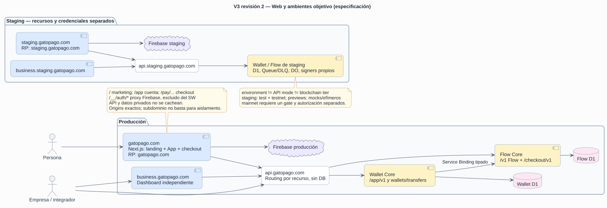

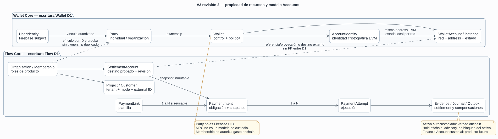

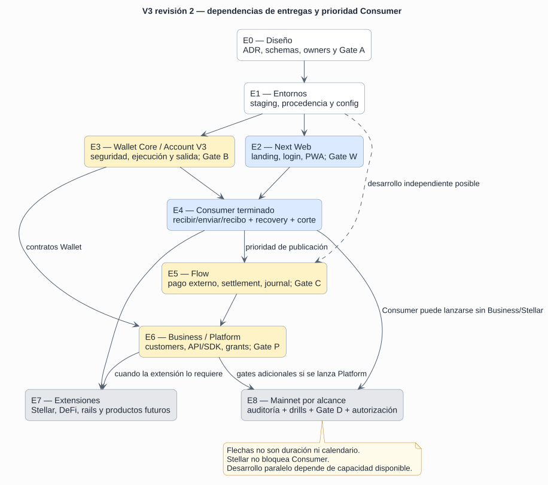

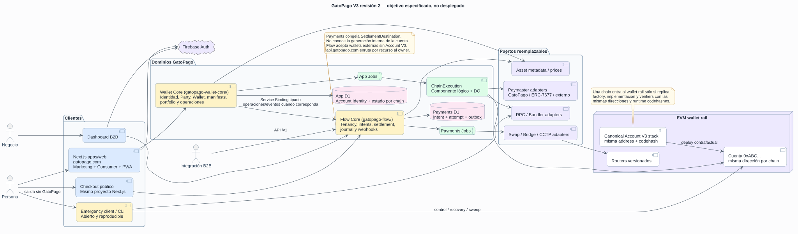

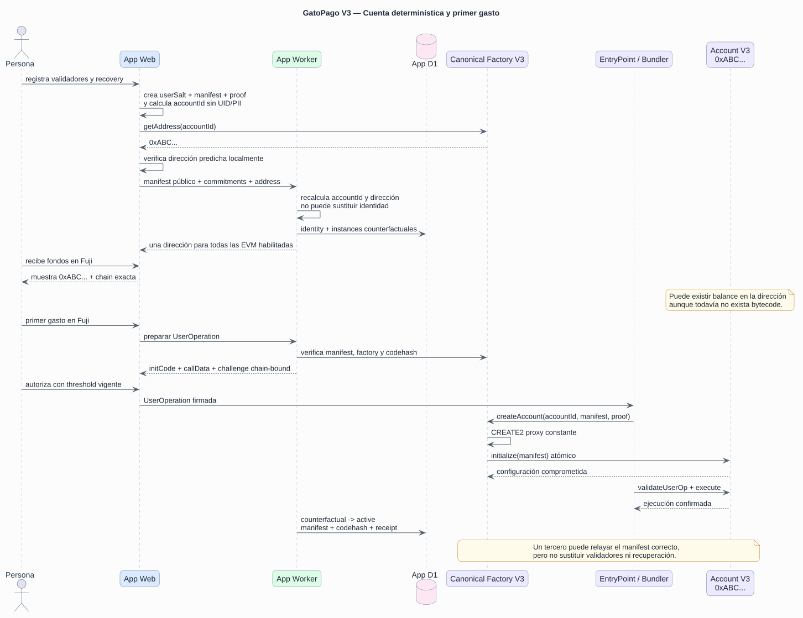

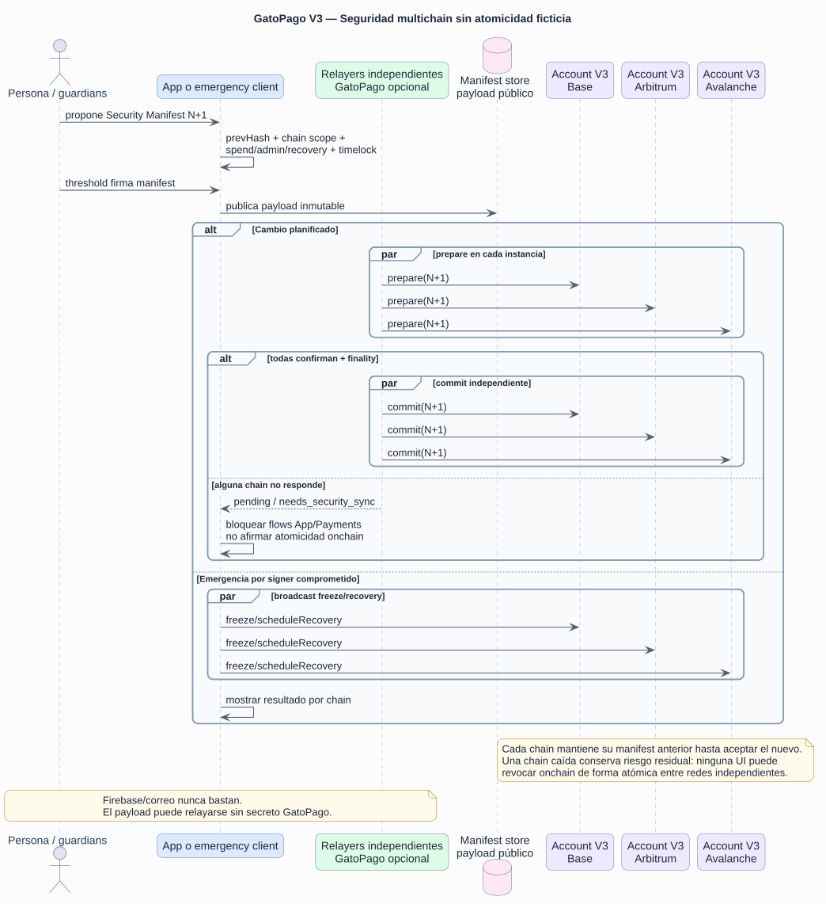

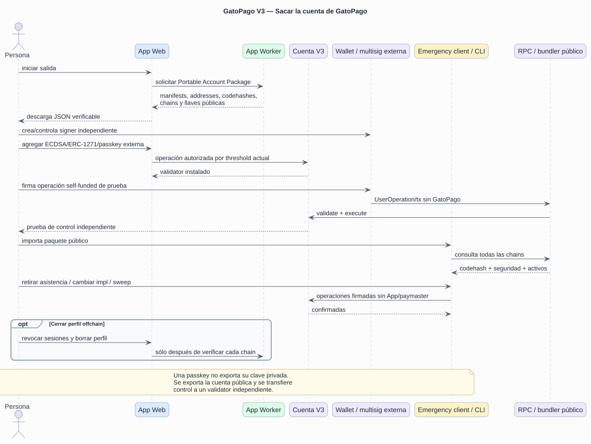

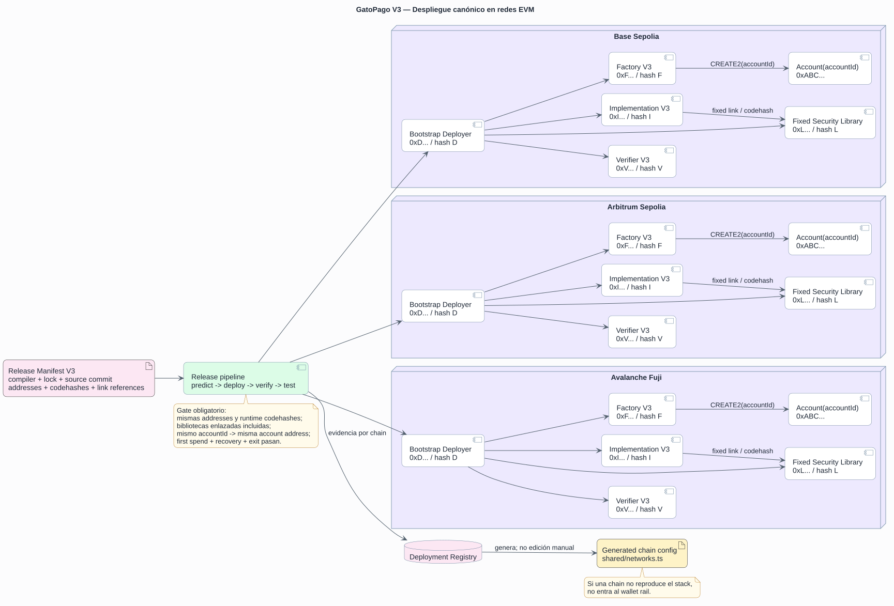

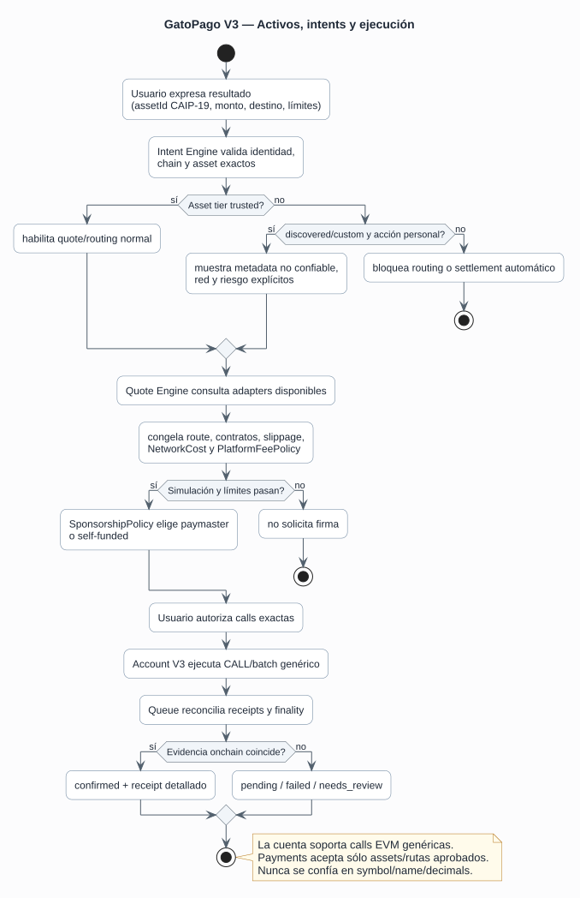

### Soberanía, Stellar y decisiones tecnológicas

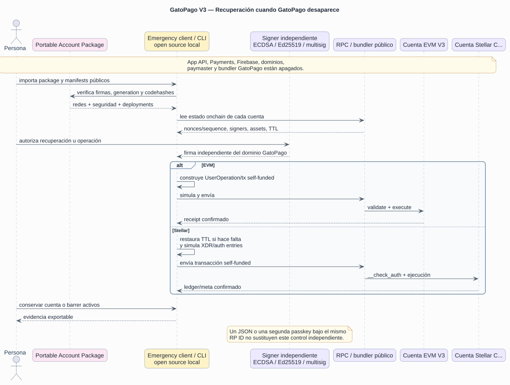

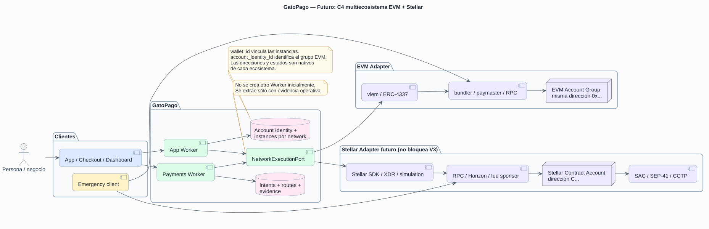

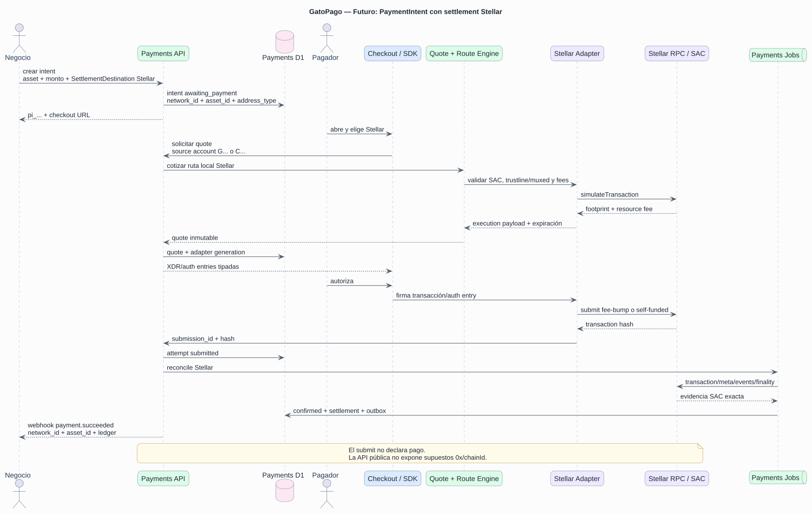

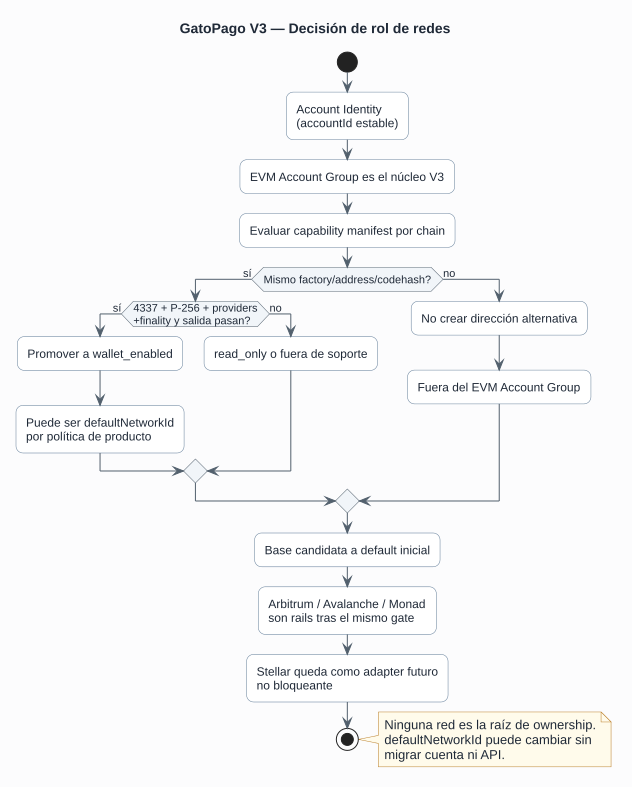

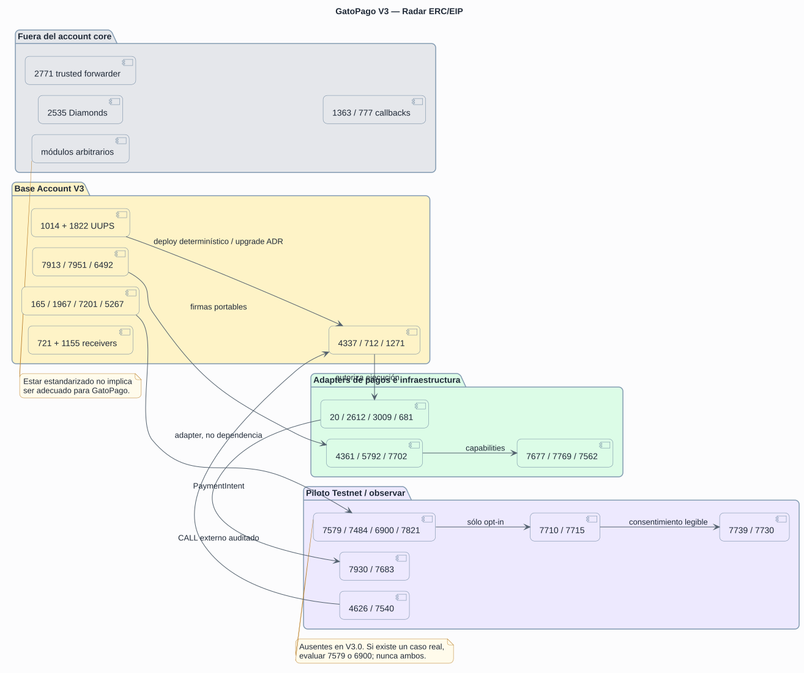

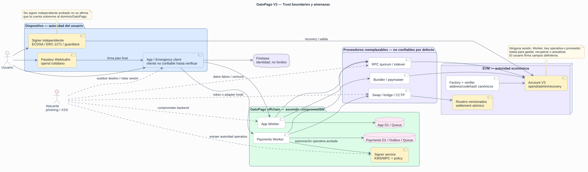

---

## Apéndice A — Antecedentes y correcciones de Payments

> Esta parte conserva el razonamiento histórico que condujo a las fronteras actuales. Si contradice una decisión cerrada de V3, prevalecen las Partes II y III.

### Correcciones aplicadas a la arquitectura de Payments

**Fecha:** 26 de agosto de 2026
**Alcance:** código, pruebas, gates, runbook, diagramas y auditoría posterior
**Estado remoto:** correcciones promovidas en testnet; pagos live desactivados

Este documento explica por qué se hizo cada corrección. La regla fue evitar dos
extremos: no dejar riesgos reales detrás de diagramas bonitos y no crear una
arquitectura genérica para proveedores que todavía no existen.

### 1. Reentrega segura de Queue

Antes, `claimJob` trataba igual un job completado y otro con lease vigente. El
consumer hacía `ack` en ambos casos. Si una invocación caía después de adquirir
el lease pero antes de terminar, la reentrega podía confirmarse y el trabajo se
perdía.

Ahora el claim devuelve tres estados: `claimed`, `completed` o `leased`. Sólo
`completed` se confirma; `leased` se reprograma hasta que expire el lease. La
prueba de runtime inserta exactamente el estado dejado por una caída, verifica
que no existe `ack`, vence el lease y comprueba que la siguiente entrega termina.

### 2. Finalización de job y outbox en el mismo batch

Antes, marcar el job `completed` y marcar su outbox `completed` eran dos
escrituras. Una caída entre ambas dejaba un outbox `enqueued` sin recuperación
limpia. Ahora las dos actualizaciones pertenecen al mismo batch D1. Una
reentrega de un job ya completado también repara idempotentemente el outbox.

### 3. `payment.created` es un contrato real

La API y los diagramas prometían `payment.created`, pero crear un intent sólo
insertaba `payment_intents` y `payment_links`. La creación ahora confirma en un
solo batch: intent, link, evento determinístico, outbox y deliveries de endpoints
suscritos. El replay con la misma `Idempotency-Key` devuelve el intent existente
sin duplicar evento, outbox ni delivery.

No se añadió una migración: las tablas, FKs e índices únicos necesarios ya
existen en `payments-worker/migrations/0001_payments_schema.sql`.

### 4. Modo live bloqueado por capacidad de backend

La configuración actual usa Arbitrum Sepolia, Base Sepolia y Fuji; las entradas
mainnet del manifest no tienen routers activos. Sin embargo, Dashboard permitía
crear claves y webhooks live y afirmaba que moverían dinero real.

Se añadió `PAYMENT_LIVE_ENABLED=false` y una capacidad calculada en el Worker.
Para habilitar live no basta el flag: el settlement debe ser mainnet y debe
existir al menos una ruta mainnet habilitada con router desplegado. Merchant API
rechaza keys/webhooks live con `503`; `/v1` vuelve a verificarlo al crear el
intent. Dashboard consulta `/merchant/capabilities` y deshabilita los selectores,
pero esa UI sólo informa: la seguridad sigue en backend.

### 5. Corte `legacy | frozen | payments`

Un cambio directo de proxy deja una carrera entre la última escritura App y el
snapshot. Se agregó un control explícito:

- `legacy`: App atiende la implementación previa;
- `frozen`: los GET siguen disponibles y las escrituras de checkout responden 503;
- `payments`: las superficies extraídas usan el Service Binding.

Un valor inválido falla cerrado como `frozen`. Liveness, readiness y ops
publican el modo efectivo. Durante `legacy` y `frozen`, los runners legacy de
checkout siguen activos para drenar trabajos ya aceptados; en `payments` quedan
inertes. Esto es código temporal de migración, no boilerplate permanente. El
procedimiento y el rollback están en `docs/runbooks/payments-cutover.md`.

### 6. Frontera personal frente a checkout

La primera versión del cutover era demasiado amplia: congelaba todo `/pay` y
delegaba todo `/crosschain`. Eso habría roto transferencias directas, Earn,
UserOperations y CCTP personal al cambiar a `payments`; además, el destino sólo
tenía handlers 410 para esas rutas.

La frontera ahora sigue el dominio, no un prefijo conveniente:

- App conserva `/pay` y `/crosschain` en todos los modos;
- sólo el prepare de un link almacenado reserva un attempt en Payments por RPC;
- `frozen` bloquea prepare/submit de links, pero no una operación personal;
- un pending legacy creado antes del switch se rechaza al llegar a `payments`,
  evitando liquidarlo contra la D1 equivocada;
- un attempt de Payments tampoco puede enviarse después de volver a `legacy`;
  se debe congelar y reconciliar hacia delante;
- `crosschain_relayer` permanece activo en App;
- el split D1 no convierte CCTP personal en intents sintéticos de comercio.

Payments mantiene su propia tabla CCTP únicamente para attempts de Universal
Checkout. Se eliminó su ruta HTTP `/crosschain`, que era engañosa y podía
interceptar una funcionalidad cuyo dueño real es App. El drill deja tres filas
personales en App y exige cero importadas en Payments.

### 7. Job fantasma eliminado

`payments-worker` aceptaba el mensaje `webhook_key_rotation`, pero su runner no
hacía nada y lo confirmaba como exitoso. Eso es peor que rechazarlo: el equipo
de operación podía creer que una rotación ocurrió. Se quitó del contrato de
Queue de Payments y el parser ahora lo rechaza. La rotación legacy que sí está implementada sigue
en App mientras se drena ese dominio.

### 8. Frontera de persistencia comprobable

Los diagramas decían que repositorios eran la única frontera SQL, pero había SQL
directo en middleware, Queue, reconciliación e entrypoint. Se introdujeron stores
funcionales pequeños para jobs, outbox, rate limit, health y chain journal. No se
añadieron clases, contenedores DI ni interfaces de una sola implementación.

El gate `check:backend-boundaries` falla si `PAYMENTS_DB.prepare/batch/exec`
aparece fuera de `repositories/` o `stores/`. Así la afirmación arquitectónica
deja de depender de disciplina manual.

### 9. Rail on-chain aislado sin abstracción universal

Circle estaba importado directamente desde el motor de quotes y la
reconciliación. Su cliente de fees/attestations vive ahora bajo
`payments-worker/src/rails/onchain/`; servicios de dominio consumen esa frontera.
Se conserva el invariante actual: USDC y rutas `local | cctp_fast |
cctp_standard`.

No se crearon `PayinProvider`, `PayoutProvider` o `CardProvider` vacíos. El
diagrama objetivo muestra dónde aparecerán, pero el primer puerto se extraerá
del contrato real del primer proveedor. Esto mantiene extensibilidad sin clases
ni adapters especulativos.

### 10. Cron descrito como recuperación

Payments ya tenía un Cron cada minuto, mientras la documentación afirmaba que
no existía ningún Cron. La documentación ahora distingue: App no tiene Cron;
Payments usa uno sólo para recuperar outbox y watchers activos. Queue y el
Durable Object siguen siendo transporte/scheduler primario.

### 11. Inputs, selectores y modales apilados

Con la fuente real cargada, la prueba de navegador reprodujo dos portales de
diálogo coexistiendo. Cada instancia intentaba volver inerte el resto del body;
una capa que ya no era la superior podía seguir bloqueando clicks, foco y texto,
incluidos nombre y red social en Perfil y el selector anidado.

`useDialog` ahora mantiene una pila mínima ordenada por `z-index` y montaje.
Sólo el modal superior es interactivo, conserva/restaura el estado `inert` y
`aria-hidden` previo, coordina el scroll lock y devuelve el foco al cerrar un
selector anidado. No se añadió un framework de modales ni un store global. La
prueba E2E escribe en ambos inputs y abre/cierra el selector real.

### 12. Pruebas visuales con la misma fuente que producción

El workspace aislado de `client/` hacía que Vite rechazara los archivos de fuente
ubicados en el store pnpm de la raíz. Las pruebas caían silenciosamente a otra
tipografía y no reproducían las dimensiones que disparaban el solapamiento.
`server.fs.allow` permite únicamente la raíz exacta del repositorio. Así el E2E
valida el layout real sin abrir acceso arbitrario al sistema de archivos.

### 13. Diagramas corregidos

Los diagramas ahora reflejan que:

- Checkout es una ruta de App Web, no un contenedor desplegable;
- productores publican en Queue y Queue entrega al Job Runtime;
- la wallet llama al router, no el Authorization Service;
- Iris entrega una attestation y el relayer llama `receiveMessage` on-chain;
- fee evidence es idempotente, pero la transición económica + evento + outbox
  es el batch atómico;
- live/mainnet está deshabilitado;
- el corte incluye freeze, drain, watermark y rollback condicionado;
- `/pay` y `/crosschain` personales permanecen en App durante el corte;
- el split no duplica CCTP personal en Payments;
- proveedores futuros aparecen en gris y no como funcionalidad existente.

La secuencia extensa se dividió entre creación/ejecución y
reconciliación/webhook. Hay diez diagramas numerados.

### 14. Drift de SVG bloqueado en CI

`docs:architecture:check` renderiza en una carpeta temporal, compara hashes con
los SVG versionados y no escribe en el workspace. `verify` y `verify:ci` lo
ejecutan, por lo que modificar PlantUML sin regenerar su SVG hace fallar el gate.

### 15. Bootstrap, sync y preflight fallan cerrado

El primer deploy de Payments arranca con `PAYMENTS_BOOTSTRAP_MODE=true`: health
permanece disponible, pero HTTP/RPC mutante se rechaza, Queue reintenta y Cron no
ejecuta trabajo económico. App, por su parte, deja
`PAYMENTS_SYNC_ENABLED=false` hasta que el import haya sido verificado. Después
del freeze, el SHA-256 del manifest se fija en
`PAYMENTS_DATA_CUTOVER_CHECKSUM`; incluso con bootstrap apagado, Payments vuelve
a leer `payment_migration_control` y bloquea HTTP/RPC/Queue/Cron si source,
target y configuración no coinciden. Un valor ausente o inválido nunca activa
accidentalmente el corte.

App y Payments tienen guards previos a Wrangler. Ambos validan la misma máquina
de estados de un solo escritor; App además rechaza el UUID centinela para no
publicar el caller antes de que exista el target del Service Binding.

El preflight remoto es únicamente de lectura y descubre todas las migraciones de
Payments. Verifica ownership, target vacío o importado de forma completa, Queue,
Service Binding target→caller, checksum runtime y flags bootstrap/sync. El drill
local cubre import data-only, checksum, rechazo de replay y restauración
independiente de ambas D1.

### 16. Relayer CCTP recuperable y contabilidad real

Cada mint guarda nonce, firmante, nonce EVM y transacción raw antes del broadcast.
Un lease por `signer + chain` serializa ocho ejecuciones concurrentes; después de
una caída se reenvía exactamente la misma transacción o se recupera desde
`usedNonces`, receipt y eventos. Settlement usa el monto realmente acuñado y
propaga fee y sobrepago a ledger, API y webhook sin duplicar el efecto económico.

### 17. Webhooks y creación de intents resistentes a concurrencia

Las deliveries vencidas se reclaman otra vez, el evento conserva identidad
estable y cada envío incluye timestamp, event ID, delivery ID y firma
`v1=<hex>`. Los secretos usan AES-GCM versionado con `secret_key_id`; un keyring
anterior permite leer y rotar por compare-and-swap sin invalidar endpoints.
Crear dos intents simultáneos con la misma `Idempotency-Key` devuelve el mismo
recurso y no produce un `500` por conflicto único.

### 18. Checkout público y montos definidos por quien paga

`/checkout/:linkId` se puede pagar sin cuenta GatoPago desde una wallet externa
que exponga EIP-1193 en su extensión o navegador integrado. La red es la
ubicación del USDC del pagador, no una decisión del
merchant. El cliente simula saldo, allowance y gas; intenta EIP-2612 y, si la
wallet no lo soporta, usa autorización exacta más pago. El hash se persiste antes
del registro HTTP y, si ese registro falla, una recarga vuelve a registrar el
mismo hash sin volver a transmitir la operación.

Los links de monto abierto usan `amount_mode=payer_defined`. Quotes y attempts
son autorizaciones provisionales independientes: no fijan el monto ni reservan
el link frente a otro payer. El primer settlement confirmado fija la obligación;
los siguientes settlements válidos se registran como sobrepago. `0005` introdujo
el modo y `0007_concurrent_payment_attempts.sql` elimina el lock global y añade el
commit CAS auditable que serializa la contabilidad D1.

### 19. Qué se evitó deliberadamente

- No se habilitó mainnet ni se cambió una dirección de contrato.
- No se creó un Worker por frontend ni un Worker por proveedor.
- No se añadió doble escritura entre D1.
- No se borraron handlers/tablas legacy antes del soak.
- No se creó una migración sin cambio de schema.
- No se hizo deploy, commit, push ni mutación remota.

### 20. Evidencia local exigida

Resultados ejecutados sobre este árbol de trabajo:

| Gate | Resultado |
|---|---|
| `pnpm verify` | Pasa: lint, typecheck, OpenAPI, fronteras, query plans, Knip, ciclos, unit/runtime, builds y budgets. |
| Server | 253 unit tests + 22 runtime tests, todos pasan. |
| Payments | 51 unit tests + 19 runtime tests, incluidos payer proof, capabilities, CAS, expiración y evidencia onchain adversarial. |
| Playwright | 28 pasan; 10 se omiten por la matriz configurada. Incluye checkout externo, caída de registro y recuperación tras recarga en escritorio y móvil. |
| `pnpm audit:prod` | Cero vulnerabilidades conocidas por el advisory DB de pnpm. |
| D1 | Backup/restore de 59 tablas y split App/Payments con FK, checksum semántico de todas las columnas, rechazo de mutación de contenido, replay guard y restores independientes. |
| Release | Artifact drill, detección de manipulación y archivos extra pasan. |
| Foundry | Coverage: 187 pruebas instrumentadas pasan y 4 forks se omiten sin RPC; el gate final ejecuta 191 pruebas y omite esos mismos 4 forks. Sizes, storage layout y lint pasan. |
| Diagramas | 10 SVG reproducibles con PlantUML fijado y revisados visualmente. |

Límites de esta evidencia:

- `pnpm test:fork` usa endpoints públicos de Arbitrum Sepolia, Base Sepolia y
  Avalanche Fuji y valida sus chain IDs antes de ejecutar; para CI o mayor
  estabilidad se pueden sobrescribir `ARBITRUM_SEPOLIA_RPC_URL`,
  `BASE_SEPOLIA_RPC_URL` y `AVALANCHE_FUJI_RPC_URL`;
- Foundry avisa que los directorios vendorizados no conservan metadata `.git`.
  Los paquetes declaran las versiones fijadas (forge-std 1.16.2 y OpenZeppelin
  5.7.0), pero el checkout local no puede demostrar sus commits mediante Git;
- una auditoría de dependencias sin hallazgos no demuestra ausencia absoluta de
  vulnerabilidades, y ninguna prueba local sustituye un smoke autenticado en
  producción ni una auditoría externa de contratos.

### 21. Remediación de la auditoría posterior

El checkout público ya no confía en que una dirección o hash escritos por el
navegador sean verdaderos. La quote liga un hash de capability; la wallet
cotizada firma un mensaje exacto; y el attempt guarda sólo el hash de esa
capability. Lectura, registro y cancelación requieren el valor aleatorio. Antes
de persistir un source hash, Payments consulta su propio RPC y verifica receipt
exitoso, `from`, `to`, router y `PaymentSettled`/`CctpPaymentBurned` contra el
attempt firmado. Un receipt pendiente no cambia D1 y un conflicto no revela la
autorización del attempt ganador.

La migración `0006_checkout_attempt_access.sql` añade esos compromisos y un
índice para expirar `submitted` sin evidencia. El drill D1 ahora hashea todas
las columnas, con tipos canónicos y orden estable, y demuestra que alterar el
contenido conservando IDs hace fallar la verificación.

La salud RPC conserva por hasta cinco minutos una observación pública válida y
la marca `degraded`, pero nunca la usa para firmar/autorizaciones. El preflight
exige dos hostnames RPC por chain. El helper operativo construye y prueba dos
proveedores reales para las tres testnets antes del upload. El checkout remonta
toda `PayPage` por identidad de ruta, no sólo el hijo cuando llega el nuevo
`link.id`; A desaparece mientras B carga y también cuando B termina en 404. El
preflight Vercel comprueba acceso HTTP anónimo, incluidos redirects externos.

El checkout no integra SDKs ni relays de conexión remota. La compatibilidad con
wallets externas queda limitada a una interfaz EIP-1193 ya expuesta por el
navegador o a abrir el link dentro del navegador propio de la wallet. App,
Dashboard, Workers, passkeys y smart accounts no requieren un proveedor de
wallets.

Finalmente, los comandos de deploy ahora rechazan cambios relevantes
dirty/untracked y un HEAD sin publicar en su upstream. El runtime del corte fue
versionado y publicado antes de desplegarse. `DEPLOY.md` usa esos entrypoints también para dry-run y
publicación; un gate estático impide reintroducir `wrangler deploy` directo.

El checksum histórico no se puede promover cambiando el valor de control. El
importador ahora produce manifest v4/checksum semántico v2, normaliza de forma
criptográficamente verificable la representación AES-GCM aleatoria y cifra
webhooks con el formato `enc:v2:<key-id>` consumido por Payments. El preflight
exporta el target pre-activación y ejecuta `--verify-target-sql`. El recut siguió
ese runbook hacia `gatopago-payments-semantic-20260826`; la D1 histórica quedó
intacta como evidencia/rollback.

`pnpm verify:all` terminó en verde después de estas correcciones: App 253+22,
Payments 52+19, Playwright 36/16, audit sin vulnerabilidades conocidas,
split/restore semántico y 191 pruebas Foundry finales con 4 forks omitidos por
ausencia de RPC.

El gate remoto posterior ejecutó 197 pruebas Foundry sin fallos ni omisiones,
preflights Cloudflare/Vercel y smokes de checkout/direct proxy. No ejecutó un
pago E2E: esa evidencia permanece como el alcance de Fase 4.

### 22. Tercera revisión: disponibilidad, Turnstile y aislamiento RPC

La firma del payer demuestra control de wallet, pero no que vaya a pagar. Por eso
ninguna reserva pública puede ser un mutex del intent. `0007` permite múltiples
attempts, mantiene idempotencia por payer/chain/key y deja que cada router acepte
atómicamente el primer pago en su chain. Como routers de chains distintas no
comparten storage, Payments contabiliza cada settlement confirmado mediante un
commit append-only y compare-and-set; cualquier segundo pago se conserva como
sobrepago en vez de sobrescribir al primero. Una reserva tampoco impide que el
merchant cancele. La cancelación corta nuevas firmas, pero un pago con firma ya
emitida puede aterrizar hasta `valid_until` y debe reconciliarse.

App y Dashboard dejan de esperar Turnstile indefinidamente: la carga del script
tiene límite de 10 s, el challenge de 15 s y los estados error/timeout/unsupported
ofrecen retry. El backend exige además que el token tenga la action esperada y un
hostname incluido en `ALLOWED_ORIGINS`, evitando reutilización entre login,
creación de cuenta y faucet.

La caché de salud RPC ya no almacena Promises pendientes en scope global. Sólo
retiene observaciones resueltas; misses concurrentes pueden repetir una lectura,
pero ninguna request comparte I/O creado por el contexto de otra. La autorización
monetaria sigue fallando cerrada y sólo health puede usar la última observación
válida como degradada.

Wrangler permanece en `4.125.0`: las releases `4.126.0`/`4.127.0` aún no cumplen
la cuarentena de siete días de `minimumReleaseAge`. No se añadió una excepción de
supply chain ni se adelantó TypeScript 7.

---

## Control de cambios de V3 FUSION

**Revisión 2 — 8 de septiembre de 2026:** Next.js consumer aceptado; landing
local inventariada; topología/RP/ambientes definidos; Accounts/tenancy/API y
ledger refinados; soberanía y API movidas al núcleo; ADR-011–018 y gates W/P;
entregas E0–E8 priorizan Consumer. Los antecedentes fechados conservados no
prueban estado remoto actual. No se implementó ni desplegó runtime con esta
revisión.


Toda modificación posterior debe indicar:

1. decisión o sección afectada;
2. amenaza o invariant que cambia;
3. impacto en contratos, App Backend, Payments Backend y clientes;
4. compatibilidad o corte limpio requerido;
5. prueba y gate de aceptación;
6. efecto en la salida soberana del usuario;
7. estado real: propuesta, implementado, testnet o mainnet.

No se debe introducir una red, token, proveedor, estándar o versión de cuenta
mediante una excepción dispersa fuera de este documento.
